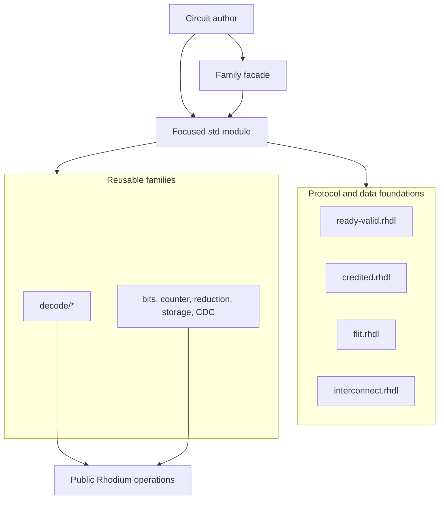

<!-- Explains how to extend, maintain, and validate Rhodium's standard library. -->

# Developing the Rhodium standard library

Read the [standard-library guide](README.md) first. It is the authoritative
contract for imports, interfaces, component behavior, timing, configuration,
and deliberate limits. This guide owns the implementation structure and the
workflow for changing that contract.

## Boundaries and placement

Everything under `rhodium/std/` is optional library code written through the
public `#lang rhodium` authoring surface. Standard-library modules must not
import Rhodium's core, frontend implementation, backend, or a domain library.
The repository-wide package graph and exact direct-dependency inventory live
in [`../DEVELOPING.md`](../DEVELOPING.md#standard-library-dependencies); update
that inventory whenever a standard-library module's direct Rhodium imports
change.

Use these placement rules when adding code:

- Put a protocol declaration or protocol-neutral parameter next to the other
  top-level foundations, such as `ready-valid.rhdl`, `credited.rhdl`,
  `flit.rhdl`, or `interconnect.rhdl`.
- Put a reusable circuit with no natural family in a focused top-level module,
  as with `counter.rhdl`, `scoreboard.rhdl`, and `sync-ram.rhdl`.
- Put a ready-valid transformation, buffer, allocator, or routing primitive in
  root-level [`flow/`](../../flow/DEVELOPING.md), not this package.
- Re-export a family through a facade only when callers commonly compose
  several of its members. `decode.rhdl` and `cdc.rhdl` are
  aggregation boundaries; they should not acquire distinct behavior.
- Keep domain policy out of this package. CHI, NoC, RISC-V, device, core, and
  SoC libraries and `flow/` may consume `std`, but `std` must not depend on them.

Tests and examples are outside the package. Put executable authoring examples
under [`../../examples/std/`](../../examples/std/) and compiler-facing host
tests under [`../../tests/frontend/`](../../tests/frontend/). CIRCT fixtures
and Verilator benches belong under [`../../tests/backend/`](../../tests/backend/).

## Architecture and ownership

Arrows below mean “uses.” Public facades aggregate focused modules; they do not
form a separate implementation layer.



| Area | Source owner | Maintenance responsibility |
|---|---|---|
| Ready-valid contracts | [`ready-valid.rhdl`](ready-valid.rhdl) | Nominal interface families, refinement, endpoint classification, and `fire()` |
| Credited and flit contracts | [`credited.rhdl`](credited.rhdl), [`flit.rhdl`](flit.rhdl) | Transport accounting and packet representations, independent of buffering policy |
| Decode descriptions | [`decode/pattern.rhdl`](decode/pattern.rhdl), [`decode/table.rhdl`](decode/table.rhdl) | Immutable typed patterns, set algebra, cases, and table validation |
| Decode emission | [`decode/generator.rhdl`](decode/generator.rhdl), [`decode/pattern-value.rhdl`](decode/pattern-value.rhdl) | `rtl.decode` construction and the explicit materialization of output don't-cares |
| Generic utilities and storage | Top-level focused modules and [`cdc/`](cdc/) | Host utilities or reusable circuits that do not require the flow facade |

The core IR and backend own primitive meaning and lowering. For example,
`DecodeGen` constructs the public `rtl.decode` operation, but the operation's
verification belongs to core and its CIRCT lowering belongs to the backend.
Do not copy those implementations into the library.

## Adding or changing a public facility

1. Choose the narrow owning module and state its public contract in
   [README.md](README.md): accepted types, ports or return shape, handshake and
   timing behavior, reset behavior, priority, invalid-input behavior, and any
   deliberate omission.
2. Decide whether the facility is host-only data, an inline topology
   transformation, or a named circuit generator. Avoid adding hierarchy or
   state to an operation whose public contract promises neither.
3. Import only the focused sibling modules required by the implementation.
   Add the new public name to a facade only when it belongs to that facade's
   established family.
4. Validate host parameters during elaboration. Use exact hardware types and
   nominal interface support rather than accepting coincidentally compatible
   widths or display names.
5. Add a host test only for static information, types, pure host policy, or a
   public elaboration-time rejection. Do not snapshot incidental operation or
   instance structure for every new module.
6. Test observable RTL behavior with the focused backend emitter and Verilator
   bench. Generated Verilog is test output, not
   hand-maintained source.
7. Update the standard-library dependency inventory in
   [`../DEVELOPING.md`](../DEVELOPING.md#standard-library-dependencies), this
   source map when ownership changes, and the public README when the
   caller-visible contract changes.

Protocol declaration changes must preserve the public nominal contracts.
Streaming component changes belong to the [flow guide](../../flow/DEVELOPING.md).

### Decode changes

`Pattern` and `PatternSet` are immutable host data. Constructing or combining
them must not emit hardware. Keep normalization and set algebra in
`decode/pattern.rhdl`, relation validation in `decode/table.rhdl`, and hardware
construction in `decode/generator.rhdl`.

Preserve exact type equality across pattern values and care masks, deterministic
disjoint set covers, and rejection of overlapping decode inputs. Do not add
implicit row priority, Boolean minimization, or a runtime-X interpretation of
pattern don't-cares. A new output materialization policy belongs beside
`pattern-value.rhdl`, not in the neutral pattern representation.

## Test organization

The standard library is covered at three levels:

| Coverage | Location | What it should prove |
|---|---|---|
| Compiler-facing host | [`tests/frontend/std-*-test.rhm`](../../tests/frontend/) plus decode and pattern tests | Static information, exact public types, pure host policy, protocol compatibility, and invalid uses |
| Executable examples | [`examples/std/`](../../examples/std/) | Public import paths and realistic authoring composition |
| CIRCT and Verilator | Emitters and benches under [`tests/backend/`](../../tests/backend/) | Lowering and cycle-visible behavior for stateful or backend-sensitive components |

Prefer a focused test and its fixture. Representative ownership is:

- `decode-test.rhm`, `decode-composition-test.rhm`, and `pattern-test.rhm` for
  typed decode;
- `std-ready-valid-test.rhm`, `std-credited-test.rhm`, and
  `std-flit-test.rhm` for transport contracts;
- the focused `std-bits`, `std-cdc`, `std-counter`, `std-interconnect`,
  `std-reduction`, `std-scoreboard`, `std-shift-register`, and `std-sync-ram`
  tests for their owning modules.

Keep host checks distinct from backend evidence. Exact IR is appropriate when
the standard-library feature is compiler-facing; a reusable hardware module
does not need its own elaboration snapshot. Use the corresponding emitter and
Verilator bench for reset, latency, handshake, and other observable behavior.

Lane-mask expansion belongs in `bits.rhdl`, using ordinary vector construction
and bit selection without new IR operations or protocol dependencies. The
`std-bits` host tests cover its result widths and rejected arguments;
the `expand-mask` backend fixture exhaustively checks bit-to-lane ordering,
including single-bit and sliced masks and non-byte lane widths.

Runtime log2-alignment also belongs in `bits.rhdl`; it builds a bounded lookup
of existing static alignment checks without importing a protocol or adding IR.
Only representable exponent cases are emitted. `runtime-alignment` exhaustively
checks zero, narrow/non-power-of-two operand widths, bounded/oversized exponents,
and unit/full-width alignment. Host `std-bits` tests reject invalid bounds and
operand types. CHI consumers retain their size-validity and range checks.

Striped bank geometry belongs in `interconnect.rhdl`, independently of CHI
flit parameters. Host projection validates membership; hardware projection
only removes bank-select bits from a caller-provided relative offset. Host
`std-interconnect-test.rhm` covers ownership, dense addressing, and rejected
layouts. The `chi-request-update` behavioral fixture covers single-bank,
byte-stripe, and whole-bank-stripe projection plus metadata-transparent CHI
adaptation. CHI adapters and LLCs consume this same geometry.

Transfer containment also belongs in `interconnect.rhdl`. Keep both exclusive
ends widened, and reject empty transfers and wrapping windows. The
`transfer-range` fixture exhaustively compares all four-bit addresses, lengths,
bases, and window sizes against integer arithmetic; host tests reject invalid
widths and window sizes. RAM and BootROM retain their independent alignment,
size, and address-acceptance policies.

## Focused validation

Run Racket and Rhombus through the repository wrapper, which creates the
required isolated compiled root. For example:

```sh
tools/run-racket-tests.sh tests/frontend/std-ready-valid-test.rhm
tools/run-racket-tests.sh tests/frontend/decode-test.rhm
```

Validate all standard-library examples after changing a public import or
composition surface:

```sh
make examples-std
```

Run `make check-boundaries` after adding or moving a module or changing direct
imports. Use `make frontend-test` when a change spans several standard-library
families or shared interface semantics. For backend-sensitive changes, select
the corresponding fixture through [`tests/backend/run-circt.sh`](../../tests/backend/run-circt.sh);
the CI grouping for the complete standard-library backend set is:

```sh
make ci-circt-std-test
```

That final target requires the external CIRCT and Verilator toolchain. State
which level was actually run; do not treat host elaboration as RTL simulation.
