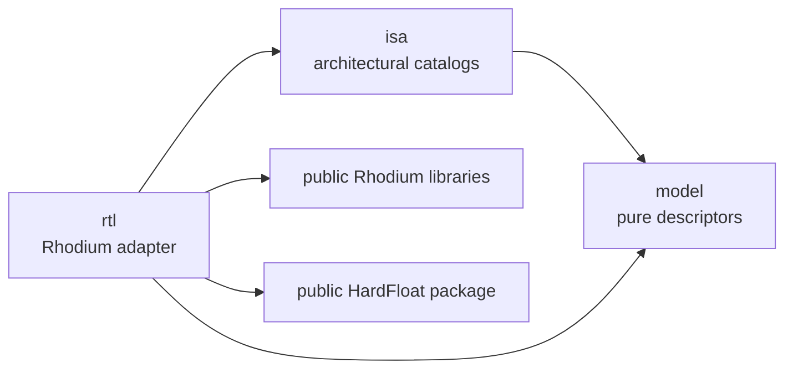

<!-- Guides contributors through extending the pure RISC-V model, ISA catalogs, and host toolchain projections. -->
<!-- SPDX-License-Identifier: Apache-2.0 -->

# Developing the RISC-V instruction model

Read the package [README](README.md) for public descriptor semantics, catalog
coverage, compressed expansion, and architectural references. This guide owns
implementation structure, dependency enforcement, extension workflow, and
focused validation.

## Architecture and dependency boundary

The package has three directed layers:



Keep `model/` and `isa/` usable as ordinary host data without importing
Rhodium, `flow/`, HardFloat, processor implementations, or backend tooling. Keep
hardware materialization in `rtl/`; keep decode policy, pipeline controls,
architectural state, and retirement in concrete cores. The package-local
[`check-boundaries.sh`](check-boundaries.sh) enforces these directions.

## Implementation map

| Area | Owner |
|---|---|
| Named fields and fixed constraints | [`model/fields.rhm`](model/fields.rhm) |
| Width-aware encoding relations | [`model/encoding.rhm`](model/encoding.rhm) |
| Operand formats and immediate layouts | [`model/formats.rhm`](model/formats.rhm) |
| Instruction specs and disjoint catalogs | [`model/instruction.rhm`](model/instruction.rhm) |
| Compact-to-canonical bindings | [`model/expansion.rhm`](model/expansion.rhm) |
| Pure-model facade | [`model/main.rhm`](model/main.rhm) |
| Architectural catalogs and profiles | [`isa/`](isa/) |
| Pure vector geometry and data-overlap model | [`isa/vector.rhm`](isa/vector.rhm), tested by [`tests/vector-test.rhm`](tests/vector-test.rhm) |
| GNU compiler target projection | [`gnu-toolchain.rhm`](gnu-toolchain.rhm) |
| Typed UDB document values and deterministic YAML serialization | [`udb.rhm`](udb.rhm) |
| Hardware materialization | [`rtl/DEVELOPING.md`](rtl/DEVELOPING.md) |
| Model, catalog, and adapter tests | [`tests/`](tests/) |

## Extend the model or catalogs

1. Put reusable structure in the lowest pure-model module that owns its
   invariant. Keep architecture-specific names and versioned instruction sets
   in `isa/`.
2. Express operand and immediate placement through `InstructionFormat` and
   `ImmediateLayout`; do not duplicate bit slices in instruction catalogs or
   hardware adapters.
3. Construct each `InstructionSpec` from one complete, nonoverlapping encoding
   and format. Compose catalogs from existing instruction objects when an ISA
   extension includes another extension.
4. Add host tests for successful construction and encoding plus intentional
   invalid widths, overlaps, missing fields, foreign fields, or illegal
   immediates that the supported contract rejects.
5. Update the public catalog map and architectural references in
   [README.md](README.md) when observable coverage changes.

For compressed instructions, keep the 16-bit match, legality constraints,
operand bindings, immediate scattering, and canonical 32-bit target together
in the pure descriptor. Test host expansion before changing its hardware
materialization in [`rtl/compressed.rhdl`](rtl/compressed.rhdl).

## Maintain specification provenance

Record the implemented extension version in the public catalog map and cite a
ratified specification or canonical opcode source. Preserve intentional
omissions such as assembler-only aliases as explicit public limits. When an
upstream specification changes, compare encodings and legality conditions
before updating the stated version; do not infer conformance from names alone.

The `riscv-isa-tests` and `riscv-arch-test` submodules supply upstream test
sources, not package dependencies. Simulator-specific selection and execution remain owned by
[`../sims/`](../sims/README.md).

## Focused validation

From the repository root, run:

```sh
make riscv-test
```

This target checks the pure model, ISA catalogs, compressed host and hardware
expansion, reusable RTL adapters, and package boundaries. Repository wrappers
provide a fresh `PLTCOMPILEDROOTS` unless the caller supplies one. Direct
Racket or Rhombus commands must use a newly created compiled root and `racket
-y` where Racket is invoked directly.
