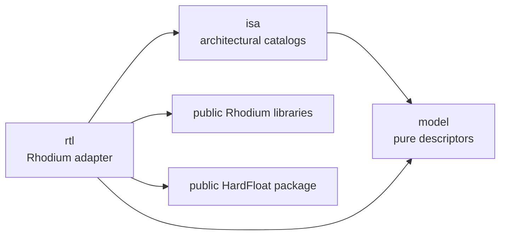

<!-- Guides contributors through extending the pure RISC-V model, ISA catalogs, and host toolchain projections. -->
<!-- SPDX-License-Identifier: Apache-2.0 -->

# Developing the RISC-V instruction model

Read the package [README](README.md) for public descriptor semantics, catalog
coverage, compressed expansion, and architectural references. This guide owns
implementation structure, dependency enforcement, extension workflow, and
focused validation.

## Architecture and dependency boundary

The package has three directed layers:


```mermaid
flowchart LR
  ISA["isa<br/>architectural catalogs"] --> Model["model<br/>pure descriptors"]
  RTL["rtl<br/>Rhodium adapter"] --> ISA
  RTL --> Model
  RTL --> Rhodium["public Rhodium libraries"]
  RTL --> HardFloat["public HardFloat package"]
```

Keep `model/` and `isa/` usable as ordinary host data without importing
Rhodium, `flow/`, HardFloat, processor implementations, or backend tooling. Keep
hardware materialization in `rtl/`; keep decode policy, pipeline controls,
architectural state, and retirement in concrete cores. The package-local
[`check-boundaries.sh`](check-boundaries.sh) enforces these directions.

## Implementation map

| Area | Owner |
|---|---|
| Named fields and fixed constraints | [`model/fields.rhm`](model/fields.rhm) |
| Width-aware encoding relations | [`model/encoding.rhm`](model/encoding.rhm) |
| Operand formats and immediate layouts | [`model/formats.rhm`](model/formats.rhm) |
| Instruction specs and disjoint catalogs | [`model/instruction.rhm`](model/instruction.rhm) |
| Compact-to-canonical bindings | [`model/expansion.rhm`](model/expansion.rhm) |
| Pure-model facade | [`model/main.rhm`](model/main.rhm) |
| Architectural catalogs and profiles | [`isa/`](isa/) |
| CSR identifiers, addresses, and architectural fields | [`isa/csr.rhm`](isa/csr.rhm) |
| Normalized ISA claims and MISA projection | [`isa/profile.rhm`](isa/profile.rhm), tested by [`tests/profile-test.rhm`](tests/profile-test.rhm) |
| Implementation-neutral hart, MMU, cache, and CBO description | [`isa/hart.rhm`](isa/hart.rhm), tested by [`tests/profile-test.rhm`](tests/profile-test.rhm) |
| Pure vector geometry and data-overlap model | [`isa/vector.rhm`](isa/vector.rhm), tested by [`tests/vector-test.rhm`](tests/vector-test.rhm) |
| Standard vector profile selection | [`isa/vector-profile.rhm`](isa/vector-profile.rhm) |
| RVV 1.0 instruction catalog and fields | [`isa/v.rhm`](isa/v.rhm), tested by [`tests/vector-isa-test.rhm`](tests/vector-isa-test.rhm) |
| Zvfhmin conversion subset | [`isa/zvfhmin.rhm`](isa/zvfhmin.rhm), tested by [`tests/vector-isa-test.rhm`](tests/vector-isa-test.rhm) |
| Full Zvfh catalog and SEW=8 conversion subset | [`isa/zvfh.rhm`](isa/zvfh.rhm), tested by [`tests/vector-isa-test.rhm`](tests/vector-isa-test.rhm) |
| Zvbb vector basic bit-manipulation catalog | [`isa/zvbb.rhm`](isa/zvbb.rhm), tested by [`tests/vector-isa-test.rhm`](tests/vector-isa-test.rhm) |
| Zvkt vector data-independent timing scope | [`isa/zvkt.rhm`](isa/zvkt.rhm), tested by [`tests/zvkt-test.rhm`](tests/zvkt-test.rhm) |
| GNU compiler target projection | [`gnu-toolchain.rhm`](gnu-toolchain.rhm) |
| Typed UDB document values and deterministic YAML serialization | [`udb.rhm`](udb.rhm) |
| Hardware materialization | [`rtl/DEVELOPING.md`](rtl/DEVELOPING.md) |
| Model, catalog, and adapter tests | [`tests/`](tests/) |
| Shared patched-submodule materialization and identity | [`patched_submodule.py`](patched_submodule.py), tested by [`tests/test_patched_submodule.py`](tests/test_patched_submodule.py) |
| Shared Spike disassembler and FESVR upstream | [`riscv-isa-sim/`](riscv-isa-sim/), with downstream changes in [`riscv-isa-sim-patches/`](riscv-isa-sim-patches/) |
| ACT and embedded reference-model upstream | [`sail-riscv/`](sail-riscv/), with downstream changes in [`sail-riscv-patches/`](sail-riscv-patches/); embedding is owned by [`sims/cosim/`](../sims/cosim/README.md) |

## Extend the model or catalogs

Follow the repository's [source documentation requirements](../AGENTS.md#source-documentation),
including the exemption for files under `tests/`.

1. Put reusable structure in the lowest pure-model module that owns its
   invariant. Keep architecture-specific names and versioned instruction sets
   in `isa/`.
2. Express operand and immediate placement through `InstructionFormat` and
   `ImmediateLayout`; do not duplicate bit slices in instruction catalogs or
   hardware adapters.
3. Construct each `InstructionSpec` from one complete, nonoverlapping encoding
   and format. Compose catalogs from existing instruction objects when an ISA
   extension includes another extension.
4. Add host tests for successful construction and encoding plus intentional
   invalid widths, overlaps, missing fields, foreign fields, or illegal
   immediates that the supported contract rejects.
5. Update the public catalog map and architectural references in
   [README.md](README.md) when observable coverage changes.

For compressed instructions, keep the 16-bit match, legality constraints,
operand bindings, immediate scattering, and canonical 32-bit target together
in the pure descriptor. Test host expansion before changing its hardware
materialization in [`rtl/compressed.rhdl`](rtl/compressed.rhdl).

## Maintain specification provenance

Record the implemented extension version in the public catalog map and cite a
ratified specification or canonical opcode source. Preserve intentional
omissions such as assembler-only aliases as explicit public limits. When an
upstream specification changes, compare encodings and legality conditions
before updating the stated version; do not infer conformance from names alone.

The `riscv-isa-sim` submodule supplies the shared Spike disassembler and FESVR
source; it is a host dependency, not a pure-model dependency or target
software. Keep it pristine and express downstream changes through its adjacent
ordered patch series and the shared materializer. Rebase or remove patches
when advancing the gitlink, then validate embedded Spike, RHEG export, and
FESVR execution. Stage the new gitlink before running `make -C sims setup`:
the materializer identifies the revision from the Git index and the ordered
patch contents. Keep native consumers on C++20, including the independently
compiled RHEG parser. Remove a patch only when upstream implements its contract,
and retain regression coverage for that behavior.

At pin `609dbe0b9994154833039209fa37151e7c05e9d4`, upstream supplies RV32
`medelegh`, CSRIND state-enable gating, and HS overflow-interrupt priority;
their former downstream patches are retired. The 21-patch series preserves
the embedding hooks and advertised architectural contracts, including an XLEN
guard for P1P13, whose controlled
[`hedelegh` CSR](https://docs.riscv.org/reference/isa/priv/hypervisor) is RV32-only.
Keep native regression coverage for RV32/RV64 with and without H, and for
`hedelegh` permission checks.
The H-mandated `hedeleg` software-check and hardware-error bits remain writable
independently of optional exception sources; `spike_arch_test.cc` exercises
their set/clear behavior without CFI or counters.
Execution-loop rebases must preserve pre-instruction counter controls, trap accounting,
WFI retirement/idle/wakeup, and both fast and logged paths. Run
`make -C sims spike-core-test transport-test spike-dpi-compile-check spike-dpi-abi-check`
and the [RHEG exporter checks](../rheg/DEVELOPING.md#focused-validation) before
the platform/software matrix in the [simulator guide](../sims/DEVELOPING.md).

Target software upstreams and ports are owned by
[`../sw/`](../sw/DEVELOPING.md); simulator selection and execution remain under
[`../sims/`](../sims/DEVELOPING.md).
The pinned `sail-riscv` submodule is likewise a host-side reference dependency,
not a pure-model import. Keep it pristine and build the adjacent patch series
through the shared materializer. Its compiler and emulator installation belong
to the ACT flow under `sims/arch-test/`.
At pin `5482c232c826131e88c047d373cd3e86a88d0f2b`, the model requires Sail
compiler 0.20.3 but still reports release version 0.14.1. Upstream supplies the
GEILEN=0 interrupt mask and explicit v2 memory-access classification, so their
former standalone patches are retired. The remaining patches provide
default-disabled host memory/interrupt hooks, host time, exact subpage device
PMAs, effective fault addresses above the implemented physical width, explicit
interrupt boundaries, empty whole-register memory `vstart` cleanup, and optional
`tselect` presence. The selector patch preserves Sail's default placeholder;
shared UDB projection disables it for our no-trigger harts. RV32/RV64 embedded
regressions check absent read/write traps and the preserved default behavior.
The CSR-WARL patch adds configurable `hedeleg`, HPM selector event IDs, and
unsupported PMM normalization with legacy defaults. Resolved static policy,
not observed DUT state, selects each implementation's behavior. The Sstc patch
uses architectural host time without enabling a duplicate CLINT device.
The WRS hook permits early completion of an already-waiting instruction without
clearing reservations; standalone behavior and timeout exception checks remain
unchanged. Embedded callers distinguish early release from timeout explicitly.
Keep the executable and embedded library in one identity-scoped package.
The fault-address patch includes a Sail unit test for positive, negative, and
XLEN-wrapped offsets; run the upstream `unit_tests` target when building the model.
Validate `arch-test-sail-test`, `sail-cosim-test`, representative
`sail-cosim-config-test` configs, both supported scalar `cosim-smoke` configs,
and freshly generated full ACT inventories after changing the pin or patch stack.

## Focused validation

From the repository root, run:

```sh
make riscv-test
```

This target checks the pure model, ISA catalogs, compressed host and hardware
expansion, reusable RTL adapters, and package boundaries. Repository wrappers
provide the persistent worktree-specific `PLTCOMPILEDROOTS` unless the caller
supplies one. Use the wrappers for direct Racket or Rhombus execution.
