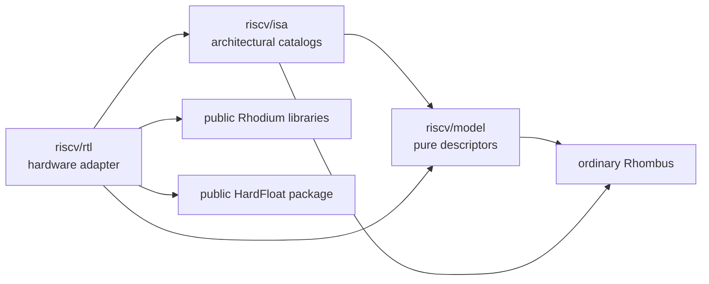
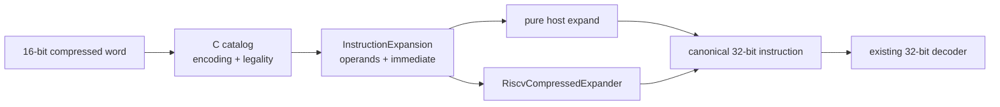

<!-- Defines the pure RISC-V host model, ISA catalogs, and Rhodium adapter boundary. -->

# RISC-V instruction model

`riscv/` describes architectural instruction encodings, decoded fields, and
compact-to-canonical expansion as immutable host data. The pure [`model/`](model/)
and [`isa/`](isa/) packages do not depend on Rhodium. The isolated
[`rtl/`](rtl/README.md) adapter materializes those descriptions as hardware
without moving processor policy into the architectural model.

Contributors extending the model or catalogs should read
[`DEVELOPING.md`](DEVELOPING.md).

## Find what you need

| Task | Start here |
|---|---|
| Define a field, encoding, format, or instruction | [Pure model](#pure-model) |
| Select an integer, floating-point, compressed, or privileged catalog | [ISA catalog map](#isa-catalog-map) |
| Expand a 16-bit C instruction to its canonical 32-bit instruction | [Compressed-instruction expansion](#compressed-instruction-expansion) |
| Turn descriptions into hardware patterns or extracted fields | [RISC-V/Rhodium adapter](rtl/README.md) |
| Build CSR, PMA, Sv39, counter, trap, interrupt, or FP hardware | [Adapter component map](rtl/README.md#component-map) |
| Run the focused package checks | [Validation](#validation) |
| Initialize the architectural test sources | [Architectural tests](#architectural-tests) |

## Dependency boundary

Arrows show allowed import direction. Pure ISA and model code never imports the
adapter, Rhodium, HardFloat, a processor implementation, or backend tooling.



Concrete processors consume these packages but do not define their contracts;
core-specific decode, execution, fetch, pipeline, CSR policy, and retirement
belong under [`../cores/`](../cores/README.md).

## Pure model

[`model/main.rhm`](model/main.rhm) re-exports the complete pure model. Import a
narrow module when only one abstraction is needed:

| Module | Owns |
|---|---|
| [`model/fields.rhm`](model/fields.rhm) | Named `BitField` values, fixed `FieldConstraint`s, extraction, masks, and width checks |
| [`model/encoding.rhm`](model/encoding.rhm) | Width-aware `InstructionEncoding` value/care images and matching, overlap, and subsumption relations |
| [`model/formats.rhm`](model/formats.rhm) | Integer and floating-point register operands, instruction formats, and scattered immediate layouts |
| [`model/instruction.rhm`](model/instruction.rhm) | Validated 32-bit `InstructionSpec` values and disjoint `InstructionCatalog`s |
| [`model/expansion.rhm`](model/expansion.rhm) | Validated compact-source bindings, immediate resizing/scattering, legality constraints, and host expansion |

An `InstructionEncoding` defaults to 32 bits, while the C catalogs use the same
abstraction at 16 bits. Construction rejects fields outside the selected width,
out-of-range values, and conflicting constraints. Encodings are ordinary host
values and support `matches`, `overlaps`, and `subsumes` without elaborating
hardware.

An `InstructionSpec` binds one 32-bit encoding to its operand and immediate
format. Its fixed requirements and variable fields must be disjoint and must
cover all 32 instruction bits. `InstructionSpec.encode` assembles a word from
one constraint for every operand and auxiliary field plus the format-owned
semantic immediate, rejecting missing, duplicate, foreign, misaligned, or
out-of-range values:

```rhombus
ADDI.encode([rd.constrain(11), rs1.constrain(0)], ~immediate: 0)
```

An `InstructionCatalog` requires unique names and pairwise-disjoint encodings.
Architecture-facing `encoding_fields` remain instruction bits, not generated
controls; microarchitectural operations and pipeline classes belong in a
core-owned typed decode relation.

`ImmediateLayout` records each source fragment, destination position, signedness,
and implicit zero bit. `ImmediateLayout.encode` validates a semantic signed or
unsigned value before scattering it into instruction fields, while
`ImmediateLayout.scatter` accepts an already width-masked value for lower-level
uses such as compressed expansion. In particular, five-bit RV32 shift amounts
and six-bit RV64 shift amounts remain distinct. `InstructionExpansion` requires
exactly one binding for every target operand and a correctly sized source or
constant for every target immediate. The same validated expansion can run as
pure host code or be materialized by the Rhodium adapter.

## ISA catalog map

### Base integer and architectural width

| Module | Public catalog or configuration | Coverage |
|---|---|---|
| [`isa/xlen.rhm`](isa/xlen.rhm) | `XLen.X32`, `XLen.X64` | Closed host-side architectural width selection |
| [`isa/integer-common.rhm`](isa/integer-common.rhm) | `RVIntegerCommonInstructions` | 37 immutable encodings shared by RV32I and RV64I |
| [`isa/rv32i.rhm`](isa/rv32i.rhm) | `RV32I` | 40 architectural instructions, RV32I 2.1 |
| [`isa/rv64i.rhm`](isa/rv64i.rhm) | `RV64I` | 52 architectural instructions, RV64I 2.1 over RV32I 2.1 |

Import `rv32i.rhm` or `rv64i.rhm` explicitly; there is no combined namespace
for architecture-specific names. `SLLI`, `SRLI`, and `SRAI` are distinct
objects because RV32 fixes bit 25 while RV64 uses it as the sixth shift bit.
RV64I additionally supplies wider loads, a wider store, and word operations.

Assembler pseudoinstructions and specialized aliases such as `FENCE.TSO`,
`PAUSE`, and `SEXT.W` are deliberately absent because they overlap architectural
encodings.

### Integer extensions

| Module | Public catalogs | Coverage |
|---|---|---|
| [`isa/zmmul.rhm`](isa/zmmul.rhm) | `RV32Zmmul`, `RV64Zmmul` | Multiply-only Zmmul 1.0; RV64 adds `MULW` |
| [`isa/m.rhm`](isa/m.rhm) | `RV32M`, `RV64M` | M 2.0, reusing Zmmul objects and adding divide/remainder operations |
| [`isa/a.rhm`](isa/a.rhm) | `RV32A`, `RV64A` | A 2.1 word and RV64 doubleword LR/SC and AMO encodings with variable `aq`/`rl` |
| [`isa/zba.rhm`](isa/zba.rhm) | `RV32Zba`, `RV64Zba` | Ratified Zba 1.0.0 address generation |
| [`isa/zbb.rhm`](isa/zbb.rhm) | `RV32Zbb`, `RV64Zbb` | Ratified Zbb 1.0.0 basic bit manipulation |
| [`isa/zbs.rhm`](isa/zbs.rhm) | `RV32Zbs`, `RV64Zbs` | Ratified Zbs 1.0.0 single-bit operations |
| [`isa/b.rhm`](isa/b.rhm) | `RV32B`, `RV64B` | Standard B 1.0.0 composition of Zba, Zbb, and Zbs; no Zbc or crypto subsets |
| [`isa/zicond.rhm`](isa/zicond.rhm) | `RV32Zicond`, `RV64Zicond` | Zicond 1.0.0 `CZERO.EQZ` and `CZERO.NEZ` |
| [`isa/zimop.rhm`](isa/zimop.rhm) | `Zimop` | Zimop 1.0's 32 `MOP.R.n` and eight `MOP.RR.n` encodings |
| [`isa/zicsr.rhm`](isa/zicsr.rhm) | `Zicsr` | Six XLEN-independent Zicsr 2.0 encodings |
| [`isa/zifencei.rhm`](isa/zifencei.rhm) | `Zifencei` | XLEN-independent Zifencei 2.0 `FENCE.I` encoding |

These catalogs describe architectural dependencies and encodings only. Atomic
reservation and coherence policy, multiply/divide execution, conditional-mask
datapaths, CSR behavior, and instruction-cache serialization remain processor
responsibilities.

### Compressed instructions

| Module | Public catalogs | Coverage |
|---|---|---|
| [`isa/compressed.rhm`](isa/compressed.rhm) | `CompressedInstructionSpec`, `CompressedInstructionCatalog` | Shared 16-bit encoding, legality, and canonical-expansion descriptors |
| [`isa/zca.rhm`](isa/zca.rhm) | `RV32Zca`, `RV64Zca` | Zca 1.0.0 compressed integer instructions |
| [`isa/zcb.rhm`](isa/zcb.rhm) | `RV32Zcb`, `RV64Zcb`, `zcb_instructions` | Zcb 1.0.0 instructions with target-catalog prerequisite filtering |
| [`isa/zcmop.rhm`](isa/zcmop.rhm) | `Zcmop` | Zcmop 1.0's eight exact compressed MOP encodings and no-effect expansions |
| [`isa/zcf.rhm`](isa/zcf.rhm) | `RV32Zcf` | Zcf 1.0.0 RV32 compressed single-precision loads and stores |
| [`isa/zcd.rhm`](isa/zcd.rhm) | `RV32Zcd`, `RV64Zcd` | Zcd 1.0.0 compressed double-precision loads and stores |
| [`isa/c.rhm`](isa/c.rhm) | `CompressedExtension`, `compressed_extensions`, `compressed_extensions_instructions` | Validates and composes independent C, Zca, Zcb, Zcmop, Zcf, and Zcd selections |

See [Compressed-instruction expansion](#compressed-instruction-expansion) for
the pure descriptor and hardware materialization path.

### Floating point

| Module | Public catalog or configuration | Coverage |
|---|---|---|
| [`isa/fp-profile.rhm`](isa/fp-profile.rhm) | `FloatingPointProfile.None`, `.F`, `.D` | Host specialization; D implies F and selects a 64-bit FP register width |
| [`isa/fp-profile.rhm`](isa/fp-profile.rhm) | `HalfPrecisionProfile.None`, `.Zfhmin`, `.Zfh` | Orthogonal half-precision specialization; Zfh implies Zfhmin and requires F or D |
| [`isa/f.rhm`](isa/f.rhm) | `RV32F`, `RV64F` | Standard F 2.2 instruction encodings |
| [`isa/d.rhm`](isa/d.rhm) | `RV32D`, `RV64D` | D-specific 2.2 instruction encodings, composed with F by a D-profile consumer |
| [`isa/zfhmin.rhm`](isa/zfhmin.rhm) | `RV32Zfhmin`, `RV64Zfhmin` plus D-dependent catalogs | Zfhmin 1.0 move, load/store, and widening/narrowing conversions |
| [`isa/zfh.rhm`](isa/zfh.rhm) | `RV32Zfh`, `RV64Zfh` plus D-dependent catalogs | Full Zfh 1.0 binary16 arithmetic, fused, comparison, classification, and conversion operations |
| [`isa/zfa.rhm`](isa/zfa.rhm) | `ZfaF`, `ZfaD`, `ZfaH`, and `RV32ZfaDMove` | Zfa 1.0 immediate, IEEE min/max, integral-rounding, quiet-comparison, modulo-conversion, and RV32D pair-move encodings |

The profiles are host data so unsupported hardware specializes away rather than
becoming runtime control. The half-precision profile leaves FLEN under the base
F/D profile, and its `None` default adds no half-precision operations.

### Privileged and address-space descriptions

| Module | Owns |
|---|---|
| [`isa/csr.rhm`](isa/csr.rhm) | Closed `CsrId` namespace and canonical 12-bit addresses, including `fflags`/`frm`/`fcsr` aliases |
| [`isa/trap.rhm`](isa/trap.rhm) | Synchronous `ExceptionCause` members, architectural codes, and cause-set masks |
| [`isa/interrupt.rhm`](isa/interrupt.rhm) | Standard supervisor and machine interrupt causes and codes |
| [`isa/privileged.rhm`](isa/privileged.rhm) | Exact `MRET`, `SRET`, `WFI`, and `SFENCE.VMA` encodings |
| [`isa/sv39.rhm`](isa/sv39.rhm) | Pure Sv39 geometry and canonical-address helpers |

Sparse identifiers stay host-side until the [adapter](rtl/README.md) produces a
typed hardware value. Pending interrupt sources, delegation, privilege, CSR
WARL behavior, translation state, and exception selection remain integration
policy.

## Compressed-instruction expansion

[`isa/compressed.rhm`](isa/compressed.rhm) defines the shared compressed
descriptor machinery. The Zca, Zcb, Zcmop, Zcf, and Zcd catalogs retain each 16-bit
encoding, legality constraint, compressed field, immediate layout, operand binding, and canonical
`InstructionSpec` target as pure host data. A `CompressedInstructionCatalog`
checks unique names and nonoverlapping base encodings. Matching additionally
checks constraints such as nonzero registers and immediates, and host `expand`
rejects an illegal or nonmatching word.



[`isa/c.rhm`](isa/c.rhm) represents compressed support as a normalized list of
`CompressedExtension` values. `ZcaCompressedExtensions` and
`CCompressedExtensions` are concise presets, while combinations such as
`compressed_extensions(CompressedExtension.C, CompressedExtension.Zcb)` add
orthogonal subsets without multiplying profile variants. C composes Zca with
Zcf on RV32F and with Zcd when D is present; Zcb requires Zca or C and enables
only instructions whose canonical targets are supported by the downstream
decoder. Zcmop also requires Zca or C and fills the eight legal `C.LUI xn, 0`
holes with no-effect operations; it does not require Zimop. A Zca-only integer configuration can report `misa.C`, but an
FP-capable Zca-only configuration cannot because it omits the FP subset
required by C. Zcb does not affect `misa.C`.
[`rtl/compressed.rhdl`](rtl/compressed.rhdl) materializes the selected pure
composition as combinational hardware. Reserved encodings produce
`valid = #false`; architectural hint encodings remain legal and expand to the
canonical no-effect instruction where the base ISA assigns that behavior. See
the [adapter contract](rtl/README.md#compressed-instruction-expansion) for the
exact profile matrix and output rules.

## Architectural tests

[`riscv-isa-tests/`](riscv-isa-tests/) pins the upstream
[`riscv-tests`](https://github.com/riscv-software-src/riscv-tests) repository.
Initialize it and its test-environment submodule after cloning Rhodium:

```sh
git submodule update --init --recursive riscv/riscv-isa-tests
```

The submodule supplies architectural sources and standard target environments.
Simulator-specific selection, building, and execution belong under
[`../sims/`](../sims/README.md); neither the pure model nor the adapter imports
the test repository.

## Validation

Run the focused model, catalog, adapter, expansion, and package-boundary checks
from the repository root:

```sh
make riscv-test
```

Test ownership, package-boundary enforcement, and the workflow for extending
the model are documented in [`DEVELOPING.md`](DEVELOPING.md#focused-validation).

Executable pattern and field-extraction examples live in
[`../examples/riscv/`](../examples/riscv/).

## Architectural references

The catalogs were checked against the RISC-V International
[RV32I specification](https://docs.riscv.org/reference/isa/unpriv/rv32.html),
[RV64I specification](https://docs.riscv.org/reference/isa/unpriv/rv64.html),
and canonical [`rv_i`](https://github.com/riscv/riscv-opcodes/blob/master/extensions/rv_i)
and [`rv64_i`](https://github.com/riscv/riscv-opcodes/blob/master/extensions/rv64_i)
opcode listings. Zmmul follows the ratified
[multiply-only extension](https://docs.riscv.org/reference/isa/unpriv/m-st-ext.html#_zmmul_extension_version_1_0),
A follows the ratified
[atomic extension](https://docs.riscv.org/reference/isa/unpriv/a-st-ext.html),
B follows the ratified
[bit-manipulation extension](https://docs.riscv.org/reference/isa/unpriv/b-st-ext.html),
Zicond follows the ratified
[integer conditional-operations extension](https://docs.riscv.org/reference/isa/unpriv/zicond.html),
and C follows the ratified
[compressed-instruction extension](https://docs.riscv.org/reference/isa/unpriv/c-st-ext.html).
Zcb follows the ratified
[Zc code-size-reduction specification](https://docs.riscv.org/reference/isa/unpriv/zc.html).
Zfhmin and Zfh follow the ratified
[half-precision floating-point extension](https://github.com/riscv/riscv-isa-manual/blob/main/src/unpriv/zfh.adoc).
Zfa follows the ratified
[additional floating-point extension](https://docs.riscv.org/reference/isa/unpriv/zfa.html).
