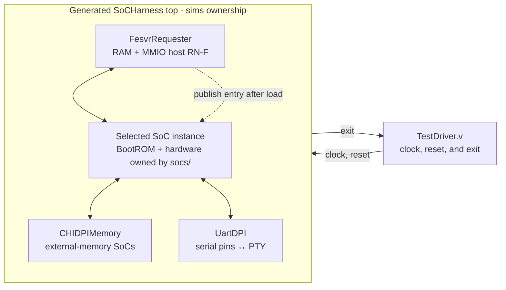

<!-- Documents executable SoC harnesses, host models, and simulator bindings. -->
<!-- SPDX-License-Identifier: Apache-2.0 -->

# Simulation harnesses

This directory turns [`socs/` compositions](../socs/README.md)
into executable simulations. It owns the parameterless generated top, FESVR
transport, Verilator binding, simulation-only memory model, clock/reset driver,
and executable workflows. [Target software](../sw/README.md) owns pinned
sources, ports, patches, and ELF builders. The SoCs continue to own processor, device, CHI,
NoC, and synthesizable-memory structure.

Contributors changing a harness, binding, or build rule should read
[`DEVELOPING.md`](DEVELOPING.md).

## Choose a harness

`SOC=mini|simple|tiled` chooses the topology; `CORE=rv5stage|spike` chooses
the hart implementation; `ISA=rv32int|rv32max|rva23` is required. There is no implicit
ISA. Alternatively pass a complete key such as `SOC=mini-rv5stage-rva23`.
Both forms produce the same canonical artifact identity. `single` remains a
spelling alias for the `simple` shape. Shape and core default to `simple` and
`rv5stage` only when not supplied; ISA must always be explicit.

| `SOC` | Memory supplied by harness | Topology |
| --- | --- | --- |
| `mini` | None; internal 64 KiB `CHIRam` | One hart and a forwarding Home |
| `simple` | One `CHIDPIMemory` | One hart and one inclusive LLC |
| `tiled` | One `CHIDPIMemory` | Eight harts and four LLC slices in the default mesh |

RV5Stage uses the shape-specific profiles described in the [SoC comparison](../socs/README.md#choose-a-system).
All RV64 products request `rva23`, including Mini and Spike. Spike remains
simulation-only and executes that exact selected architecture. Its broad
ACT/UDB projection preserves the requested ISA; simulator execution and successful
configuration generation do not imply full ACT qualification. See the
[Spike reference-model limits](../cores/spike/README.md). No narrower fallback is selected.
The two core choices do not add a runtime mux to the RTL.

Mini supports `rv32int` and `rv32max` on both Spike and RV5Stage.
The `smoke`, `boot-test`, `host-mmio-test`, and `uart-pty-test` payloads select
ELF32/ILP32 for both ISAs. Both smoke variants exercise integer vectors and
Zvbb with VLEN64. RV32Max additionally exercises scalar F and Zve32f;
RV32Int has no floating point. For example:

```sh
make -C sims smoke SOC=mini-spike-rv32max
make -C sims smoke SOC=mini-rv5stage-rv32max
make -C sims smoke SOC=mini-spike-rv32max HTIF_ARGS=+load-through-chi
make -C sims boot-test host-mmio-test uart-pty-test SOC=mini-spike-rv32max
```

Substitute `rv32int` to run the integer-only preset. This is bounded platform
and vector bring-up, not ACT qualification. All four Mini RV32 bindings run
smoke, boot, host MMIO, UART PTY, and capability-filtered ISA smoke in CI.

Simple also accepts all four RV32 bindings with its inclusive LLC and 1-GiB
external memory. Qualify the platform and complete applicable native ISA
inventory through the same FESVR path:

```sh
make -C sims smoke boot-test host-mmio-test uart-pty-test SOC=simple CORE=rv5stage ISA=rv32max
make -C sims smoke boot-test host-mmio-test uart-pty-test SOC=simple CORE=spike ISA=rv32max
make -C sims isa-test SOC=simple CORE=rv5stage ISA=rv32max
make -C sims isa-test SOC=simple CORE=spike ISA=rv32max
```

Both cores and both RV32 presets are selected in CI with platform tests, the full
applicable native ISA inventory, and ACT. They use Bare translation and
VLEN64/ELEN32. Native FP tests are selected for RV32Max only. The existing
RV64-only benchmark ports are not selected for RV32.

The host emitters require an explicit third architectural selector:

```sh
tools/run-racket.sh -S "$PWD" sims/program-test/write-target.rhm simple rv5stage rva23 /tmp/simple-target.json
```

Run this command from the repository root. The same three selectors are
accepted by `emit-soc-harness.rhm`; it emits MLIR to standard output.
Both use the [shared product resolver](../socs/README.md#typed-product-selection).
The [paired-product inventory](test-products.rhm) describes the ten test
products. Workload selection depends on shape and ISA, not core implementation.
Make, software targets, simulator
attestations, and ACT configurations include ISA in their product keys.
Setup and product-independent adapter tests do not require an ISA.

## Ownership and execution boundary

The stack follows a Chipyard-like boundary:



`TestDriver.v` generates clock and reset and observes the harness exit status.
The emitter specializes one shared single-core harness for RV5Stage or Spike.
It instantiates the FESVR requester and connects it to the selected SoC's
common `SoCHostInterface`. Mini and Tiled retain shape-specific harness circuits.
Each harness connects its SoC's UART TX and RX pins to
the device-owned `UartDPI` PTY model. The UART interrupt remains connected to
the SoC's PLIC. The Single and Tiled harnesses each instantiate one
`CHIDPIMemory` on their external normal-memory boundary. The
SoC composition layer adds no DPI calls or simulator harness policy; the
simulation-only Spike core itself owns its typed DPI execution boundary.

The directory owns:

- [`fesvr/`](fesvr/): the simulator-independent direct-memory FESVR transport
  and its Rhodium CHI requester.
- [`verilator/`](verilator/): the Verilator VPI/DPI binding.
- [`tests/`](tests/): independent structural checks for FESVR and each system
  harness, plus the executable smoke payload.

## Build a simulator

Install the pinned FESVR dependency once, then build any system-specific
simulator:

```sh
make -C sims setup
make -C sims simulator SOC=single CORE=rv5stage ISA=rva23
make -C sims simulator SOC=single CORE=spike ISA=rva23
make -C sims simulator SOC=mini CORE=spike ISA=rva23
make -C sims simulator SOC=tiled CORE=rv5stage ISA=rva23
```

CI uses fourteen canonical product names: `mini-rv5stage-rv32int`, `mini-spike-rv32int`,
`mini-rv5stage-rv32max`, `mini-spike-rv32max`,
`mini-rv5stage-rva23`, `mini-spike-rva23`,
`simple-rv5stage-rv32int`, `simple-spike-rv32int`,
`simple-rv5stage-rv32max`, `simple-spike-rv32max`,
`simple-rv5stage-rva23`, `simple-spike-rva23`, `tiled-rv5stage-rva23`, and
`tiled-spike-rva23`. Each has its own target descriptor, simulator attestation,
and build directory. The `SOC`/`CORE` selectors above remain available locally;
all artifact identities include the explicit ISA for software and ACT consumers.

Setup requires Python 3.9+, initializes the shared
[`riscv-isa-sim`](../riscv/riscv-isa-sim/) submodule, applies Rhodium's
adjacent ordered patch series to a temporary source tree, and installs FESVR
and the Spike libraries under `.tools/`. RHEG uses the same gitlink and patch series for
instruction disassembly; neither consumer modifies the submodule checkout.

The Single and Tiled harnesses attach `CHIDPIMemory` to their external SN-F
channels. Mini instead contains synthesizable `CHIRam`. Each product has an
independent artifact at `/tmp/rhodium-sims/<product>/obj/VTestDriver`, so
switching configurations cannot reuse generated RTL for the other SoC. The
shared Verilator `TestDriver` exposes only clock, reset, and exit; UART traffic
crosses the PTY inside the harness. Set
`BUILD_ROOT` when a different artifact root is required. Building a simulator
does not require or embed a target program.

The Makefile passes `SOC` and `CORE` to the host-side emitter. The emitter
selects one hart binding and elaborates it inside the chosen shape's harness.
Test specializations may still provide a harness module path. Every selection emits the
same parameterless `SoCHarness` Verilog top contract, allowing `TestDriver.v`
to remain shared. There is no runtime variant enum or hardware selector.

## Run OpenSBI

Initialize the pinned OpenSBI source and build generic `FW_JUMP` firmware for
either single-core SoC:

```sh
make -C sims opensbi-setup
make -C sims opensbi-firmware SOC=single CORE=rv5stage ISA=rva23
make -C sims opensbi-firmware SOC=single CORE=spike ISA=rva23
```

The build derives the firmware, next-stage, and writable FDT addresses from the
same target description as the simulator. It derives an OpenSBI-only DTB from
the canonical SoC description and adds the simulator's `ucb,htif0` reset
endpoint. FW_JUMP embeds that DTB, relocates it to RAM using
`FW_JUMP_FDT_ADDR`, and passes the relocated address to S-mode. The
synthesizable SoC and its BootROM retain their hardware-only DTB. Generated
firmware, the derived DTB, and layout metadata are under
`/tmp/rhodium-software/<soc>/opensbi/`.
OpenSBI requires a linker capable of producing RISC-V PIEs. When the selected
GNU cross-linker lacks that support, select a complete LLVM installation with
`OPENSBI_LLVM=/path/to/llvm/bin`.

Run a caller-provided S-mode ELF linked at the `next_stage_address` recorded in
`layout.json`:

```sh
make -C sims opensbi-run SOC=simple-rv5stage-rva23 \
  NEXT_STAGE=/absolute/path/to/next-stage.elf
```

FESVR loads the next-stage ELF with its existing auxiliary-payload facility
and boots from `fw_jump.elf`. OpenSBI owns the firmware's `tohost` and
`fromhost`; an S-mode next stage terminates through SBI system reset rather
than defining a second HTIF mailbox. OpenSBI itself contains no embedded
application. The repository's tiny S-mode SBI qualification image is available
only through:

```sh
make -C sims opensbi-test SOC=single CORE=rv5stage ISA=rva23
make -C sims opensbi-test SOC=single CORE=spike ISA=rva23
```

The initial qualification requires one bootable RV64 hart, IMA,
Zicsr/Zifencei/Zicntr, and enough writable RAM for the firmware, a 2 MiB-aligned
next stage, and a 64 KiB FDT reservation. Other cores and SoCs are selected by
those capabilities rather than by core name.

## Use the UART terminal

Every harness creates UART DPI model 0 and prints `UART DPI model 0 PTY: <path>`
to stderr on startup. Open that slave path in a terminal client while the
simulator is running. The PTY is raw and byte-transparent, independent of the
FESVR console; firmware accesses the actual UART MMIO registers and serial pins.
The path is process-local and goes away when the simulator exits.

Each `SoCHarness` accepts an elaboration parameter `uart_oversample_divisor`
(1–65535, default 1). Program the same divisor into the target UART; reset
divisor zero also behaves as one. At the configured SoC clock frequency,
the serial bit rate is `clock_frequency_hz / (16 * divisor)`. Terminal-client
baud settings do not change this simulated timing. A different divisor requires
specializing the harness's exported design and rebuilding; there is no runtime
baud autodetection. Framing is 8-N-1. PTY input is queued across reset.

This does not add a BootROM console or select `/chosen/stdout-path`. A target
must configure and use its UART. The driver's cycle limit still applies, so
set `HTIF_ARGS=+max-cycles=...` appropriately for interactive programs.

Test all byte values through a real external PTY client with:

```sh
make -C sims uart-pty-test SOC=mini CORE=rv5stage ISA=rva23
make -C sims uart-pty-test SOC=single CORE=rv5stage ISA=rva23
make -C sims uart-pty-test SOC=tiled CORE=rv5stage ISA=rva23
```

## Export RV5Stage SoC events to Perfetto

Expanded end-to-end ancestry is still under integration. See the current
[SingleCoreRV5StageSoC tracing limit](../chi/home/README.md#inclusive-home-event-tracing)
before attempting a new traced build.

The harness uses [partial tracing](../rhodium/event/README.md): supported Flow
paths retain their edges while opaque boundaries are reported as ancestry gaps.
Affected occurrences carry `ancestry_unknown` in Perfetto; they are not silently
treated as independent roots. Invalid contracts and unsafe lineage structures
still reject the build.

Tracing is opt-in on the normal simulator and run targets. It supports
`SOC=single CORE=rv5stage ISA=rva23` and `SOC=tiled CORE=rv5stage ISA=rva23`:

```sh
make -C sims smoke SOC=single CORE=rv5stage ISA=rva23 TRACE=1 TRACE_FILE=/tmp/single-core-rv5stage-soc.pftrace
make -C sims run SOC=single CORE=rv5stage ISA=rva23 TRACE=1 TRACE_FILE=/tmp/program.pftrace BINARY=/absolute/path/to/program.elf
make -C sims run SOC=single CORE=rv5stage ISA=rva23 TRACE=1 TRACE_FILE=/tmp/program.pftrace.gz BINARY=/absolute/path/to/program.elf
make -C sims run SOC=tiled CORE=rv5stage ISA=rva23 TRACE=1 TRACE_FILE=/tmp/tiled.pftrace.gz \
  BINARY=/absolute/path/to/multihart.elf \
  HTIF_ARGS='+boot-harts=0,1 +permissive +max-cycles=2000000 +permissive-off'
```

Choose a fresh trace path: the exporter overwrites the selected output file.
Open the resulting `.pftrace` in Perfetto. Traced builds live in
`/tmp/rhodium-sims/<soc>-rv5stage-<isa>-trace/`, separate from ordinary builds. The
trace flag instruments the same selected SoC elaboration used by `TRACE=0`;
it does not select a different hardware configuration. `TRACE=0`
(the default) neither instruments RTL nor links the optional exporter.
Direct invocation of a traced binary requires `+rheg-trace=/absolute/path`.
The same binary can run different target programs and trace destinations.
Optionally set `RHEG_PERFETTO_TRACKS=/absolute/path/to/vector-tracks.json`
when running the traced binary or `make ... TRACE=1`. The binding passes the
[shared-track configuration](../rheg/README.md#shared-tracks)
to the common exporter; it never infers grouping from labels. Use exact site IDs
from that build's descriptor. This combines mutually exclusive mode sites without
changing RTL or lineage; changes to the configuration need no simulator rebuild.
Existing simulator binaries must first be rebuilt with this binding version.
Choose a filename ending in `.gz` to enable streaming gzip compression in the
C++ exporter; other names retain raw protobuf output. Open the completed gzip
file directly in Perfetto. Compression preserves all events, fields, and edges.
Unlike raw traces, gzip files require finalization before native import; normal
exit and timeout both finalize them, but abrupt termination can leave a truncated file.

Four checkpoints observe real external-memory request and response handshakes:
`memory-request` to `memory-accept`, and `memory-response` to `soc-response`.
Each pair describes the same transfer across a transparent harness wire, so its
inferred edge has zero latency and preserves the payload. External SN data
channels remain untraced. Available Flow contracts also infer
`memory-accept` to `memory-response` dependencies, but do not cover every
controller response branch or identify the originating instructions.
Unmodeled request and response branches report unknown ancestry; their
downstream wire-pair edges remain known.

The host access engine retains each accepted FESVR command as the owner of all
generated CHI request fragments and write-data transfers until the final host
response is accepted, including errors. It emits no host checkpoints. Without
a caller-supplied checkpoint at the opaque DPI boundary, host-originated ancestry is
unknown in partial tracing; instruction-originated ancestry remains independent.

The trace also includes the frontend's S0 → S1 → S2 and core's Decode → Execute → Memory
→ WB stage events. See the [core tracing contract](../cores/rv5stage/README.md#pipeline-event-tracing)
for transfer predicates, squash behavior, payloads, and the distinction between
WB arrival and retirement. These pipeline events inherit accepted S0 occurrences through
the buffered packet/parcel assembly path. Scalar and vector lookups converge on
the cache-owned `dcache/s1.access` track; caller capture is separately visible as
`dcache/s2.resp` or `vector/memory.result`. Dependencies follow modeled
arbitration, translation, and storage; unsupported paths retain explicit ancestry gaps.
The `dcache/s1.tags` and `dcache/s1.memory` tracks show actual tag/data SRAM
port requests one cycle before their synchronous responses, including the
winning snoop, refill, or store-service owner when a core lookup replays.

It also includes the [private-cache outer CHI channels](../cores/rv5stage/README.md#private-cache-outer-traffic)
as `icache/chi.*` and `dcache/chi.*` labels, including request, response, refill-data,
writeback-data, and snoop transfers. These use compact named control fields,
not full cache-line payloads. Transaction ancestry follows declared Flow/storage
contracts, never matching transaction IDs or addresses.

Slash-separated annotations form collapsible groups: `core/s2.decode` appears as
`s2.decode` under `core`, and `dcache/chi.txreq` as `chi.txreq` under `dcache`.
Dots preserve ordering within a group rather than creating additional nesting.
The complete label is retained in each event track's static description for queries.

The trace uses the SoC's configured frequency (currently 100 MHz for SingleCoreRV5StageSoC),
not the testbench delay or timer timebase. Tracks identify stages; instruction
slices show mnemonics, with full assembly in their arguments. See the
[RHEG display contract](../rheg/README.md#perfetto-display-and-queries) for timing,
metadata, and SQL queries. Only the initial reset epoch is supported by this
driver. Exit and timeout flush the final settled cycle. A timeout returns failure
but leaves an importable prefix; output after an export/I/O failure is incomplete.

The optional build requires Make and the [RHEG exporter dependencies](../rheg/README.md#streaming-to-perfetto).
That guide also lists the offline source-tree variables for JSON and the Spike
disassembler. Set `BUILD_JOBS` to bound native compilation (default 4).

## Run a target

Run any FESVR-compatible target binary through an already-built simulator:

```sh
make -C sims run SOC=single CORE=rv5stage ISA=rva23 BINARY=/absolute/path/to/program.elf
make -C sims run SOC=mini CORE=rv5stage ISA=rva23 BINARY=/absolute/path/to/program.elf
make -C sims run SOC=tiled CORE=rv5stage ISA=rva23 BINARY=/absolute/path/to/program.elf
```

`HTIF_ARGS` places optional FESVR host arguments before the target binary, and
`TARGET_ARGS` places arguments after it. The simulator passes this process
argument vector through VPI to `DirectMemoryHtif`. FESVR owns ELF parsing,
segment loading, entry-point discovery, `tohost`/`fromhost` polling, and exit
status; the Makefile and RTL do not implement a separate binary loader.
The Verilator binding removes the simulator-owned `+rheg-trace=`,
`+max-cycles=`, and `+load-through-chi` options before passing arguments to FESVR.

SingleCoreRV5StageSoC and TiledSoC DPI RAMs register their native backing stores during
clocked reset, before FESVR starts. Each instance's existing hardware identity
and configuration supply its physical window; no separate memory-map declaration
is needed. FESVR reads,
writes, and clears in that physical window access the same native byte store
as CHI, in chunks up to 64 KiB. Other ranges, including MMIO, retain normal
target transactions; accesses crossing a registration boundary are split.
Use `HTIF_ARGS=+load-through-chi` to load entirely through the target transport.
MiniRV5StageSoC has no registered native RAM and uses target transactions.

This is a cold-boot optimization, not a coherent runtime debug interface.
The cores must remain in the boot ROM without accessing registered RAM until
the entry is published. Fast access closes before publication; runtime HTIF,
including signatures and mailboxes in dirty cache lines, always uses CHI.
Warm reloads and concurrent native memory access are not supported by this path.

After ELF loading completes, the C++ transport writes `1` to the ACLINT MSIP
register of each selected hart at the fixed `0x02000000` ACLINT base, waking
nonzero harts before hart zero while the shared entry remains zero. It then
writes the reported entry point to the SoC's configured 64-bit boot-address
register through the ordinary memory request path. The harness supplies that
address through DPI from its SoC configuration. Normal HTIF polling starts only
after every blocking write completes; hardware contains no host-only boot
sequencer or entry handshake. Every hart starts at the ROM reset address and
waits in `WFI`; a selected hart wakes, polls the shared entry until publication,
clears its own MSIP, and jumps with `a0 = mhartid` and `a1 = embedded DTB address`. Changing
binaries or the selected hart set does not require rebuilding RTL. Zero entries
and ELF loading writes overlapping the boot register are
rejected. Publishing the entry last provides one release point after all selected
harts have received their wakeup. Startup errors report a nonzero exit.

The simulator option `+boot-harts=` selects explicit decimal hart IDs. It
accepts comma-separated IDs and inclusive ascending ranges, for example
`+boot-harts=0`, `+boot-harts=0-7`, or `+boot-harts=0,2,4-7`. Omission selects
hart zero. Empty items, descending ranges, duplicates, multiple options, and
IDs outside the ACLINT MSWI architectural limit are rejected. There is no
`all` spelling: explicit IDs keep topology out of the DPI ABI. Program-target
descriptors publish their implemented `harts` list so suite runners can choose
a valid selection.

Outside registered initial-image ranges, `DirectMemoryHtif` presents FESVR's abstract memory chunks as one-outstanding,
one-to-eight-byte transactions with 64-bit addresses and data. It never widens
device reads or synthesizes read-modify-write for narrow writes. Target XLEN
may be 32 or 64. `FesvrRequester` uses the SoC's physical map and Home service
descriptions to select coherent `ReadClean`/`WriteUniquePtl` for cacheable RAM
or `ReadNoSnp`/`WriteNoSnpPtl` for non-cacheable regions. RAM chunks may be
fragmented into aligned transfers; MMIO must be an exact, aligned, supported
1/2/4/8-byte access. Unmapped, forbidden, or unsupported accesses fail before
device traffic is issued. Target and protocol errors stop FESVR with failure.

The requester retains no cache lines and reports Invalid for every snoop.
Runtime `tohost`/`fromhost` polling and signature reads observe dirty RV5Stage cache
lines without reserving a special mailbox address range. The same endpoint
can access platform devices, including the boot-address register and UART.

## SoC software suites

Run the complete profile-selected upstream ISA suite, benchmarks, both CoreMark
variants, Embench-IoT, a Bringup-Bench smoke, configuration-exact ACT, and OpenSBI qualification on
both single-core SoCs:

```sh
make -C sims program-test-setup
make -C sims opensbi-setup
make -C sims single-core-software-test ISA=rva23
```

`SOFTWARE_SOC` defaults to `simple` and `SOFTWARE_CORE` defaults to
`rv5stage spike`; set `SOFTWARE_CORE=rv5stage` or `SOFTWARE_CORE=spike` to
select one implementation. The aggregate target requires the ACT dependencies
described below. The individual
`isa-test`, `benchmark-test`, `coremark-test`, `coremark_scalar-test`,
`embench-test`, and `bringup-test` targets accept either single-core SoC and
remain available for focused execution. CI schedules five complete native
suites, a bounded Bringup-Bench smoke, and ACT independently for Spike and RV5Stage;
it also qualifies OpenSBI on both. Each ACT lane uses its own UDB projection and
generated test inventory.

The full ISA adapter selects upstream physical-environment tests from the
concrete target profile. Both Simple RVA23 implementations select RV64
I/M/A/F/D/C, Zba/Zbb/Zbs/Zicond, and Zicboz groups.
For a target advertising Sv39 and M/S/U modes, it also selects each applicable
group's upstream `-v-` virtual-environment tests. Here `-v-` means virtual
memory, not the RISC-V vector extension. Both environments omit `ma_data`,
which requires successful misaligned data accesses rather than these cores'
traps. Privileged-platform groups remain outside this ISA adapter; ACT keeps
its own independent selection and limitations. The adapter consumes upstream
Makefrag inventories, so additions to selected groups are included automatically.

Run the smaller, single-hart ISA selections on either core in Mini or Tiled:

```sh
make -C sims program-test-setup
make -C sims isa-smoke SOC=mini CORE=rv5stage ISA=rv32max
make -C sims isa-smoke SOC=mini CORE=rv5stage ISA=rva23
make -C sims isa-smoke SOC=mini CORE=spike ISA=rva23
make -C sims isa-smoke SOC=tiled CORE=rv5stage ISA=rva23
make -C sims isa-smoke SOC=tiled CORE=spike ISA=rva23
```

Run the target-capability-filtered upstream multihart benchmarks in two-,
four-, and eight-hart configurations on either Tiled product:

```sh
make -C sims tiled-mt-benchmark-test SOC=tiled-rv5stage-rva23
make -C sims tiled-mt-benchmark-test SOC=tiled-spike-rva23
```

Each command is independently runnable. CI gives each product its own job, so
one slow or failing Tiled run cannot suppress another product's result.
Both Tiled cores run the same multihart manifests in CI. Slow runs remain
visible as timeouts, not as core-specific exclusions.

Selection follows each concrete SoC's core profile and covers representative
integer arithmetic, branches, loads/stores, multiply/divide, atomics, bit
operations, conditional zeroing, and cache zeroing where an upstream group exists.
Compressed profiles also run the compressed-instruction test. ISA groups and
word-sized smoke operations follow target XLEN. The pinned upstream has no RV32
CBO-zero group; manifests record this coverage gap. Every selected ELF must fit the
actual RAM window, including zero-filled BSS; oversized tests fail preparation
rather than being silently skipped. Physical assembly tests use no
runtime-allocated stack; virtual-environment tests bring their own upstream
page-table, stack, and trap runtime. The complete and smoke ISA selections both bind their
manifests to the generated target description and require a matching simulator
attestation. Smoke results and target descriptions live under
`$PROGRAM_BUILD_ROOT/<product>/isa-smoke/`, independently of the full single-core
suites. The existing runner executes every selected test even after failures.
ISA smoke still boots only hart 0. The separate tiled multihart selection builds
each workload for two, four, and eight workers and boots harts 0–1, 0–3,
or 0–7 for the workloads selected by the target's extensions. Any remaining physical
harts stay parked. These counts divide the upstream matrix benchmark's 16 rows
evenly while exercising shared barriers and data through the coherent mesh.
The private build overlay reports a successful HTIF exit only after every
selected hart reaches its exit; a nonzero exit from any hart fails the run.
ACT and the complete native suites remain restricted to the two single-core
SoCs.

Run the same model-checked litmus7 path in either eight-hart tiled composition.
Smoke selects a fixed nine-case subset for CI; full selects every case supported
by the target's ISA and hart count (3,443 at the current upstream pin). Each
case boots only the two to four harts it needs:

```sh
make -C sims litmus-setup
make -C sims litmus-smoke-test SOC=tiled CORE=rv5stage ISA=rva23 \
  LITMUS7=/path/to/litmus7 LITMUS7_LIBDIR=/path/to/herdtools7/litmus/libdir
make -C sims litmus-smoke-test SOC=tiled CORE=spike ISA=rva23 \
  LITMUS7=/path/to/litmus7 LITMUS7_LIBDIR=/path/to/herdtools7/litmus/libdir
make -C sims litmus-full-test SOC=tiled CORE=rv5stage ISA=rva23 \
  LITMUS7=/path/to/litmus7 LITMUS7_LIBDIR=/path/to/herdtools7/litmus/libdir \
  LITMUS_FULL_SHARD_INDEX=0 LITMUS_FULL_SHARD_COUNT=8
make -C sims litmus-full-test SOC=tiled CORE=spike ISA=rva23 \
  LITMUS7=/path/to/litmus7 LITMUS7_LIBDIR=/path/to/herdtools7/litmus/libdir \
  LITMUS_FULL_SHARD_INDEX=0 LITMUS_FULL_SHARD_COUNT=8
```

The builder consumes the generated target descriptor, emits separate ELFs and
a target-bound manifest under `$PROGRAM_BUILD_ROOT/tiled-<core>/litmus-smoke/`
or `litmus-full/`, and checks reported histograms against the pinned upstream
Herd RVWMO result log. `LITMUS_SMOKE_RUNS` and `LITMUS_FULL_RUNS` each default
to one sample per case; increase them when the extra simulated time is useful.
The explicit `LITMUS7` executable is required. CI builds herdtools7 from
commit `7a64d9d8480ae02d9065b2778b4f2d473c6595ae`; local runs should use
the same revision for comparable results. No tool is downloaded by the Make
targets. The full profile is manual only; CI runs smoke for both cores.

For parallel full execution, run `litmus-full-elfs` once, then invoke
`litmus-full-run` for shard indexes `0` through `LITMUS_FULL_SHARD_COUNT-1`
with the same count and different indexes; `litmus-full-test` combines the
build with one shard run. After all shards finish, run
`make -C sims litmus-full-report SOC=tiled CORE=<core>
LITMUS_FULL_SHARD_COUNT=8`; it fails if any shard is missing, mismatched, or
contains a failure. Shards partition the entire supported inventory.
Each shard writes atomic `results.json` checkpoints under
`litmus-full/results/shard-<index>-of-<count>/`; rerunning an interrupted shard
resumes completed cases only when the manifest, simulator, and run limits are
identical. Use a new `PROGRAM_BUILD_ROOT` after changing any of those inputs.
The result distinguishes build failures, model-forbidden observations, cycle
limits, and wall-timeouts. A partial checkpoint has `complete: false` and a
nonempty `pending` list; only complete shards count toward full coverage.
No forbidden observation is a bounded test result, not a proof of memory-model
compliance or of observing every allowed outcome.

The previous branch-free 84-case adapter remains available separately for
adapter debugging and explicit subsets:

```sh
make -C sims litmus-test SOC=tiled CORE=spike ISA=rva23 LITMUS_CASES=MP,LB+ctrls
```

Scalar benchmarks are `median`, `qsort`, `rsort`, `towers`, `vvadd`, `memcpy`,
`multiply`, `mm`, `dhrystone`, and `spmv`. Target-native builds also select the
upstream `vec-memcpy`, `vec-daxpy`, `vec-sgemm`, and `vec-strcmp` workloads when
the concrete SoC advertises V. Their GNU `-march` and `-mabi` options are derived
from the exact core profile. This mode lets the compiler use every extension
that the concrete system advertises; it does not imply that every benchmark
contains an instruction from every extension. Use `BENCHMARK_MODE=baseline` to
reproduce the former `rv64imafdc_zicsr_zifencei`/`lp64d` compiler target for
historical comparisons.
Baseline mode selects only scalar workloads. The upstream PMP benchmark
requires capabilities outside this platform.
These are compatibility selections, not a list of tests proven to pass. Any
selected workload failure fails its suite; there are no expected-failure masks.

`coremark-test` builds the pristine pinned EEMBC sources for the concrete RV64
target and produces one `coremark.riscv` using the standard performance seeds.
It defaults to one iteration and requires the known list, matrix, and state
CRCs. CoreMark reports that this is shorter than its scoring duration; that is
expected because this is a functional simulation workload, not a performance
score. Override `COREMARK_ITERATIONS` to exercise a longer run. The port reads
`mcycle`; its ticks-per-second, ISA flags, ABI, and RAM linker window come from
the concrete SoC target descriptor. The upstream benchmark sources remain
unmodified in the submodule.

`coremark_scalar-test` uses the same upstream sources, 32-bit types, seeds, and
CRC requirements, but compiles with GCC auto-vectorization disabled via
`-fno-tree-vectorize`. It produces a separate `coremark_scalar.riscv` and
manifest. Both variants run in CI and use separate build caches and results.
Use `coremark_scalar-elf` to build without running the simulator. Compare their
instruction reports to isolate the effect of auto-vectorization; neither
one-iteration functional run is a CoreMark score.

`embench-test` builds all 19 workloads from the recorded upstream Embench-IoT
development-tree revision for the concrete RV64 target. Each executable uses
the upstream lifecycle and result-verification path, then returns that result
through HTIF without adding an output stream. The default `EMBENCH_SCALE=1`
and `EMBENCH_LOCAL_SCALE=1` run each kernel once, while
`EMBENCH_WARMUP_HEAT=0` disables performance warmup. The adapter materializes
build-only source copies with that local scale and records every upstream local
scale in the manifest; the submodule remains unmodified. The functional
`xgboost` profile evaluates ten deterministic samples, one with each expected
class. It includes one expected model miss and requires the pinned model's
exact 9-correct result. This replaces the upstream scale-one verifier's vacuous
zero threshold while keeping RTL simulation bounded. The manifest records the
sample indices and expected count. This is a functional simulation suite, not
a standards-conforming Embench performance score. Score publication
additionally requires the unmodified upstream sample set, scale, warmup,
timing, normalization, and reporting methodology.

`bringup-test` builds the pinned Bringup-Bench inventory for the concrete RV64
target, one bounded ELF per workload. The pinned submodule remains pristine; the
ordered [Bringup-Bench patch series](../sw/bringup-bench-patches/) is
applied to a build-local copy and participates in the ELF cache key. Its
bare-metal port hashes all `libtarg_putc`
output and checks its expected hash before writing the ordinary
HTIF completion word; a normal return from `main` without `libmin_success`
fails. The default includes every benchmark in upstream `BMARKS`; a build or
runtime failure is not an exclusion. For a short local port check, set
`BRINGUP_BENCHMARKS=bubble-sort,blake2b,fft-int` with `bringup-test`, or use
`bringup-elfs` to build without execution. The manifest records the full
upstream count, exact selection, expected hashes, target fingerprint, and ELF
metadata. CI and `single-core-software-test` select eight names from this same
suite for routine SoC execution; an explicit unselected `bringup-test` attempts
all 108 and reports any failures or timeouts.
The expensive workloads use patched, bounded input sizes and their own pinned
output hashes; unchanged workloads retain upstream references. For example,
checkers performs one depth-two search, LZ77 compresses and decompresses 256
bytes once, pi-calc generates 100 digits, and rho-factor samples 4- through
8-bit inputs. These are functional integration tests, not equivalent benchmark
scores or substitutes for running the original upstream workloads.

Use a bare-metal compiler with C headers and `libm`, not only an assembler.
CI installs a checksum-pinned GCC/Newlib release via
`bash tools/install-riscv-toolchain.sh` (x86-64 Linux); local builds accept
`RISCV_CC=/path/to/riscv64-unknown-elf-gcc`.

`PROGRAM_BUILD_ROOT` defaults to `/tmp/rhodium-program-tests`; each suite
writes beneath `<soc>-<core>/`, so parallel products cannot reuse one another's
ELFs or results. Each suite writes
a manifest, build log, per-test execution logs, `results.json`, and `junit.xml`.
Benchmark builds also write `instruction-report.json`, with executable
instruction counts, compressed counts, unknown-decoding counts, and canonical
mnemonic frequencies from no-alias disassembly. Their manifest records the
concrete target and its fingerprint, exact compiler options, normalized ELF ISA
attributes, source/compiler provenance, exclusions, and ELF checksums. The
runner rejects a target-bound manifest unless the simulator attests the same
profile fingerprint.
The runner requires confirmed HTIF success and executes the entire manifest,
including tests following a failure. Empty selections and missing/modified ELFs
are errors. Results include exact simulator commands for reruns.

CI attaches each completed ISA, benchmark, CoreMark, Embench-IoT, and
Mini/Tiled ISA-smoke workload as a compressed archive alongside its results.
Each archive contains `manifest.json` and every selected ELF at the manifest's
relative path, including ISA binaries without a filename extension. Extract an
archive to an empty directory to replay the exact CI-built binaries with a
matching simulator; the runner checks their manifest SHA-256 digests. The
simulation job separately publishes its hand-written smoke ELFs, and ACT
publishes its generated ELF archive.

`PROGRAM_JOBS` defaults to one; `PROGRAM_TIMEOUT` defaults to 300 seconds per ELF.
`PROGRAM_MAX_CYCLES` defaults to ten million; benchmarks, CoreMark, and
Embench-IoT use 100 million. These are safety budgets, including loading,
not measured performance requirements. Override `BENCHMARK_MAX_CYCLES`,
`COREMARK_MAX_CYCLES`, or `EMBENCH_MAX_CYCLES` when diagnosing timeouts.
Benchmark CI checks correctness, never exact cycle counts.

CI selects ISA tests, benchmarks, both CoreMark variants, Embench-IoT, and ACT on pull requests and
pushes to `main`; manual dispatch selects all six. The native suites consume
each core's exact-commit executable, with the matching patched Spike runtime
where needed. ACT generates one profile-specific ELF inventory for each single-core
SoC, then partitions each across four execution jobs consuming that SoC's
exact-commit executable. Spike shards restore the producer's pinned libraries.
ISA/benchmark/CoreMark/Embench-IoT binaries and ACT reference products are cached by their
build inputs, but results are always rerun. Full Linux suite validation remains
necessary before treating these new lanes as required branch-protection checks.
CI also runs the focused two-, four-, and eight-hart benchmarks on both Tiled cores.

## Architectural certification tests

The ACT4 integration selects suites from the configured core's UDB description.
It uses the [generated UDB catalog](../socs/README.md#risc-v-udb-configuration-catalog)
to select the DUT architecture and Sail to compute expected results. Install
Python 3.10+, Ruby 3.2+ with Bundler, and GCC 15+ with Binutils 2.44+ first:

```sh
make -C sims arch-test-setup
make -C sims arch-test SOC=simple-rv5stage-rva23
make -C sims arch-test SOC=simple-spike-rva23
make -C sims arch-test SOC=simple-rv5stage-rv32max
make -C sims arch-test SOC=simple-spike-rv32max
```

Spike ACT retains the full selected ISA and reports known Sail reference-model
differences without filtering affected tests; see the [Spike guide](../cores/spike/README.md).

Set `PYTHON=/path/to/python3` for setup if the default Python is too old. Setup
initializes the pinned `sw/riscv-arch-test` submodule, installs Python and
Ruby dependencies under `.tools/`, and downloads checksum-verified Sail 0.14.1
for Apple Silicon macOS or x86-64/AArch64 Linux. Normal simulator dependencies
are still required; see [Build a simulator](#build-a-simulator).
On Apple Silicon it also installs native Z3 5.0.0 in the local UDB cache,
working around the pinned UDB installer's Linux-only library download.

`arch-test-config` only prepares and validates the Sail/platform files.
The selected product supplies its core-specific UDB and a generated
`platform.json`; RAM bounds and the entry point come from the shared SoC
description, not per-core Make files. Both cores use the same platform policy
for a given shape and ISA, while reference expectations retain implementation
choices such as writable CSRs and ASID width. ACT currently supports the
Simple shape. Configuration and ELF outputs remain keyed by the full product.
`arch-test-source` copies the clean pinned ACT checkout into the build root and
applies Rhodium's adjacent
[`riscv-arch-test-patches`](../sw/riscv-arch-test-patches/) series there.
`arch-test-tests` stages the
handwritten tests from that materialized tree and runs ACT's canonical generator
into the same build-root tree, including vector suites whose generated assembly
is intentionally not tracked. The upstream submodule remains unmodified.
`arch-test-elfs` does both before validating UDB through ACT and generating
self-checking ELFs for every test matching the generated UDB configuration. It
replaces the configuration's generated ELF files before building, so an older
core profile cannot leave stale tests in the suite; reference intermediates
remain cached.
`arch-test` builds the selected simulator and executes those ELFs through ACT's
upstream runner. After a successful build, `arch-test-run` reruns the existing
ELFs without regenerating the bundle. An empty ELF directory is an error.
Outputs and per-test logs live under
`/tmp/rhodium-arch-test`; set `ACT_BUILD_ROOT` to change that location.
`ACT_SAIL`, `ACT_VENV`, `ACT_TESTGEN`, `ACT_PATCH_SERIES`, and
`ACT_BUNDLE_PATH` select installed tool locations or inputs.
The adapter also writes `results.json` and `junit.xml` beside ACT's `summary.log`,
accounting for every generated ELF and rejecting missing results.
For distributed execution, `arch-test-run ACT_SHARDS=4 ACT_SHARD=0` runs the
first of four deterministic, disjoint partitions. Run indices 0 through 3 to
cover the full suite. Each shard writes its inventory and results under
`shards/<index>/`; the default `ACT_SHARDS=1` runs the complete inventory.
Partitioning never filters by extension or prior test results.
`RISCV_CC` and `ACT_OBJDUMP` select compiler tools.

Generation always considers all extensions. ACT selects applicable tests using
UDB's implemented (including implied) extensions and each test's parameter
constraints; there is no separate extension list or selection wrapper in Make.
The reference configuration maps UDB's `ASID_WIDTH` to Sail's `memory.asidlen`,
so `satp.ASID` expectations match the configured core's implemented width.

Selection is not a claim that every candidate has passed. The reference adapter
projects RV32Int, RV32Max, and RVA23, including their exact vector geometry; it is not a
universal UDB-to-Sail projection. ACT's `include_priv_tests` is always true: privileged
tests are selected by the same UDB extension and parameter constraints as all
other tests, without a separate harness exclusion.
Generation attempts all selected tests even if some fail, and reports an overall
failure in that case. `arch-test-run` can exercise the ELFs that did build.
The full DUT device and PMA map is not modeled for this stage. Sail retains its
reference interrupt devices, while the DUT macros use the shared Simple SoC's ACLINT and
direct UART/PLIC MMIO; the selected zero-PMP configurations permit those
physical accesses from every tested privilege. Build, reference-model, and DUT
failures in newly selected suites are surfaced normally, not silently excluded;
they need diagnosis before claiming coverage.

The runner translates confirmed HTIF completion into ACT's `RVCP-SUMMARY`
protocol. Console printing macros are empty, so failures currently report
completion status and simulator logs without ACT's detailed mismatch console.
`ACT_MAX_CYCLES` defaults to ten million cycles; `ACT_TIMEOUT` defaults to 300
seconds per ELF. `ACT_JOBS` defaults to one simulator at a time;
`ACT_BUILD_JOBS` defaults to two compilation/reference tasks at a time. The shared
CI lane sets `ACT_FAST=1` to omit bulk disassembly; leave it at its default of
zero when generating local disassembly for debugging. The shared
driver also accepts `HTIF_ARGS='+permissive +max-cycles=N +permissive-off'`
for ordinary `run`; the permissive brackets keep FESVR from treating a
simulator option as the ELF name.

These tests complement the separate `sw/riscv-isa-tests` (`riscv-tests`)
source dependency. A passing integer run does not establish full architectural
certification. Upstream documents the framework in the
[ACT4 guide](https://github.com/riscv/riscv-arch-test/blob/act4/README.md).

## Focused validation

Run the genuine execution smoke for any system:

```sh
make -C sims smoke SOC=single CORE=rv5stage ISA=rva23
make -C sims smoke SOC=single CORE=spike ISA=rva23
make -C sims smoke SOC=mini CORE=rv5stage ISA=rva23
make -C sims smoke SOC=tiled CORE=rv5stage ISA=rva23
make -C sims boot-test SOC=single CORE=rv5stage ISA=rva23
make -C sims boot-test SOC=mini CORE=rv5stage ISA=rva23
make -C sims boot-test SOC=tiled CORE=rv5stage ISA=rva23
```

The ordinary smoke payload follows ISA selection, independent of core: RVA23
exercises integer, vector, Zvbb and vector FP; RV32Max exercises integer vectors
and FP32, while RV32Int uses integer-vector operations without FP. The FP32 smoke
checks shared scalar/vector arithmetic, conversions and flags, masked updates,
memory round-trips, and ordered reduction. The supported traced SingleCoreRV5StageSoC
build adds one compressed instruction for its disassembly check.

Run the LR/SC progress qualification through normal FESVR loading and coherent
signature collection with:

```sh
make -C sims lrsc-test SOC=single CORE=rv5stage ISA=rva23
make -C sims lrsc-test SOC=mini CORE=rv5stage ISA=rva23
make -C sims lrsc-test SOC=tiled CORE=rv5stage ISA=rva23
```

All three targets exercise word/doubleword constrained loops in Bare and Sv39
modes, including cache-line and page crossings and halfword instruction starts.
MiniRV5StageSoC keeps page tables within its 64 KiB RAM. TiledRV5StageSoC uses its ordinary
harness and `+boot-harts=0-7` to release all eight harts onto shared counters.
Builds and six-value
signatures stay under `BUILD_ROOT/lrsc-test/<soc>/`. Each execution has a
20-million-cycle limit. See the [qualification scope](DEVELOPING.md#lrsc-system-qualification);
Ziccrse advertisement is owned by the qualified SoC profiles, not this test target.

The smoke starts with `tohost` cleared, executes RV64I instructions on
RV5Stage, stores the passing value into a dirty L1D line, and succeeds only
after the coherent FESVR requester observes that write. It uses the same `run`
path as an external target binary.

`boot-test` runs the same handoff checks at ELF entries `0x80002000` and
`0x80003000` through one compiled simulator and ROM per SoC. It verifies the
runtime register value, primary hart ID, and embedded DTB pointer and magic.

The Simple RVA23 software lane checks Zihintntl on both core implementations
through the normal ELF loader and coherent HTIF path:

```sh
make -C sims zihintntl-test SOC=single CORE=rv5stage ISA=rva23
make -C sims zihintntl-test SOC=single CORE=spike ISA=rva23
```

The payload uses Sv39-translated data accesses, checks all four hints and
compressed aliases when C is available, and tests a hinted FP load when D is
available. It accepts architecturally valid no-op hints and verifies that dirty
data remains authoritative after coherent transactions. Separately,
`make -C sims zihintntl-policy-test SOC=single CORE=rv5stage ISA=rva23` enables
relative hit/miss timing assertions for RV5Stage's non-allocating policy.
The inclusive outer
cache may invalidate that L1 copy while allocating the hinted line, so the
SoC test does not claim that the resident remains cached. FESVR reads the final
dirty signature coherently. Its conflict pattern
is tied to SingleCoreRV5StageSoC's checked-in four-way L1D, so this is not an assertion about
other SoC cache geometries, an ISA-mandated timing test, or a claim of locality
control in outer caches.

Contributor binding, structural, and lowering checks are documented in
[`DEVELOPING.md`](DEVELOPING.md#focused-validation).

These simulators always use CIRCT-inferred memories. To validate a
design-and-technology SRAM mapping while reusing this harness, driver, FESVR
transport, and smoke payload, run `make -C vlsi/sim smoke`; see the
[`vlsi/sim` guide](../vlsi/sim/README.md). Keeping mapped simulation there
prevents technology policy from entering this package or the SoCs.
