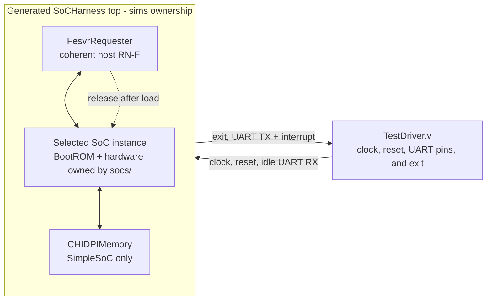

<!-- Documents executable SoC harnesses, host models, and simulator bindings. -->

# Simulation harnesses

This directory turns the synthesizable [`socs/` compositions](../socs/README.md)
into executable simulations. It owns the parameterless generated top, FESVR
transport, Verilator binding, simulation-only memory model, clock/reset driver,
and executable workflows. The SoCs continue to own processor, device, CHI,
NoC, and synthesizable-memory structure.

Contributors changing a harness, binding, or build rule should read
[`DEVELOPING.md`](DEVELOPING.md).

## Choose a harness

| `SOC` | Selected system | Memory supplied by the harness | Default core specialization |
| --- | --- | --- | --- |
| `simple` | `SimpleSoC` | `CHIDPIMemory` behind the SoC's external SN-F boundary | RV64IMAFDC plus B and Zicond; C composes Zca and Zcd |
| `mini` | `MiniSoC` | None; the SoC contains its own 64 KiB `CHIRam` | Integer-only, compressed instructions disabled |
| `tiled` | Default 4x4 `TiledSoC` | None; each LLC tile contains its backing `CHIRam` bank | Integer-only; C specializes to Zca |

`SOC` defaults to `simple`. Read the [SoC comparison](../socs/README.md#choose-a-system)
for the hardware differences, then use this guide to build or run the matching
harness.

## Ownership and execution boundary

The stack follows a Chipyard-like boundary:



`TestDriver.v` generates clock and reset, holds the UART RX line idle, and
observes the harness exit status. Each SoC has a separate parameterless harness
that instantiates the FESVR requester and connects it to that SoC's common
`SoCHostInterface`. Each harness passes through the synthesizable UART RX, TX,
and interrupt boundary; it does not instantiate the UART PTY DPI model. The
SimpleSoC harness additionally instantiates `CHIDPIMemory`, because only that
SoC exposes an external normal-memory boundary. No SoC contains DPI calls or
simulator dependencies.

The directory owns:

- [`fesvr/`](fesvr/): the simulator-independent direct-memory FESVR transport
  and its Rhodium CHI requester.
- [`verilator/`](verilator/): the Verilator VPI/DPI binding.
- [`tests/`](tests/): independent structural checks for FESVR and each system
  harness, plus the executable smoke payload.

## Build a simulator

Install the pinned FESVR dependency once, then build any system-specific
simulator:

```sh
make -C sims setup
make -C sims simulator SOC=simple
make -C sims simulator SOC=mini
make -C sims simulator SOC=tiled
```

`SOC` accepts `simple`, `mini`, or `tiled` and defaults to `simple`. The
SimpleSoC harness attaches `CHIDPIMemory` to the SoC's exposed ready-valid SN-F
channels as a simulation-only external memory model. MiniSoC instead contains
its own synthesizable `CHIRam`. Each harness has an independent artifact at
`/tmp/rhodium-sims/<soc>/obj/VTestDriver`, so
switching configurations cannot reuse generated RTL for the other SoC. The
shared Verilator `TestDriver` leaves TX and the UART interrupt observable but
unused and drives RX high as an idle 8-N-1 serial line. Set
`BUILD_ROOT` when a different artifact root is required. Building a simulator
does not require or embed a target program.

The Makefile maps `SOC` to one harness module. A shared emitter dynamically
loads only that module's exported `design`, so unrelated SoCs are neither
imported nor elaborated. Every harness emits the same parameterless
`SoCHarness` Verilog top contract, allowing `TestDriver.v` to remain shared;
there is no Rhodium variant enum or conditional harness circuit.

## Run a target

Run any FESVR-compatible target binary through an already-built simulator:

```sh
make -C sims run SOC=simple BINARY=/absolute/path/to/program.elf
make -C sims run SOC=mini BINARY=/absolute/path/to/program.elf
make -C sims run SOC=tiled BINARY=/absolute/path/to/program.elf
```

`HTIF_ARGS` places optional FESVR host arguments before the target binary, and
`TARGET_ARGS` places arguments after it. The simulator passes this process
argument vector through VPI to `DirectMemoryHtif`. FESVR owns ELF parsing,
segment loading, entry-point discovery, `tohost`/`fromhost` polling, and exit
status; the Makefile and RTL do not implement a separate binary loader.

Each harness requires the ELF entry point reported by FESVR to match the SoC's
configured BootROM payload address. It then converts that entry notification
into a one-shot release; every hart starts at the reset address, hart zero
jumps to the loaded payload, and secondary harts park in the ROM.

`DirectMemoryHtif` presents FESVR's abstract memory chunks as one-outstanding,
aligned 32-bit transactions. Target XLEN may be 32 or 64; addresses and entry
points remain 64-bit. `FesvrRequester` is a non-caching RN-F that converts
those private ready-valid DPI signals into coherent CHI `ReadClean` and
`WriteUniquePtl` transactions and reports Invalid for every snoop. ELF loading
and `tohost`/`fromhost` polling therefore observe dirty RV5Stage cache lines
without reserving a special mailbox address range.

## Focused validation

Run the genuine execution smoke for any system:

```sh
make -C sims smoke SOC=simple
make -C sims smoke SOC=mini
make -C sims smoke SOC=tiled
```

The smoke starts with `tohost` cleared, executes RV64I instructions on
RV5Stage, stores the passing value into a dirty L1D line, and succeeds only
after the coherent FESVR requester observes that write. It uses the same `run`
path as an external target binary.

Contributor binding, structural, and lowering checks are documented in
[`DEVELOPING.md`](DEVELOPING.md#focused-validation).

These simulators always use CIRCT-inferred memories. To validate a
design-and-technology SRAM mapping while reusing this harness, driver, FESVR
transport, and smoke payload, run `make -C vlsi/sim smoke`; see the
[`vlsi/sim` guide](../vlsi/sim/README.md). Keeping mapped simulation there
prevents technology policy from entering this package or the SoCs.
