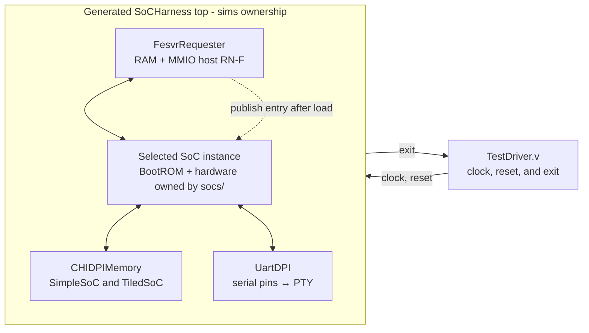

<!-- Documents executable SoC harnesses, host models, and simulator bindings. -->

# Simulation harnesses

This directory turns the synthesizable [`socs/` compositions](../socs/README.md)
into executable simulations. It owns the parameterless generated top, FESVR
transport, Verilator binding, simulation-only memory model, clock/reset driver,
and executable workflows. The SoCs continue to own processor, device, CHI,
NoC, and synthesizable-memory structure.

Contributors changing a harness, binding, or build rule should read
[`DEVELOPING.md`](DEVELOPING.md).

## Choose a harness

| `SOC` | Selected system | Memory supplied by the harness | Default core specialization |
| --- | --- | --- | --- |
| `simple` | `SimpleSoC` | `CHIDPIMemory` behind the SoC's external SN-F boundary | RV64IMAFDC plus B and Zicond; C composes Zca and Zcd |
| `mini` | `MiniSoC` | None; the SoC contains its own 64 KiB `CHIRam` | Integer-only, compressed instructions disabled |
| `tiled` | Default 5x4 `TiledSoC` | One `CHIDPIMemory` behind the shared external channel | Integer-only; C specializes to Zca |

`SOC` defaults to `simple`. Read the [SoC comparison](../socs/README.md#choose-a-system)
for the hardware differences, then use this guide to build or run the matching
harness.

## Ownership and execution boundary

The stack follows a Chipyard-like boundary:



`TestDriver.v` generates clock and reset and
observes the harness exit status. Each SoC has a separate parameterless harness
that instantiates the FESVR requester and connects it to that SoC's common
`SoCHostInterface`. Each harness connects its SoC's UART TX and RX pins to
the device-owned `UartDPI` PTY model. The UART interrupt remains connected to
the SoC's PLIC. The
SimpleSoC and TiledSoC harnesses each instantiate one `CHIDPIMemory` on their
external normal-memory boundary. No SoC contains DPI calls or
simulator dependencies.

The directory owns:

- [`fesvr/`](fesvr/): the simulator-independent direct-memory FESVR transport
  and its Rhodium CHI requester.
- [`verilator/`](verilator/): the Verilator VPI/DPI binding.
- [`tests/`](tests/): independent structural checks for FESVR and each system
  harness, plus the executable smoke payload.

## Build a simulator

Install the pinned FESVR dependency once, then build any system-specific
simulator:

```sh
make -C sims setup
make -C sims simulator SOC=simple
make -C sims simulator SOC=mini
make -C sims simulator SOC=tiled
```

`SOC` accepts `simple`, `mini`, or `tiled` and defaults to `simple`. The
SimpleSoC and TiledSoC harnesses attach `CHIDPIMemory` to their exposed ready-valid SN-F
channels as a simulation-only external memory model. MiniSoC instead contains
its own synthesizable `CHIRam`. Each harness has an independent artifact at
`/tmp/rhodium-sims/<soc>/obj/VTestDriver`, so
switching configurations cannot reuse generated RTL for the other SoC. The
shared Verilator `TestDriver` exposes only clock, reset, and exit; UART traffic
crosses the PTY inside the harness. Set
`BUILD_ROOT` when a different artifact root is required. Building a simulator
does not require or embed a target program.

The Makefile maps `SOC` to one harness module. A shared emitter dynamically
loads only that module's exported `design`, so unrelated SoCs are neither
imported nor elaborated. Every harness emits the same parameterless
`SoCHarness` Verilog top contract, allowing `TestDriver.v` to remain shared;
there is no Rhodium variant enum or conditional harness circuit.

## Use the UART terminal

Every harness creates UART DPI model 0 and prints `UART DPI model 0 PTY: <path>`
to stderr on startup. Open that slave path in a terminal client while the
simulator is running. The PTY is raw and byte-transparent, independent of the
FESVR console; firmware accesses the actual UART MMIO registers and serial pins.
The path is process-local and goes away when the simulator exits.

Each `SoCHarness` accepts an elaboration parameter `uart_oversample_divisor`
(1–65535, default 1). Program the same divisor into the target UART; reset
divisor zero also behaves as one. At the configured SoC clock frequency,
the serial bit rate is `clock_frequency_hz / (16 * divisor)`. Terminal-client
baud settings do not change this simulated timing. A different divisor requires
specializing the harness's exported design and rebuilding; there is no runtime
baud autodetection. Framing is 8-N-1. PTY input is queued across reset.

This does not add a BootROM console or select `/chosen/stdout-path`. A target
must configure and use its UART. The driver's cycle limit still applies, so
set `HTIF_ARGS=+max-cycles=...` appropriately for interactive programs.

Test all byte values through a real external PTY client with:

```sh
make -C sims uart-pty-test SOC=mini
make -C sims uart-pty-test SOC=simple
make -C sims uart-pty-test SOC=tiled
```

## Export SimpleSoC events to Perfetto

Tracing is opt-in and currently supports `SOC=simple`:

```sh
make -C sims smoke SOC=simple TRACE=1 TRACE_FILE=/tmp/simple-soc.pftrace
make -C sims run SOC=simple TRACE=1 TRACE_FILE=/tmp/program.pftrace BINARY=/absolute/path/to/program.elf
make -C sims run SOC=simple TRACE=1 TRACE_FILE=/tmp/program.pftrace.gz BINARY=/absolute/path/to/program.elf
```

Choose a fresh trace path: the exporter overwrites the selected output file.
Open the resulting `.pftrace` in Perfetto. Traced builds live in
`/tmp/rhodium-sims/simple-trace/`, separate from ordinary builds. `TRACE=0`
(the default) neither instruments RTL nor links the optional exporter.
Direct invocation of a traced binary requires `+rheg-trace=/absolute/path`.
The same binary can run different target programs and trace destinations.
Choose a filename ending in `.gz` to enable streaming gzip compression in the
C++ exporter; other names retain raw protobuf output. Open the completed gzip
file directly in Perfetto. Compression preserves all events, fields, and edges.
Unlike raw traces, gzip files require finalization before native import; normal
exit and timeout both finalize them, but abrupt termination can leave a truncated file.

Four checkpoints observe real external-memory request and response handshakes:
`memory-request` to `memory-accept`, and `memory-response` to `soc-response`.
Each pair describes the same transfer across a transparent harness wire, so its
inferred edge has zero latency and preserves the payload. External SN data
channels remain untraced. These memory checkpoints do not match requests to responses through
the CHI controller or identify the originating instructions.
The request and response source checkpoints explicitly use `~root: #true` to
start observation at these opaque component outputs.

The trace also includes the core's connected Fetch → Decode → Execute → Memory
→ WB stage events. See the [core tracing contract](../cores/rv5stage/README.md#pipeline-event-tracing)
for transfer predicates, squash behavior, payloads, and the distinction between
WB arrival and retirement. These pipeline events have their own root; they are
not connected through unmodeled cache/MMU transactions to the memory checkpoints.

It also includes the [private-cache outer CHI channels](../cores/rv5stage/README.md#private-cache-outer-traffic)
as `icache.*` and `dcache.*` tracks, including request, response, refill-data,
writeback-data, and snoop transfers. These use compact named control fields,
not full cache-line payloads, and do not infer transaction ancestry.

The trace uses the SoC's configured frequency (currently 100 MHz for SimpleSoC),
not the testbench delay or timer timebase. Tracks identify stages; instruction
slices show mnemonics, with full assembly in their arguments. See the
[RHEG display contract](../rheg/README.md#perfetto-display-and-queries) for timing,
metadata, and SQL queries. Only the initial reset epoch is supported by this
driver. Exit and timeout flush the final settled cycle. A timeout returns failure
but leaves an importable prefix; output after an export/I/O failure is incomplete.

The optional build requires CMake and the [RHEG exporter dependencies](../rheg/README.md#streaming-to-perfetto).
That guide also lists the offline source-tree variables for JSON and the Spike
disassembler. Set `BUILD_JOBS` to bound native compilation (default 4).

## Run a target

Run any FESVR-compatible target binary through an already-built simulator:

```sh
make -C sims run SOC=simple BINARY=/absolute/path/to/program.elf
make -C sims run SOC=mini BINARY=/absolute/path/to/program.elf
make -C sims run SOC=tiled BINARY=/absolute/path/to/program.elf
```

`HTIF_ARGS` places optional FESVR host arguments before the target binary, and
`TARGET_ARGS` places arguments after it. The simulator passes this process
argument vector through VPI to `DirectMemoryHtif`. FESVR owns ELF parsing,
segment loading, entry-point discovery, `tohost`/`fromhost` polling, and exit
status; the Makefile and RTL do not implement a separate binary loader.
The Verilator binding removes the simulator-owned `+rheg-trace=`,
`+max-cycles=`, and `+load-through-chi` options before passing arguments to FESVR.

SimpleSoC and TiledSoC DPI RAMs register their native backing stores during
clocked reset, before FESVR starts. Each instance's existing hardware identity
and configuration supply its physical window; no separate memory-map declaration
is needed. FESVR reads,
writes, and clears in that physical window access the same native byte store
as CHI, in chunks up to 64 KiB. Other ranges, including MMIO, retain normal
target transactions; accesses crossing a registration boundary are split.
Use `HTIF_ARGS=+load-through-chi` to load entirely through the target transport.
MiniSoC has no registered native RAM and uses target transactions.

This is a cold-boot optimization, not a coherent runtime debug interface.
The cores must remain in the boot ROM without accessing registered RAM until
the entry is published. Fast access closes before publication; runtime HTIF,
including signatures and mailboxes in dirty cache lines, always uses CHI.
Warm reloads and concurrent native memory access are not supported by this path.

After ELF loading completes, the C++ transport writes the reported entry point
to the SoC's configured 64-bit boot-address register through the ordinary memory
request path. The harness supplies that address through DPI from its SoC
configuration. Normal HTIF polling starts only after successful final write
completion; hardware contains no boot-specific sequencer or entry handshake.
Every hart starts at the ROM reset address as reset deasserts; hart zero polls
the initially zero register while loading proceeds, then loads the entry from the
register and jumps to it with `a0 = mhartid` and `a1 = embedded DTB address`.
Secondary harts park in the ROM. Changing binaries does not require rebuilding
RTL. Zero entries and ELF loading writes overlapping the boot register are
rejected, preventing premature publication. Startup errors report a nonzero exit.

Outside registered initial-image ranges, `DirectMemoryHtif` presents FESVR's abstract memory chunks as one-outstanding,
one-to-eight-byte transactions with 64-bit addresses and data. It never widens
device reads or synthesizes read-modify-write for narrow writes. Target XLEN
may be 32 or 64. `FesvrRequester` uses the SoC's physical map and Home service
descriptions to select coherent `ReadClean`/`WriteUniquePtl` for cacheable RAM
or `ReadNoSnp`/`WriteNoSnpPtl` for non-cacheable regions. RAM chunks may be
fragmented into aligned transfers; MMIO must be an exact, aligned, supported
1/2/4/8-byte access. Unmapped, forbidden, or unsupported accesses fail before
device traffic is issued. Target and protocol errors stop FESVR with failure.

The requester retains no cache lines and reports Invalid for every snoop.
Runtime `tohost`/`fromhost` polling and signature reads observe dirty RV5Stage cache
lines without reserving a special mailbox address range. The same endpoint
can access platform devices, including the boot-address register and UART.

## SimpleSoC software suites

Run the pinned upstream ISA tests and benchmarks through the same FESVR-backed
SimpleSoC simulator used by architectural tests:

```sh
make -C sims program-test-setup
make -C sims isa-test SOC=simple
make -C sims benchmark-test SOC=simple
```

After also installing ACT dependencies below, `make -C sims program-test
SOC=simple` runs all three suites. This aggregate stops if a suite fails;
CI runs the suites independently so one failure does not suppress the others.

The ISA adapter selects upstream physical-environment tests for RV64 I/M/A/F/D/C,
Zba/Zbb/Zbs/Zicond, and Zicboz. It omits `rv64ui-p-ma_data`, which requires
successful misaligned accesses rather than SimpleSoC's traps. Virtual-environment
and privileged-platform groups are outside this initial ISA adapter; ACT keeps
its own independent selection and limitations. The adapter consumes upstream
Makefrag inventories, so additions to selected groups are included automatically.

MiniSoC and TiledSoC have a smaller, single-hart ISA smoke subset:

```sh
make -C sims program-test-setup
make -C sims isa-smoke SOC=mini
make -C sims isa-smoke SOC=tiled
```

Selection follows each concrete SoC's core profile and covers representative
integer arithmetic, branches, loads/stores, multiply/divide, atomics, bit
operations, conditional zeroing, and cache zeroing where supported. TiledSoC
also runs the compressed-instruction test. Every selected ELF must fit the
actual RAM window, including zero-filled BSS; oversized tests fail preparation
rather than being silently skipped. These physical assembly tests use no
runtime-allocated stack. Results and target descriptions live under
`$PROGRAM_BUILD_ROOT/<soc>/isa-smoke/`, independently of the full SimpleSoC
suites. The existing runner executes every selected test even after failures.
TiledSoC boots only hart 0: this is mesh-backed memory coverage, not a
multihart coherence test. ACT and benchmarks remain SimpleSoC-only.

Benchmarks are `median`, `qsort`, `rsort`, `towers`, `vvadd`, `memcpy`, `multiply`,
`mm`, `dhrystone`, and `spmv`, compiled for RV64IMAFDC with the double-float ABI.
Multihart, vector, and PMP benchmarks require capabilities outside this platform.
These are compatibility selections, not a list of tests proven to pass. Any
selected workload failure fails its suite; there are no expected-failure masks.

Use a bare-metal compiler with C headers and `libm`, not only an assembler.
CI installs a checksum-pinned GCC/Newlib release via
`bash tools/install-riscv-toolchain.sh` (x86-64 Linux); local builds accept
`RISCV_CC=/path/to/riscv64-unknown-elf-gcc`.

`PROGRAM_BUILD_ROOT` defaults to `/tmp/rhodium-program-tests`. Each suite writes
a manifest, build log, per-test execution logs, `results.json`, and `junit.xml`.
The manifest records source/compiler provenance, exclusions, and ELF checksums.
The runner requires confirmed HTIF success and executes the entire manifest,
including tests following a failure. Empty selections and missing/modified ELFs
are errors. Results include exact simulator commands for reruns.

`PROGRAM_JOBS` defaults to one; `PROGRAM_TIMEOUT` defaults to 300 seconds per ELF.
`PROGRAM_MAX_CYCLES` defaults to ten million; benchmarks use
`BENCHMARK_MAX_CYCLES=100000000`. These are initial safety budgets, including
loading, not measured performance requirements. Override them when diagnosing
timeouts. Benchmark CI checks correctness, never exact cycle counts.

CI selects the three suites on pull requests and pushes to `main`; manual dispatch
selects all three. ACT generates its full ELF inventory once, then partitions it
across four execution jobs. Every job consumes the same exact-commit SimpleSoC
executable. ISA/benchmark binaries and ACT reference products are cached by their
build inputs, but results are always rerun. Full Linux suite validation remains
necessary before treating these new lanes as required branch-protection checks.

## Architectural certification tests

The ACT4 integration selects suites from the configured core's UDB description.
It uses the [generated UDB catalog](../socs/README.md#risc-v-udb-configuration-catalog)
to select the DUT architecture and Sail to compute expected results. Install
Python 3.10+, Ruby 3.2+ with Bundler, and GCC 15+ with Binutils 2.44+ first:

```sh
make -C sims arch-test-setup
make -C sims arch-test ACT_CONFIGURATION=simple-soc
```

Set `PYTHON=/path/to/python3` for setup if the default Python is too old. Setup
initializes the pinned `riscv/riscv-arch-test` submodule, installs Python and
Ruby dependencies under `.tools/`, and downloads checksum-verified Sail 0.14
for Apple Silicon macOS or x86-64/AArch64 Linux. Normal simulator dependencies
are still required; see [Build a simulator](#build-a-simulator).
On Apple Silicon it also installs native Z3 5.0.0 in the local UDB cache,
working around the pinned UDB installer's Linux-only library download.

`arch-test-config` only prepares and validates the Sail/platform files;
`arch-test-elfs` also validates UDB through ACT and generates self-checking
ELFs for every test matching the generated UDB configuration. It replaces the
configuration's generated ELF files before building, so an older core profile
cannot leave stale tests in the suite; reference intermediates remain cached.
`arch-test` builds the selected simulator and executes those ELFs through ACT's
upstream runner. After a successful build, `arch-test-run` reruns the existing
ELFs without regenerating the bundle. An empty ELF directory is an error.
Outputs and per-test logs live under
`/tmp/rhodium-arch-test`; set `ACT_BUILD_ROOT` to change that location.
`ACT_SAIL`, `ACT_VENV`, and `ACT_BUNDLE_PATH` select installed tool locations.
The adapter also writes `results.json` and `junit.xml` beside ACT's `summary.log`,
accounting for every generated ELF and rejecting missing results.
For distributed execution, `arch-test-run ACT_SHARDS=4 ACT_SHARD=0` runs the
first of four deterministic, disjoint partitions. Run indices 0 through 3 to
cover the full suite. Each shard writes its inventory and results under
`shards/<index>/`; the default `ACT_SHARDS=1` runs the complete inventory.
Partitioning never filters by extension or prior test results.
`RISCV_CC` and `ACT_OBJDUMP` select compiler tools.

Generation always considers all extensions. ACT selects applicable tests using
UDB's implemented (including implied) extensions and each test's parameter
constraints; there is no separate extension list or selection wrapper in Make.
The reference configuration maps UDB's `ASID_WIDTH` to Sail's `memory.asidlen`,
so `satp.ASID` expectations match the configured core's implemented width.

Selection is not a claim that every candidate has passed. The initial reference
adapter was validated with RV64I and M-mode startup; it is not yet a complete
UDB-to-Sail projection. ACT's `include_priv_tests` is always true: privileged
tests are selected by the same UDB extension and parameter constraints as all
other tests, without a separate harness exclusion.
Generation attempts all selected tests even if some fail, and reports an overall
failure in that case. `arch-test-run` can exercise the ELFs that did build.
The full DUT device and PMA map is not modeled for this stage. Sail retains
the reference-only interrupt devices required by ACT; DUT interrupt hooks
fail if invoked. Build, reference-model, and DUT failures in newly selected suites
are surfaced normally, not silently excluded; they need diagnosis before claiming
coverage.

The runner translates confirmed HTIF completion into ACT's `RVCP-SUMMARY`
protocol. Console printing macros are empty, so failures currently report
completion status and simulator logs without ACT's detailed mismatch console.
`ACT_MAX_CYCLES` defaults to ten million cycles; `ACT_TIMEOUT` defaults to 300
seconds per ELF. `ACT_JOBS` defaults to one simulator at a time;
`ACT_BUILD_JOBS` defaults to two compilation/reference tasks at a time. The shared
CI lane sets `ACT_FAST=1` to omit bulk disassembly; leave it at its default of
zero when generating local disassembly for debugging. The shared
driver also accepts `HTIF_ARGS='+permissive +max-cycles=N +permissive-off'`
for ordinary `run`; the permissive brackets keep FESVR from treating a
simulator option as the ELF name.

These tests complement the separate `riscv/riscv-isa-tests` (`riscv-tests`)
source dependency. A passing integer run does not establish full architectural
certification. Upstream documents the framework in the
[ACT4 guide](https://github.com/riscv/riscv-arch-test/blob/act4/README.md).

## Focused validation

Run the genuine execution smoke for any system:

```sh
make -C sims smoke SOC=simple
make -C sims smoke SOC=mini
make -C sims smoke SOC=tiled
make -C sims boot-test SOC=simple
make -C sims boot-test SOC=mini
make -C sims boot-test SOC=tiled
```

`make -C sims tiled-memory-test` uses a separate stalled-memory build to check
writebacks and refills across all LLC slices through the single external
channel. The ordinary `SOC=tiled` harness leaves memory channels unstalled.

Run the LR/SC progress qualification through normal FESVR loading and coherent
signature collection with:

```sh
make -C sims lrsc-test SOC=simple
make -C sims lrsc-test SOC=mini
make -C sims lrsc-test SOC=tiled
```

All three targets exercise word/doubleword constrained loops in Bare and Sv39
modes, including cache-line and page crossings. MiniSoC uses word-aligned
instruction placements and page tables within its 64 KiB RAM; the other systems
also exercise halfword instruction starts. TiledSoC uses
a test-only boot ROM that releases all eight harts to contend on shared
counters; its core and memory system are unchanged. Builds and six-value
signatures stay under `BUILD_ROOT/lrsc-test/<soc>/`. Each execution has a
20-million-cycle limit. See the [qualification scope](DEVELOPING.md#lrsc-system-qualification);
Ziccrse advertisement is owned by the qualified SoC profiles, not this test target.

The smoke starts with `tohost` cleared, executes RV64I instructions on
RV5Stage, stores the passing value into a dirty L1D line, and succeeds only
after the coherent FESVR requester observes that write. It uses the same `run`
path as an external target binary.

`boot-test` runs the same handoff checks at ELF entries `0x80002000` and
`0x80003000` through one compiled simulator and ROM per SoC. It verifies the
runtime register value, primary hart ID, and embedded DTB pointer and magic.

All default SoC profiles enable Zihintntl. The checked-in end-to-end cache-policy
test is currently defined only for the SimpleSoC profile; run it through the
normal ELF loader and coherent HTIF path with:

```sh
make -C sims zihintntl-test SOC=simple
```

The payload uses Sv39-translated data accesses, checks all four hints and
compressed aliases when C is available, and tests a hinted FP load when D is
available. Relative hit/miss timing checks distinguish repeated non-allocating
loads from ignored hints, while the resident probe verifies that dirty data
remains authoritative after the coherent transaction. The inclusive outer
cache may invalidate that L1 copy while allocating the hinted line, so the
SoC test does not claim that the resident remains cached. FESVR reads the final
dirty signature coherently. Its conflict pattern
is tied to SimpleSoC's checked-in four-way L1D, so this is not an assertion about
other SoC cache geometries, an ISA-mandated timing test, or a claim of locality
control in outer caches.

Contributor binding, structural, and lowering checks are documented in
[`DEVELOPING.md`](DEVELOPING.md#focused-validation).

These simulators always use CIRCT-inferred memories. To validate a
design-and-technology SRAM mapping while reusing this harness, driver, FESVR
transport, and smoke payload, run `make -C vlsi/sim smoke`; see the
[`vlsi/sim` guide](../vlsi/sim/README.md). Keeping mapped simulation there
prevents technology policy from entering this package or the SoCs.

The [native C simulator](native/README.md) provides a functional MiniSoC smoke
through whole-object semantic kernels, with an optional Verilator O2 comparison.
