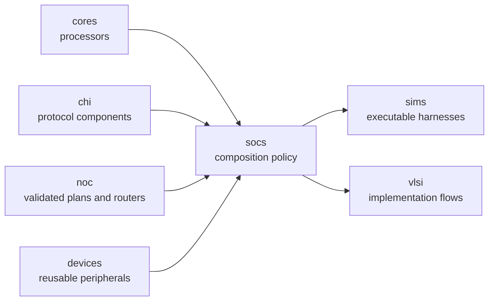

<!-- Guides contributors through changing and validating concrete SoC compositions. -->
<!-- SPDX-License-Identifier: Apache-2.0 -->

# Developing SoC compositions

Read the package [README](README.md) for the public system choices, host and
platform boundary, memory hierarchy, topology, parameters, and deliberate
limits. This guide owns implementation placement and contributor validation.

## Architecture and ownership

The SoC layer composes reusable processors, CHI endpoints and routers, Homes,
devices, address maps, PMA, memory boundaries, and common host/UART interfaces.
It owns concrete NodeIDs, address windows, interrupt wiring, clock/tick policy,
and topology. It must not acquire executable drivers, DPI calls, target
loading, or simulator policy; those belong in [`../sims/`](../sims/DEVELOPING.md).



Keep reusable component internals in their owning packages. A SoC should
configure and connect those public contracts, not fork their behavior.

Import CHI contracts, NoC adapters, selected Home engines, and SRAM only where
the composition uses them; use defining modules instead of the all-CHI facade.
Shared channel interfaces need only their parameter and channel owners.
Keep shared memory configuration separate from the concrete RAM import and
leave DPI memory to the simulator. See the
[CHI import guide](../chi/README.md#package-boundary-and-import).

Mini, Single, and Tiled are independent host-selected SoC shapes. Each circuit
accepts one immutable config that owns its hart binding. The contract in
`harts/implementation.rhdl` contains no named-core import; adapters in
`harts/rv5stage.rhdl` and `harts/spike.rhdl` supply their implementations.
`products/hart-selection.rhm` chooses a binding for a `(shape, core)` product,
and `products/` owns default profiles and thin named entrypoints. No shape
imports a product or a named core. The shared `one-hart/system.rhdl` owns the
single-router memory map, NodeIDs, external service, CHI derivation, and
`populate_single_core` helper used by Mini and Single. That helper emits the
selected hart with its Home, routers, and platform devices into the caller;
it adds no hardware wrapper. Mini supplies on-chip RAM and a forwarding Home,
while Single supplies the inclusive LLC and an external memory boundary.
The default tiled RV5Stage profile derives its architectural ISA fields from
the single-core RV5Stage profile while retaining independent cache and
execution-resource policy.
The helper groups its existing router endpoints in CHI's `CHINoCPorts` view and
passes that view to the typed RN/HN/SN attachment helpers. CHI owns the shared
injection/ejection queue policy; this view adds no circuit hierarchy.
`platform/endpoint-params.rhdl` supplies host descriptions shared with the tiled compiler;
exact ICN peers are derived through CHI's `node.icn_peer()` method. Home
parameters obtain subordinate endpoints from their services. `make check-boundaries` rejects product imports from shared code, imports between peer shapes, and named-core imports from neutral modules.

## Implementation map

| Concern | Owner |
|---|---|
| Architectural host description and device-tree projection | [`description.rhm`](platform/description.rhm) |
| RV5Stage processor profiles | [`core-profiles.rhm`](products/core-profiles.rhm) |
| Spike processor profile | [`spike-core-profile.rhm`](products/spike-core-profile.rhm) |
| Shared CHI flit profile | [`fabric-profiles.rhm`](platform/fabric-profiles.rhm) |
| Concrete RISC-V UDB product configurations | [`udb.rhm`](products/udb.rhm) |
| Common RAM/MMIO host boundary | [`host-interface.rhdl`](platform/host-interface.rhdl) |
| One-hart fabric derivation and direct composition | [`one-hart/system.rhdl`](one-hart/system.rhdl) |
| Neutral hart contract, concrete adapters, and product selection | [`harts/implementation.rhdl`](harts/implementation.rhdl), [`harts/rv5stage.rhdl`](harts/rv5stage.rhdl), [`harts/spike.rhdl`](harts/spike.rhdl), [`products/hart-selection.rhm`](products/hart-selection.rhm) |
| Core-neutral Mini and Single SoC shapes | [`mini-soc/main.rhdl`](mini-soc/main.rhdl), [`single-core-soc/main.rhdl`](single-core-soc/main.rhdl) |
| Shared host endpoint descriptions | [`endpoint-params.rhdl`](platform/endpoint-params.rhdl) |
| Shared boot-address register, BootROM, ACLINT, PLIC, and UART windows, PMA, Home map, and UART boundary | [`peripherals.rhdl`](platform/peripherals.rhdl) |
| RV5Stage binding for the shared single-core platform | [`single-core-rv5stage-soc.rhdl`](products/single-core-rv5stage-soc.rhdl) |
| Spike binding for the shared single-core platform | [`single-core-spike-soc.rhdl`](products/single-core-spike-soc.rhdl) |
| Named compact RV5Stage product | [`mini-rv5stage-soc.rhdl`](products/mini-rv5stage-soc.rhdl) |
| Tiled public entrypoint | [`tiled-soc/main.rhdl`](tiled-soc/main.rhdl) |
| Tiled layout and authoring form | [`tiled-soc/layout.rhm`](tiled-soc/layout.rhm) |
| Private tiled placement model and configuration compiler | [`tiled-soc/compiled.rhdl`](tiled-soc/compiled.rhdl), [`tiled-soc/compile.rhdl`](tiled-soc/compile.rhdl) |
| Tiled time and interrupt distribution plan and RTL | [`tiled-soc/distribution-plan.rhdl`](tiled-soc/distribution-plan.rhdl), [`tiled-soc/distribution.rhdl`](tiled-soc/distribution.rhdl) |
| Concrete tile implementations | [`tiled-soc/tiles/`](tiled-soc/tiles/) |
| Single external memory-channel router attachment | [`tiled-soc/tiles/memory.rhdl`](tiled-soc/tiles/memory.rhdl) |
| Focused tests | [`tests/`](tests/) and [`Makefile`](Makefile) |

## Change a composition

1. Identify whether the change is reusable component behavior or concrete
   system policy. Move reusable behavior down to its owning core, protocol,
   NoC, or device package before composing it here.
2. Derive PMA and CHI Home routing from one physical-region description so an
   address cannot enter the fabric with contradictory policy.
3. Keep host RAM access coherent and route device access through the device
   Home using the shared `SoCHostInterface`. Derive host access services from
   the same memory and subordinate descriptions, with per-Home capability
   projections for the shared RN-F. Do not add a simulator mailbox or binary
   loader to synthesizable hardware.
4. For tiled changes, extend the author configuration and private compiler,
   then derive occurrence IDs, routes, family plans, and link assignments once.
   Do not expose a second author-managed compiled plan.
5. Keep routers owned by tiles or subsystems and physical-link connections
   owned by their parent. The generic NoC package does not instantiate a whole
   system wrapper.
6. Test pure configuration and topology compilation at the host level. Test
   connected hierarchy and device/core behavior through the executable
   simulator; do not duplicate it with exact module-name or instance-count
   assertions. Update [README.md](README.md) when observable ports, defaults,
   maps, topology, or supported systems change.

## Focused validation

Tiled LLC subordinate ports share the existing CHI fabric with requester and
device traffic. Compile one `CHISNConnection` from each Home to the single
memory site, preserving global addresses and Home source IDs. The generic
`StripedAddressLayout` supplies LLC indexing and ownership without a CHI address
projector dependency or downstream RTL adapter. The external service owns transfer support; the simulator derives
its DPI memory configuration from that service and the architectural capacity.

Run SoC configuration and topology-compilation tests from the repository root:

```sh
make soc-test
```

This target also generates native DTBs for the Mini, Single, and Tiled shapes
with both RV5Stage and Spike harts,
round-trips their inspection DTS through `dtc`, and checks architectural
properties with `fdtdump` and `fdtget`. It also checks that the same native DTB
bytes are finalized into each SoC's BootROM image. Generated artifacts remain
temporary.

The device-tree checks resolve UART interrupt-parent phandles and verify every
PLIC context against its hart's interrupt controller. Preserve context list
order: it identifies the PLIC's MMIO context indices, not a sortable CPU list.
The executable simulator smoke exercises UART TX-empty assertion, both hart-zero
external interrupt inputs, M/S claim arbitration, completion, and rearming.

The DTB subprocess uses `tools/run-racket.sh`: local runs rebuild changed
dependencies, while CI reuses its verified exact-commit bytecode artifact.
Keep this entrypoint in the root Makefile's compilation manifest.
`bash socs/tests/check-boundaries.sh` exercises import rejection and ensures
enumeration/search errors cannot silently pass the boundary audit.

`tests/main-memory-test.rhm` checks Ziccif/Ziccamoa/Ziccrse memory-map preconditions in
MiniRV5StageSoC, SingleCoreRV5StageSoC, and TiledSoC. Cacheable regions must be coherent HN-F RAM
with execute, read, write, and atomic permissions and idempotent reads. The
disjoint sparse bank sets must cover all described RAM without gaps; do not
infer coverage from only the first and last address. BootROM and device HN-I
regions are outside these cacheable/coherent main-memory requirements.
MiniRV5StageSoC, SingleCoreRV5StageSoC, and TiledSoC enable Ziccrse. The core profile and UDB tests
check this selection, and `run-device-tree.sh` checks every hart's advertised
extension list. Static PMA checks do not prove eventuality; retain the
[complete-system qualification](../cores/rv5stage/DEVELOPING.md#ziccrse-progress-gate)
when changing a qualified system's memory hierarchy or scheduling.
The [RV5Stage validation guide](../cores/rv5stage/DEVELOPING.md#focused-validation)
owns the fetch, AMO, and coherence datapath checks and their coverage limits.

Use the package-local target while iterating:

```sh
make -C socs config-test
```

For tiled streaming adapters, run the focused behavioral fixtures:

```sh
FIXTURES='tiled-time tiled-distribution' bash tools/testing/circt/run.sh --simulate-only
```

These cover stalled time packets, latest-snapshot coalescing, complete timestamp
reconstruction, and independently backpressured time/interrupt routes. Preserve
the one-VC router's explicit availability signals when changing payload adapters.

The host target covers address maps, node policy, layouts, and compiled routing
plans. Connected hierarchy, time distribution, devices, and processor behavior
belong to the executable smoke tests in
[`../sims/DEVELOPING.md`](../sims/DEVELOPING.md).

For execution of the generated host-release ROM, run:

```sh
FIXTURE=rv5stage-io-boot bash tools/testing/circt/run.sh --simulate-only
```

This cores-group CI fixture checks entry publication followed by explicit MSIP
release, per-hart MSIP clearing, uncached fetch and data contention, an
unselected secondary hart remaining asleep, and reset using the generated ROM.
