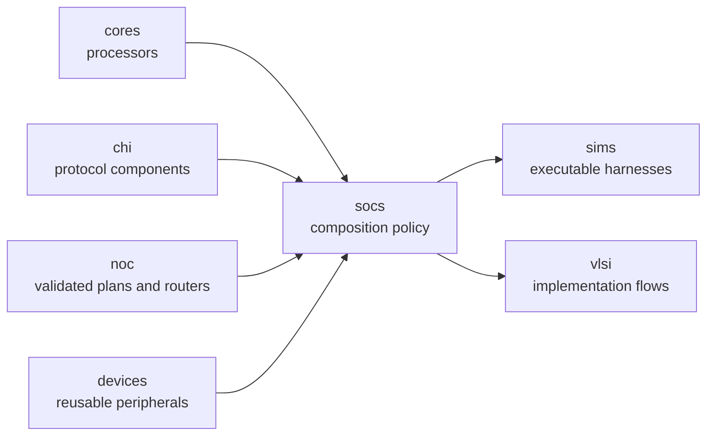

<!-- Guides contributors through changing and validating concrete SoC compositions. -->

# Developing SoC compositions

Read the package [README](README.md) for the public system choices, host and
platform boundary, memory hierarchy, topology, parameters, and deliberate
limits. This guide owns implementation placement and contributor validation.

## Architecture and ownership

The SoC layer composes reusable processors, CHI endpoints and routers, Homes,
devices, address maps, PMA, memory boundaries, and common host/UART interfaces.
It owns concrete NodeIDs, address windows, interrupt wiring, clock/tick policy,
and topology. It must not acquire executable drivers, DPI calls, target
loading, or simulator policy; those belong in [`../sims/`](../sims/DEVELOPING.md).



Keep reusable component internals in their owning packages. A SoC should
configure and connect those public contracts, not fork their behavior.

## Implementation map

| Concern | Owner |
|---|---|
| Common coherent host boundary | [`host-interface.rhdl`](host-interface.rhdl) |
| Shared device windows, PMA, Home map, and UART boundary | [`peripherals.rhdl`](peripherals.rhdl) |
| Primary external-memory composition | [`simple-soc.rhdl`](simple-soc.rhdl) |
| Compact internal-memory composition | [`mini-soc.rhdl`](mini-soc.rhdl) |
| Tiled public entrypoint | [`tiled-soc/main.rhdl`](tiled-soc/main.rhdl) |
| Tiled layout and authoring form | [`tiled-soc/layout.rhm`](tiled-soc/layout.rhm) |
| Private tiled configuration compiler | [`tiled-soc/compile.rhdl`](tiled-soc/compile.rhdl) |
| Concrete tile implementations | [`tiled-soc/tiles/`](tiled-soc/tiles/) |
| Focused tests | [`tests/`](tests/) and [`Makefile`](Makefile) |

## Change a composition

1. Identify whether the change is reusable component behavior or concrete
   system policy. Move reusable behavior down to its owning core, protocol,
   NoC, or device package before composing it here.
2. Derive PMA and CHI Home routing from one physical-region description so an
   address cannot enter the fabric with contradictory policy.
3. Keep host loading coherent and use the shared `SoCHostInterface`; do not add
   a simulator mailbox or binary loader to synthesizable hardware.
4. For tiled changes, extend the author configuration and private compiler,
   then derive occurrence IDs, routes, family plans, and link assignments once.
   Do not expose a second author-managed compiled plan.
5. Keep routers owned by tiles or subsystems and physical-link connections
   owned by their parent. The generic NoC package does not instantiate a whole
   system wrapper.
6. Test pure configuration and topology compilation at the host level. Test
   connected hierarchy and device/core behavior through the executable
   simulator; do not duplicate it with exact module-name or instance-count
   assertions. Update [README.md](README.md) when observable ports, defaults,
   maps, topology, or supported systems change.

## Focused validation

Run SoC configuration and topology-compilation tests from the repository root:

```sh
make soc-test
```

Use the package-local target while iterating:

```sh
make -C socs config-test
```

The host target covers address maps, node policy, layouts, and compiled routing
plans. Connected hierarchy, time distribution, devices, and processor behavior
belong to the executable smoke tests in
[`../sims/DEVELOPING.md`](../sims/DEVELOPING.md).
