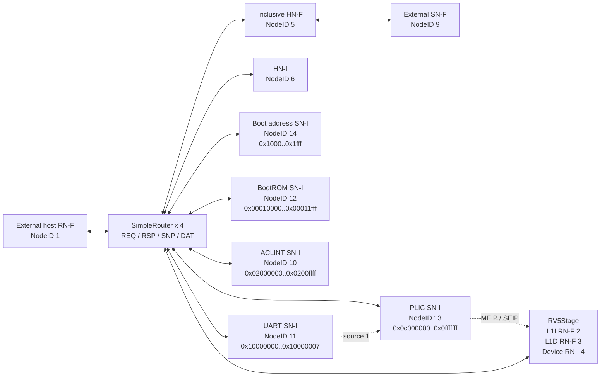
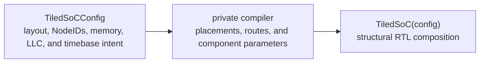

<!-- Documents the repository's concrete coherent SoC compositions and integration contracts. -->

# SoC compositions

This directory owns synthesizable system composition: processor instances,
CHI endpoints and routing, Homes, platform devices, memory boundaries, and the
common host-facing interface. It does not own executable wrappers, DPI calls,
or simulator policy; those belong to the [`sims/` harnesses](../sims/README.md).

Start with the comparison below, then read the section for the selected system.
For component internals, follow the owning guides for
[RV5Stage](../cores/rv5stage/README.md), [CHI](../chi/README.md),
[NoC planning](../noc/README.md), and [platform devices](../devices/README.md)
instead of treating this page as a component catalog.

Contributors changing a composition should read
[`DEVELOPING.md`](DEVELOPING.md).

All three default core profiles enable
[Zawrs reservation waiting](../cores/rv5stage/README.md#reservation-waiting),
the [Zihintpause hint](../cores/rv5stage/README.md#pause-hint), and
[Zihintntl locality hints](../cores/rv5stage/README.md#non-temporal-locality-hints).
Their device-tree ISA extension lists and UDB configurations derive this claim
from the same profile that selects the hardware decoder and wait controller.

All three also advertise the [Ziccif and Ziccamoa main-memory guarantees](../cores/rv5stage/README.md#coherent-main-memory-guarantees).
Their coherent RAM maps support instruction fetch and all A-extension AMOs;
these claims do not apply to BootROM or device regions.

## Choose a system

| System | Default processors | Normal-memory termination | Coherence structure | Default core specialization | Best fit |
| --- | ---: | --- | --- | --- | --- |
| `SimpleSoC` | 1 | External line-capable SN-F; 1 GiB window | One 64-set, four-way inclusive LLC, BootROM, ACLINT, PLIC, and UART on one physical router | RV64IMAFDC plus B, Zicond, and Zicbop; full C composition | Primary single-core coherent system and external-memory integration |
| `MiniSoC` | 1 | Internal 64 KiB `CHIRam` | Forwarding HN-F, BootROM, ACLINT, PLIC, and UART on one physical router; 2 KiB direct-mapped L1I/L1D | Integer-only with Zicbop; compressed instructions disabled | Compact RTL and physical-design experiments |
| `TiledSoC` | 8 in the default 5x4 layout | One external line-capable SN-F channel; 1 GiB window | Four inclusive LLC slices plus BootROM and routed memory, device-home, ACLINT, PLIC, and UART tiles | Integer-only with Zicbop and the C composition, which specializes to Zca | Configurable multicore, striped-memory, and mesh experiments |

All three systems expose the same [`SoCHostInterface`](host-interface.rhdl): a
non-caching RN-F port for coherent RAM and non-snooping MMIO access.
Each author-facing SoC parameter object owns one
`RVCoreProfile`, and the same profile specializes the instantiated core and its
architectural description. `SimpleSoC` defaults to RV64D and the full C
composition, `MiniSoC` to integer-only RV64 with 2 KiB direct-mapped L1s, and
`TiledSoC` to integer-only RV64 with the C composition. SimpleSoC and TiledSoC
also enable Zcmop; MiniSoC keeps compressed instructions disabled. All three select Sv39;
Zicbop and Zicboz are enabled in each default profile, while half precision and Zfa remain
disabled. Supply an alternate `RVCoreProfile` through the owning SoC parameter
object to change those selections.
Zicboz-capable CPU nodes advertise `riscv,cboz-block-size = 64`; normal RAM
permits block zero, while ROM and peripheral regions reject it.

Every system also exposes the shared [`SoCUartInterface`](peripherals.rhdl)
containing RX, TX, and interrupt signals.

## Architectural host description

[`description.rhm`](description.rhm) defines the immutable
`RiscvSoCDescription` consumed by architecture-facing generators. It combines
the model and compatible strings, hart IDs and `RVCoreProfile`, clock and
timebase frequencies, architectural memory regions, BootROM layout, ACLINT,
an optional PLIC, and an optional UART. The PLIC description identifies every
source and orders machine and supervisor contexts for each hart. Address regions retain their originating `AddressSet`,
so later PMA, CHI, and device-tree projections can share exact address values;
LLC ownership stripes remain distinct from architectural memory regions.

Construction rejects inconsistent frequency ratios, non-contiguous or
overlapping architectural regions, duplicate harts and compatible strings,
reset vectors outside the BootROM, and payload addresses outside memory.
`SimpleSoCParams`, `MiniSoCParams`, and `TiledSoCConfig` each expose a
`.description` projection. The projection reuses the CHI subordinate service
address sets; TiledSoC describes its single external memory channel as one
contiguous architectural region, independently of LLC ownership stripes.

Calling `.description.to_device_tree()` produces a deterministic generic
`DeviceTree`. It describes the root identity, architectural memory, clock and
timebase frequencies, every hart's ISA, MMU, L1 caches, and local interrupt
controller, plus the shared CLINT-compatible ACLINT. Each SoC serializes this
same description directly into its BootROM at offset `0x100`; the reset program
passes the resulting eight-byte-aligned address to hart zero in `a1`.

The projection emits a `sifive,plic-1.0.0` interrupt controller and enables the
16550-compatible UART with its input clock, byte-wide registers, and PLIC
interrupt binding. `RiscvPlicInterrupt` explicitly references a controller region
and source ID; construction rejects missing controllers, mismatched regions,
and undeclared sources. PLIC contexts retain their description order as MMIO
context indices, and `riscv,ndev` is the highest supported source ID, including
unused IDs below it. The default UART uses source 1.

The PLIC uses the standard driver-compatible string; there is not yet an
upstream platform-specific DT schema entry for Rhodium. Interoperability tests
check DTS/DTB encoding and bindings, not full Linux `dt-schema` acceptance or
an OS boot. Enabling the node does not select a console, add BootROM UART code,
or connect a simulation PTY.

## RISC-V UDB configuration catalog

[`udb.rhm`](udb.rhm) catalogs concrete RISC-V Unified Database configurations
for repository SoC and processor combinations. It joins a named core's UDB
projection with integration-owned facts such as physical-address width and PMA
granularity. The generic writer and Make target know only the catalog key, so a
future processor adds its own projection and a catalog entry rather than a new
command.

Generate one entry from the repository root:

```sh
make riscv-udb-config RISCV_UDB_CONFIGURATION=simple-soc
```

The current keys are `simple-soc`, `mini-soc`, and `tiled-soc`. Output defaults
to `/tmp/rhodium-udb/<key>.yaml`; set `RISCV_UDB_OUTPUT` to choose another path.
Generated configurations are build artifacts and must not be committed.

## Common host and platform contract

The external host loads and observes memory with coherent `ReadClean` and
`WriteUniquePtl` transactions, so its requests snoop private caches and
simulator mailboxes may live in ordinary coherent memory. Every hart starts at
its configured reset address when reset is deasserted; hart zero waits in the
ROM while the host loads the payload and publishes its entry address.
No SoC contains FESVR behavior, DPI calls, or a simulator-specific
loader.

The same host RN-F reaches the device HNI with `ReadNoSnp` and
`WriteNoSnpPtl`. Per-Home capability projections preserve its physical identity
while keeping coherent operations on HN-F paths and non-snooping operations on
the device path. Physical maps and Home service descriptions are also exposed
to external host adapters for permission and transfer-size checks.

[`boot.rhdl`](boot.rhdl) owns the shared reset address, payload address, ROM
layout and finalized image, and executable non-cacheable PMA entry.
Every current SoC uses an 8 KiB BootROM at
`0x00010000..0x00011fff`. Hart zero receives its embedded DTB address in `a1`
and loads its payload entry from the boot-address register; every secondary hart parks
in the ROM's `WFI` loop. Instruction fetches reach the ROM as uncached
four-byte `ReadNoSnp` requests and do not fill L1I.

Every SoC maps the 64-bit boot-address register at `0x1000` in the
`0x1000..0x1fff` device window. Its reset value is zero;
`boot.boot_address_register` configures its base.
The register is non-cacheable, non-executable, and has idempotent reads.
It is reachable through both the core RN-I and the host RN-F via the existing
device HNI. The default ROM polls until the register is nonzero. After all
payload writes complete, the host publishes the entry with one complete
eight-byte write, avoiding a partially updated pointer. Without publication,
hart zero keeps polling; zero is reserved and cannot be a payload entry.
The simulator's FESVR adapter
programs the ELF entry automatically; see the [execution contract](../sims/README.md#run-a-target).
Concurrent updates and warm reboot are not supported.
The boot layout describes the register's service region for overlap checking;
no operating-system device-tree binding is introduced for it.

[`peripherals.rhdl`](peripherals.rhdl) aggregates the boot-address register, BootROM, ACLINT, PLIC, and UART
service occurrences into one platform HN-I map and owns the UART pin interface.
The ACLINT occupies `0x02000000..0x0200ffff`. Its `mtime`
counter drives RV5Stage's `time` CSR, while each hart's MTIP and MSIP levels
drive the corresponding machine interrupt inputs. The PLIC occupies
`0x0c000000..0x0fffffff`; UART is source 1, and every hart has a machine-external
context followed by a supervisor-external context. The UART occupies
`0x10000000..0x10000007`. Its interrupt remains visible at the pin boundary and
also drives the PLIC source. The platform
owns the explicit ACLINT tick policy through `SoCClockConfig`; the same clock
and timebase frequencies drive the hardware divider and appear in the
architectural description. The default `SimpleSoC` and `MiniSoC` use a 1:1
ratio, while default TiledSoC divides 100 MHz to 1 MHz. Supervisor software and
timer interrupt lines remain low; PLIC context outputs drive both external
interrupt lines.

## SimpleSoC

[`simple-soc.rhdl`](simple-soc.rhdl) composes the primary single-core coherent
system:



The RN-I, three RN-F, and five subordinate relationships reuse one physical
single-router topology but independently compile validation, route keys,
buffering, and allocation for the four CHI channel planes. REQ is 5-to-7, RSP
is 11-to-7, DAT is 12-to-12, and SNP is 1-to-3 because all three RN-Fs receive
snoops. Router arity therefore follows the permitted protocol paths instead of
an all-node cross product.

RV5Stage exposes ready-valid `CHIRNChannels` bundles directly at its hierarchy
boundary, so the SoC connects both cache endpoints to the NoC without internal
credited links. The blocking inclusive HN-F caches subordinate lines, snoops
coherent requesters before replacement, and writes dirty snoop data back to the
subordinate. The external SN-F must accept native 64-byte reads and writes, so
this direct path needs no fragmenter.

Device addresses instead leave RV5Stage through its uncached RN-I, cross the
HN-I, re-enter the same physical fabric through the Home's subordinate-side
attachment, and terminate at the CHI-native boot-address register, BootROM, ACLINT, PLIC, or UART SN-I
attachment. Both paths are derived from one physical-region table. Each region pairs
RISC-V read, write, execute, cacheability, and atomic attributes with its CHI
Home; the SoC derives the `CHIHomeMap` from those entries. Requests outside the
table therefore trap in RV5Stage instead of entering CHI without a Home.

`SimpleSoCParams` couples the shared `SingleCoreSystemParams` contract to the inclusive LLC
geometry. The default selects a 64-set, four-way blocking LLC and exports
line-capable `CHISNChannels` for SN-F NodeID 9 over the 1 GiB range
`0x80000000..0xbfffffff`. The SoC contains no RAM, fragmenter, or simulator
binding; an external subordinate owns memory contents and response timing.

## MiniSoC

[`mini-soc.rhdl`](mini-soc.rhdl) independently composes the small,
self-contained system used for compact RTL and physical-design experiments. It
uses a 64 KiB range, replaces the inclusive LLC with the forwarding `CHIHNF`,
and terminates the native memory boundary directly in an on-chip, line-capable
`CHIRam`. Its RV64 instruction and data caches are each explicitly 32-set,
one-way direct-mapped caches with 2 KiB of line storage; `SimpleSoC` retains
RV5Stage's default 64-set cache geometry.

`MiniSoCParams` owns its `CHIRamParams`; `SimpleSoCParams` instead consumes an
external `CHISubordinateServiceParams` through its shared system parameters.
The SimpleSoC simulation harness selects the DPI memory implementation.
Neither top level imports or instantiates another SoC. They share
[`populate_single_core`](single-core-system.rhdl), which instantiates components
directly in its caller without an intermediate `fabric/` or `system/` module.
TiledSoC keeps its independent tile and mesh composition. See the
[development guide](DEVELOPING.md#architecture-and-ownership) for shared source ownership.

## TiledSoC

TiledSoC exposes one author configuration and privately derives its network and
hardware parameters during elaboration:



The author-facing layout uses rows in visual north-to-south order and supports
compact runs of like tiles:

```rhm
def layout = tile_grid:
  row [llc(4), memory]
  row [host, device_home, aclint, plic, uart]
  row [rv5stage(4), transit]
  row [rv5stage(4), transit]
```

`TiledSoCConfig` combines that immutable `TileGrid` with `TiledNodeIds`,
`StripedMemory`, `LLCGeometry`, an `RVCoreProfile`, `SoCClockConfig`, the boot
configuration, and the CHI flit parameters. The public
`TiledSoC(config)` circuit accepts this author value directly. Its private
compiler derives mesh coordinates, occurrence ordering, endpoint IDs, CHI
relationships, routes, the shared physical-link manifest, and all component
parameters in one pass. There is no public intermediate TiledSoC plan or
second compiled configuration for authors to manage. The default
`default_tiled_soc_config` defines the repository's 5x4 system; other
rectangular layouts use the same entrypoint when they satisfy the tile-count
invariants. Exactly one `memory` tile owns the external memory channel.
`StripedMemory(~base: ..., ~size_bytes: ..., ~stripe_bytes: ...)` specifies
total architectural capacity independently of the number of LLC slices;
striping selects the owning LLC, not separate physical memory banks.

The package lives under [`tiled-soc/`](tiled-soc/): `main.rhdl` is the public
entrypoint, `layout.rhm` owns the immutable configuration and macro-phase
tile-grid language, `compile.rhdl` owns private derivation, `time.rhdl` owns
the rotating platform-time stream, and `tiles/` owns the concrete tile
implementations.

The default layout places eight `RV5StageTile`s in the lower two rows, five
service routers in the middle row, and four `LLCTile`s plus one `MemoryTile`
in the upper row, with two transit tiles completing the rectangular mesh.
The middle row contains the external host RN-F, a `DeviceHomeTile` with both
sides of the shared HN-I, an `AclintTile`, a `PlicTile`, and a `UartTile`. The HN subordinate
side reaches all five device SN-Is through the same CHI mesh rather than direct
wires. The system allocates 16 RN-F NodeIDs for the eight L1I/L1D pairs, eight
RN-I NodeIDs for
uncached device traffic, one host RN-F, four HN-Fs, one HN-I, one external SN-F, one
boot-address SN-I, one BootROM SN-I, one ACLINT SN-I, one PLIC SN-I, and one UART SN-I. The BootROM and boot-address register (default NodeID 56) are colocated with
the device Home and use that router's composable local SN attachments.

One 1 GiB memory channel covers `0x80000000` through `0xbfffffff`, with
64-byte cache-line striping across the LLCs. Each LLC tile contains a 16-set,
four-way cache, giving 4 KiB per slice and 16 KiB of aggregate inclusive LLC capacity. One shared
physical-region table maps successive lines to successive HN-Fs and derives
the CHI Home map. Each LLC indexes its sets with the dense per-slice projected
address while retaining the complete global line address as its tag. Its
subordinate port rejoins the same CHI mesh and sends unchanged global addresses
to the single memory SN-F (default NodeID 48). There is no backing RAM or
address-compacting adapter inside an LLC tile. The 16 coherent requester endpoints
plus the host RN-F connect to all four HN-Fs, while the eight uncached
requester endpoints and host RN-F connect to the device HN-I and its subordinate side
connects to all five SN-Is. Together they compile 86 REQ, 163 RSP, 68 SNP, and 172
DAT routes before any hardware elaborates.

Each tile owns one `CHIRouter`, containing independent REQ/RSP/SNP/DAT
`SimpleRouterFamily` instances and site-keyed CHI adapters. Every RV5Stage tile
uses one shared RTL specialization, every LLC tile uses another, and the
service row adds one `DeviceHomeTile`, one `AclintTile`, one `PlicTile`, one `UartTile`, and
one `HostTile` specialization. Their implementations and parameter contracts
live under [`tiled-soc/tiles/`](tiled-soc/tiles/). The parent drives one constant
identity bundle per occurrence containing its router site, hart ID, endpoint
NodeIDs and striped service base; tiles contain no system-wide
identity table or runtime routing-mode selector. A `RV5StageTile` attaches one
RV5Stage's two RN-F ports and its RN-I device port. A
`LLCTile` attaches both sides of one blocking `CHIInclusiveHNF`. The `MemoryTile`
exports `TiledSoC.memory`, a single `CHISNChannels` port in the `icn` role.
Its external SN-F must support one-byte through 64-byte `ReadNoSnp`,
`WriteNoSnpFull`, and `WriteNoSnpPtl` transfers, with DBID-associated write data
and responses routed to the originating Home. Arbitration and return routing
use the existing CHI fabric; LLC-local TxnIDs need not be globally unique.
This is a memory-controller-facing protocol boundary, not a DDR controller or PHY.
The simulation harness supplies one sparse `CHIDPIMemory`; a hardware integrator
supplies the off-chip memory controller. The device HN-I is reachable through
the uncached RN-I and host routes. The
ACLINT computes the MSIP and MTIP vectors centrally, and a standard
`StateChangeSource` emits only changed `(hart, interrupt-state)` entries. Its
shared `mtime` value enters a separate narrow ready-valid stream. The default
timebase produces one tick every 100 SoC cycles, and ACLINT emits an update
only for that tick or an `mtime` MMIO write. `TiledTimeSweeper` freezes one
snapshot, uses the standard `Packetizer` to send its four 16-bit framed flits
to each hart in index order, and retains only the newest snapshot that arrives
while a sweep is active.

The PLIC tile similarly converts its per-context levels into changed
`(hart, external-interrupt-state)` entries, preserving machine-before-supervisor
context ordering for every hart. All three streams enter a tiled-platform distribution overlay compiled from the
same mesh placement as CHI. Typed tagged-union messages share one routed beat
format, while time, ACLINT interrupt, and PLIC external-interrupt traffic retain distinct injection and
ejection terminals. Each directed mesh edge carries one narrow one-VC
`VcLink`; ordinary ready-valid backpressure is preserved across every hop.
At each hart, a standard `Reassembler` publishes `mtime` only after its final
flit transfers, and a standard `StateReplica` retains the latest delivered
MSIP and MTIP state; a second `StateReplica` retains MEIP and SEIP independently.
Harts therefore converge on the latest interrupt state
and receive each time snapshot with bounded index-ordered skew without global
interrupt vectors or a 64-bit time bus. This overlay is structurally
independent of CHI routing. The UART tile passes its serial boundary to the
SoC.

Every tile exposes the family's uniform maximum of four incoming and four
outgoing physical links, each bundling the independent REQ/RSP/SNP/DAT
transports. `TiledSoC` alone applies the compiled
`RouterFamilyLinkConnection` manifest and explicitly closes unused edge and
corner slots. There is no whole-network CHI router wrapper under `noc/rtl`;
the separate platform distribution network is owned and composed by
`tiled-soc/` from the generic NoC planning, routing, router, and `VcLink`
pieces.

## Focused validation

Contributor configuration, tile, and hierarchy validation is documented in
[`DEVELOPING.md`](DEVELOPING.md#focused-validation). Executable build, run,
smoke, and lowering workflows belong to the [`sims/` guide](../sims/README.md).
