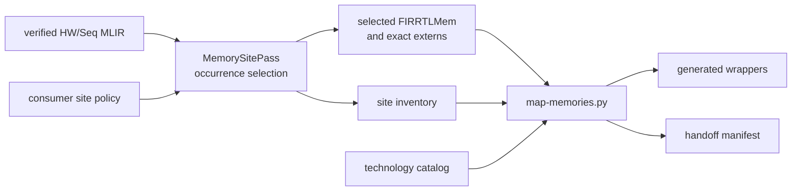

<!-- Guides contributors through extending and validating CIRCT-boundary SRAM mapping. -->
<!-- SPDX-License-Identifier: Apache-2.0 -->

# Developing SRAM mapping

Read the package [README](README.md) for the mapping contract, policy and
artifact schemas, failure boundaries, and consumer handoff. This guide owns
implementation architecture, extension workflow, generated-artifact policy,
and focused validation.

## Architecture and ownership

SRAM mapping begins after verified Rhodium IR has been lowered to HW/Seq MLIR.
Keep logical memory semantics and frontend authoring in Rhodium, generic
occurrence selection and adapter generation here, technology metadata beneath
`sram/<technology>/`, and design-specific site choices and physical checks in
the consuming VLSI flow.



Do not put macro names, PDK paths, or foundry conditionals in Rhodium, cores,
SoCs, the generic pass, or the generic adapter renderer.

## Implementation map

| Concern | Owner |
|---|---|
| Occurrence discovery, policy lookup, extern retargeting, and inventory emission | [`circt/MemorySitePass.cpp`](circt/MemorySitePass.cpp) |
| Pass build and registration | [`circt/CMakeLists.txt`](circt/CMakeLists.txt) |
| FIRRTLMem parsing, eligibility, catalog matching, tiling, wrappers, and manifests | [`map-memories.py`](map-memories.py) |
| Plugin and regression entrypoints | [`Makefile`](Makefile) |
| Synthetic mapping fixtures | [`tests/fixtures/`](tests/fixtures/) |
| Mapper, selection, wrapper, and Verilator coverage | [`tests/test_mapper.py`](tests/test_mapper.py) |
| Sky130 catalog and model | [`sky130/DEVELOPING.md`](sky130/DEVELOPING.md) |
| MiniSoC site policy and physical consumption | [`../vlsi/DEVELOPING.md`](../vlsi/DEVELOPING.md) |

## Change occurrence selection or schemas

1. Keep path discovery deterministic and relative to an explicit logical top
   and optional flattened scope. Preserve stable wrapper identity between
   direct-top and harness-scoped use.
2. Reject malformed or unknown policy paths before mapping and include the
   available scoped sites in diagnostics.
3. Version inventory or manifest schema changes explicitly. Update the pass,
   mapper, design-specific checker, fixtures, and owning README together.
4. Keep occurrence inventory generated and policy YAML hand-authored. Never
   infer a physical selection silently after a policy requested a macro.

## Add an adapter or mapper capability

1. Define a generic interface token and adapter contract independently of one
   foundry or catalog entry.
2. Validate logical ports, latency, clocks, initialization, depth, width, and
   mask granularity before emitting wrappers.
3. Preserve exact module names and calculate banking, slicing, utilization,
   area, collateral, and power metadata in the manifest.
4. Add success and intentional-failure fixtures plus compiled wrapper behavior
   when the generated SystemVerilog changes.
5. Update [README.md](README.md) when eligibility, CLI, schema, artifacts, or
   failure behavior changes.

## Generated artifacts

MLIR, occurrence inventories, wrappers, manifests, lowered RTL, plugin builds,
and simulator products are generated and remain untracked. Checked-in inputs
are policies, catalogs, functional models, mapper/pass sources, and focused
fixtures. Consumer flows own their artifact directories and cleanup targets.

## Focused validation

Build the plugin and run the complete mapper regression from the repository
root:

```sh
make -C sram test
```

The target uses the repository-pinned CIRCT by default. Set matching
`CIRCT_OPT` and `CIRCT_ROOT` for another installation; `PYTHON` and `VERILATOR`
are overridable. Coverage includes depth banking, width slicing, masks,
generated-wrapper behavior, mixed mapped/inferred equal-shape sites,
unknown-site rejection, scoped wrapper stability, and unsupported ports.

Use the consuming guides for design-specific validation:

```sh
make -C vlsi mini-soc-memory-map
make -C vlsi/sim mapping
```

Those checks validate direct-top and harness-scoped policy use respectively;
they do not broaden the generic mapper's ownership.
