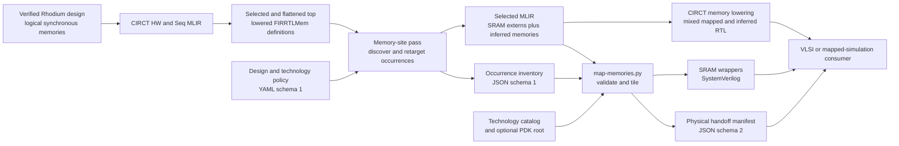

<!-- Defines the reusable CIRCT-boundary SRAM mapping package and its contracts. -->
<!-- SPDX-License-Identifier: Apache-2.0 -->

# SRAM mapping

This package turns selected occurrences of Rhodium synchronous memories into
exact-name SRAM wrapper modules after Rhodium's CIRCT backend has translated a
verified design into HW/Seq MLIR. It owns reusable occurrence selection, mapper
eligibility checks, macro-interface adaptation, depth/width tiling, and handoff
manifests. It does not put macro names or PDK paths into Rhodium, processor
cores, or SoCs.

Contributors changing selection, mapping, adapters, or schemas should read
[`DEVELOPING.md`](DEVELOPING.md).



## Ownership boundaries

| Concern | Owner |
|---|---|
| Author-visible port topology, timing, masking, and undefined behavior | Rhodium's [synchronous-memory contract](../rhodium/core/README.md#synchronous-memories) and [authoring surface](../rhodium/frontend/layers/README.md#synchronous-memories) |
| Translation from verified Rhodium IR to `seq.firmem` | The [CIRCT backend storage lowering](../rhodium/backend/README.md#storage) |
| Top selection, flattened occurrence discovery, site-policy lookup, extern retargeting, and inventory emission | [`circt/MemorySitePass.cpp`](circt/MemorySitePass.cpp) |
| Eligibility checks on lowered `FIRRTLMem`, catalog matching, tiling, wrapper generation, and manifest assembly | [`map-memories.py`](map-memories.py) |
| Macro interface, dimensions, physical size, power pins, functional model, and PDK-relative collateral paths | A technology catalog and guide, such as [Sky130 SRAM support](sky130/README.md) |
| Which logical sites use which technology macro, PDK installation, design-specific assertions, and physical implementation | The consuming design/technology flow, such as the [MiniSoC VLSI flow](../vlsi/README.md#stage-2-map-and-synthesize-minisoc-memories) |

The mapper's supported input shape is narrower than Rhodium's logical memory
contract. A mappable `FIRRTLMem` currently has exactly one shared read/write
port, one-cycle reads and writes, the default single write clock, no
initialization, and an optional uniform packed-lane write mask. The selected
macro must preserve that mask: its write granularity can be no coarser than the
logical granularity and must divide it. Other legal Rhodium memory shapes can
remain inferred; they are not language errors merely because this mapper does
not implement them.

The only generic pin adapter currently implemented is `openram_1rw1r`, which
uses a maskable read/write port and leaves the macro's read-only port unused.
Supporting another pin convention requires another generic adapter renderer.
Foundry-specific conditionals belong in neither that renderer nor the Rhodium
backend.

## Transformation and policy flow

Load `build/circt/rhodium-memory-sites.so` into the same `circt-opt` installation
used to build it. The consumer pipeline then performs these operations in
order:

1. `rhodium-select-hw-top{top=...}` makes one elaborated HW module public.
2. `hw-flatten-modules{hw-inline-all=true hw-inline-with-state=true}` creates
   occurrence-specific instance paths, followed by `symbol-dce`.
3. `lower-seq-firmem` converts `seq.firmem` resources to generated
   `FIRRTLMem` modules and instances.
4. `rhodium-map-memory-sites{policy=... inventory=... top=...
   scope-prefix=...}` discovers scoped occurrences. Selected occurrences are
   retargeted to stable, exact-name `hw.module.extern` wrappers; unselected
   occurrences retain their generated-memory implementation. The pass writes
   the complete occurrence inventory.
5. `map-memories.py` cross-checks the selected externs against that inventory,
   validates their logical contracts and the requested catalog macros, emits
   tiled wrappers, and merges mapping data into the final manifest.

A site policy is relative to one logical design top:

```yaml
# Selects implementation decisions relative to one logical design top.

schema_version: 1
top: DesignTop
default: infer
sites:
  path/to/storage: macro_name_from_catalog
  path/to/other_storage: infer
```

`schema_version: 1`, a nonempty `top`, `default: infer`, and a `sites` mapping
are required. Every explicit path must exist in the prepared scope. An omitted
site inherits `infer`; an explicit `infer` records an intentional decision.
The policy value for a mapped site is an exact macro name from the selected
technology catalog.

By default, `rhodium-map-memory-sites` uses the policy's logical `top` as the
actual elaborated top. `top=<module>` overrides it. `scope-prefix=<path>` limits
discovery to that flattened prefix and strips the prefix before policy lookup.
For example, the same `MiniSoC`-relative policy can apply directly to
`top=MiniSoC` or within `top=SoCHarness scope-prefix=soc`. Wrapper names derive
from the policy-relative path, so both contexts receive the same wrapper
identity.

The production, occurrence-aware invocation of the mapper is:

```sh
python3 sram/map-memories.py selected.mlir \
  --catalog sram/TECHNOLOGY/macros.ini \
  --site-inventory memory-sites.json \
  --output-verilog memory-wrappers.sv \
  --output-manifest memory-manifest.json
```

Add `--pdk-root /path/to/pdk` when the mapper should verify that every selected
macro's catalogued Verilog, LEF, GDS, Liberty, and SPICE path exists. The
checked-in [MiniSoC policy](../vlsi/designs/mini-soc/sky130/sram-map.yaml) and
its Makefile-owned pipelines are concrete examples; use them instead of
copying their site or macro lists here.

## Inputs and artifacts

| Item | Contract and lifetime |
|---|---|
| Selected MLIR | Mapper input emitted after the complete site-pass pipeline. It uses pinned, one-line CIRCT `FIRRTLMem` syntax, contains tagged externs for selected occurrences, and retains generated definitions needed by inferred sites. |
| Policy YAML | Checked-in design-and-technology intent. It names logical occurrence paths and exact catalog macros, with inference as the safe default. |
| Site inventory JSON | Generated schema 1 record of actual top, logical policy top, scope prefix, every policy-relative and actual instance path, source module, decision, and mapped wrapper identity. Do not treat it as hand-authored policy. |
| Technology catalog | Checked-in INI metadata interpreted by the generic mapper. Technology directories own their catalog contents and functional models. |
| Wrapper SystemVerilog | Generated exact-name adapters and macro banks/slices. Compile it with CIRCT's RTL and the appropriate functional or PDK macro model. |
| Handoff manifest | Generated schema 2 record when `--site-inventory` is used. It preserves every mapped and inferred occurrence, logical contracts for mapped sites, bank/slice instances, utilization and area totals, collateral, power pins, and the selection scope. |

Without `--site-inventory`, the mapper accepts generated `FIRRTLMem`
definitions directly, chooses the lowest-area compatible catalog entry, and
emits a schema 1 manifest scoped to unique definitions. That mode supports
generic mapper tests and exploration; physical consumers should use the
occurrence-aware schema 2 flow so repeated instances and inferred decisions
are explicit.

All MLIR, inventories, wrappers, manifests, lowered RTL, and simulator build
products are generated artifacts and stay outside version control.

## Failure boundaries

The CIRCT pass fails before mapping when the policy is unreadable or malformed,
the actual top is absent, the scope prefix is malformed, flattened paths are
duplicated, a policy path is unknown, a wrapper symbol collides, or the
inventory cannot be written. Unknown-path diagnostics include the available
scoped sites; use that reported site list rather than guessing hierarchy names.

The Python mapper fails when the selected MLIR does not use the pinned form,
the MLIR and inventory disagree, a logical port/timing/mask contract is
unsupported, a requested macro is missing or incompatible, catalog metadata or
the checked-in functional model is invalid, or optional PDK collateral is
missing. It does not silently fall back to inference for a site that policy
selected for mapping.

A successful manifest and wrapper prove mapping consistency, not physical
readiness. Functional models prove cycle behavior only. Macro placement,
blockages, PDN connections, routing, timing, extraction, and LVS remain the
physical flow's responsibility; the manifest only carries the information
needed for that handoff.

## Focused validation and consumers

Contributor plugin, mapper, wrapper, and schema validation is documented in
[`DEVELOPING.md`](DEVELOPING.md#focused-validation).

Consumer-specific validation belongs with each consumer:

- [`make -C vlsi mini-soc-memory-map`](../vlsi/README.md#stage-2-map-and-synthesize-minisoc-memories)
  verifies the direct-top MiniSoC manifest and installed PDK collateral.
- [`make -C vlsi/sim mapping`](../vlsi/sim/README.md)
  verifies the same logical policy when scoped through `SoCHarness` and uses
  checked-in functional models rather than signoff views.

Use the linked owner guides for later RTL, simulation, synthesis, and physical
checks; this package does not duplicate those workflows.
