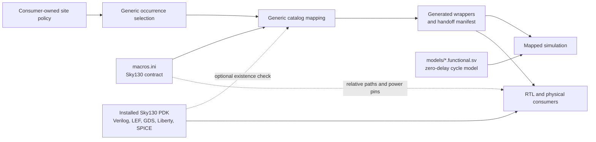

<!-- Documents the Sky130 macro catalog and simulation-model ownership. -->
<!-- SPDX-License-Identifier: Apache-2.0 -->

# Sky130 SRAM support

This directory owns the Sky130 entries supplied to the technology-independent
[SRAM mapper](../README.md): exact macro names, interface and geometry metadata,
PDK-relative collateral paths, power-pin names, and checked-in functional
models. It does not choose which design memories become macros or define the
generic mapping, tiling, manifest, simulation, or physical-flow policy.

Contributors maintaining the catalog or functional model should read
[`DEVELOPING.md`](DEVELOPING.md).

## Catalogued macro

[`macros.ini`](macros.ini) currently contains one `[macro:*]` section. The
section name and `name` value both use the exact module and hard-macro name
`sky130_sram_2kbyte_1rw1r_32x512_8`.

| Property | Catalog contract |
|---|---|
| Capacity and geometry | 512 words × 32 bits = 16,384 bits (2 KiB); 9-bit address |
| Interface token | `openram_1rw1r` |
| Ports | One read/write port and one read-only port |
| Write mask | 8-bit granularity; `wmask0[3:0]`, with bit *i* enabling `din0[8*i +: 8]` |
| Physical abstract | 683.1 µm × 416.54 µm = 284,538.474 µm² |
| Power metadata | `vccd1` primary power; `vssd1` primary ground |
| Functional model | [`models/sky130_sram_2kbyte_1rw1r_32x512_8.functional.sv`](models/sky130_sram_2kbyte_1rw1r_32x512_8.functional.sv) |

The interface has these macro-visible signals:

| Port | Signals and behavior |
|---|---|
| Read/write port 0 | `clk0`; active-low `csb0`; active-low write control `web0`; `wmask0[3:0]`; `addr0[8:0]`; `din0[31:0]`; `dout0[31:0]` |
| Read-only port 1 | `clk1`; active-low `csb1`; `addr1[8:0]`; `dout1[31:0]` |

The current generic adapter drives the logical one-cycle read/write memory
through port 0. It ties `clk1` to the logical clock, disables port 1 with
`csb1 = 1`, ties `addr1` low, and leaves `dout1` unconnected. Wider or deeper
logical memories are tiled by the generic mapper; this catalog describes one
physical instance, not a particular tiling.

The mapper requires `depth == 2^address_width`, a positive width evenly
divisible by `write_granularity`, exactly one read and one read/write port for
the `openram_1rw1r` token, and an existing functional-model path when one is
listed. The complete logical-memory eligibility and mask-compatibility rules
remain in the [generic mapping guide](../README.md#ownership-boundaries).

## Functional model and PDK views

The checked-in functional model is deterministic, zero-delay SystemVerilog for
mapper regression and cycle-level mapped simulation. On a rising edge it reads
port 0 when `csb0` is low and `web0` is high, or updates each enabled byte when
`web0` is low; port 1 performs a rising-edge read when enabled. Storage starts
uninitialized. The model deliberately omits timing arcs, delays, power-aware
behavior, analog behavior, physical geometry, and supply pins.

The catalog's physical paths are relative to the PDK root passed to
`map-memories.py --pdk-root`. For the repository VLSI flow that root is
`$(PDK_ROOT)/$(PDK)`, normally `$HOME/.ciel/sky130A` after the setup described
by the [VLSI guide](../../vlsi/README.md#stage-0-initialize-tools-and-physical-inputs).

| View | PDK-relative path | Consumer contract |
|---|---|---|
| Verilog | `libs.ref/sky130_sram_macros/verilog/sky130_sram_2kbyte_1rw1r_32x512_8.v` | PDK macro RTL used by the physical-flow lint handoff; exposes `vccd1` and `vssd1` only under `USE_POWER_PINS` |
| LEF | `libs.ref/sky130_sram_macros/lef/sky130_sram_2kbyte_1rw1r_32x512_8.lef` | Placement and routing abstract; source of the catalogued 683.1 µm × 416.54 µm size and power/ground pins |
| GDS | `libs.ref/sky130_sram_macros/gds/sky130_sram_2kbyte_1rw1r_32x512_8.gds` | Layout view for later hard-macro integration |
| Liberty | `libs.ref/sky130_sram_macros/lib/sky130_sram_2kbyte_1rw1r_32x512_8_TT_1p8V_25C.lib` | Nominal TT, 1.8 V, 25 °C timing view supplied by the installed bundle |
| SPICE | `libs.ref/sky130_sram_macros/spice/sky130_sram_2kbyte_1rw1r_32x512_8.spice` | Circuit view for macro-aware LVS setup |

Supplying `--pdk-root` makes the mapper check that all five files exist for
each selected macro. It does not compare their internal ports, dimensions,
corners, or cell names with the INI entry. Catalog maintainers must keep those
values aligned with the pinned PDK collateral.

`power_pins` is physical handoff metadata. The mapper records the names in the
manifest, but its generated adapter neither exposes nor connects supplies, and
the functional model has no supply ports. A later physical flow must establish
and verify the PDN connections; merely finding the PDK files does not do so.

## Consumer handoff

The mapper copies the selected macro's interface, collateral map, power-pin
list, and resolved functional-model path into the generated manifest, uses its
geometry to calculate mapped area, and emits wrappers that instantiate its
exact `name`. The relevant consumer-owned inputs and checks are:

- [`../../vlsi/designs/mini-soc/sky130/sram-map.yaml`](../../vlsi/designs/mini-soc/sky130/sram-map.yaml)
  chooses the current MiniSoC memory sites; this catalog does not own that list.
- [`../../vlsi/openlane/mini_soc/config.yaml`](../../vlsi/openlane/mini_soc/config.yaml)
  registers the PDK views with LibreLane. It is the physical consumer's
  configuration, not a second catalog definition.
- The [MiniSoC VLSI flow](../../vlsi/README.md#stage-2-map-and-synthesize-minisoc-memories)
  validates installed collateral and the design-specific manifest, then hands
  mixed inferred/mapped RTL to lint and synthesis.
- The [mapped-simulation flow](../../vlsi/sim/README.md) compiles the generated
  wrappers with the checked-in functional model and intentionally does not
  consume signoff views.

Follow the [generic transformation and policy flow](../README.md#transformation-and-policy-flow)
for mapper commands, schemas, tiling, and failure behavior. Keeping those
contracts in `sram/` lets this page stay focused on Sky130 catalog ownership.

## Implementation map

Source ownership and the macro-maintenance workflow moved to
[`DEVELOPING.md`](DEVELOPING.md#implementation-map).

## Deliberate limits

This directory does not certify PDK timing, power, analog behavior, DRC, LVS,
placement, routing, extraction, or silicon correctness. It also does not
provide a second adapter, exercise the macro's read-only port through mapped
Rhodium memories, wire supply pins in generated wrappers, or make a design site
eligible for mapping. A valid catalog and successful functional model prove
metadata consistency and logical cycle behavior only; consumer flows own
physical integration and signoff.

## Focused validation

Contributor catalog, mapper, physical-consumer, and mapped-simulation checks
are documented in [`DEVELOPING.md`](DEVELOPING.md#focused-validation).
