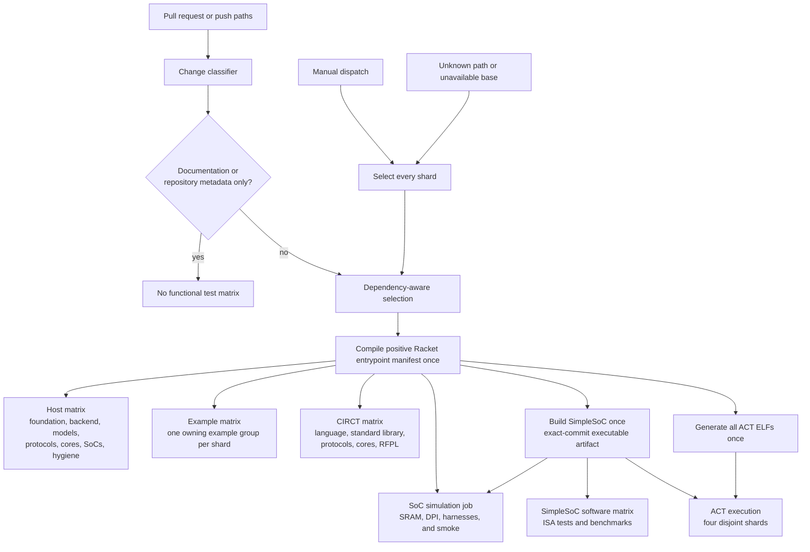

<!-- Explains how to add, organize, classify, and maintain Rhodium tests. -->

# Developing Rhodium tests

Read the [test-running guide](README.md) first for validation targets, focused
selectors, toolchain depth, and failure interpretation. This guide owns the
contributor rules for adding and maintaining tests.

## Test placement and ownership

The central test tree mirrors the implementation boundaries:

| Directory | Tests owned here |
|---|---|
| [`core/`](core/) | Backend-independent types, IR construction, verification, and primitive semantics |
| [`analysis/`](analysis/) | Optional backend-independent analyses over completed core IR |
| [`frontend/`](frontend/) | Language profiles, layers, elaboration, compiler-facing interface metadata, static event graphs, examples, and invalid frontend uses |
| [`backend/`](backend/DEVELOPING.md) | Host-side backend tests, CIRCT fixtures, Verilog benches, and reference maintenance |
| [`formal/`](formal/) | Optional Rosette semantics, queries, witnesses, and differential replay |
| [`emacs/`](emacs/) | Project-aware `rhodium-mode` dispatch and Racket back-end configuration |

Keep library, protocol, core, and system tests with the package that owns the
behavior rather than moving them into this mirrored tree. Canonical valid
authoring programs belong under [`../examples/`](../examples/README.md);
frontend-invalid programs belong under [`frontend/invalid/`](frontend/invalid/).
When moving or adding a Rhodium module, preserve the mirrored
`core/`/`frontend/`/`backend/` organization and run `make check-boundaries`.

## Authoring principles

- A new hardware module does not require a dedicated test merely because it
  elaborates or passes `verify_design`. Successful compilation and elaboration
  are compiler responsibilities and should be covered once at representative
  integration boundaries, not repeated for every library component.
- For reusable hardware, prefer CIRCT/Verilator tests of cycle-visible behavior:
  outputs, state transitions, reset, handshakes, backpressure, arbitration,
  ordering, faults, and protocol interactions.
- Keep host tests for pure host algorithms and configuration, public
  elaboration-time rejection, specialization that removes or changes a public
  interface, and structural metadata consumed by another tool.
- Inspect exact operations, internal instance names, register names, or counts
  only when that IR is the compiler feature under test or an explicitly stable
  downstream contract. Incidental implementation shape is not behavior.
- Test supported behavior and invalid uses of supported features.
- Prefer semantic structure, opcodes, and types over generated temporary names.
- Use language-layer equivalence tests when syntax should lower to existing
  kernel or core meaning.
- Update Verilog references only when backend output changes intentionally, and
  review the example-source diff.
- Keep generated Racket, CIRCT, SystemVerilog, and Verilator output out of
  version control.
- Reserve broader suites for cross-layer, shared-infrastructure, or complete
  backend-pipeline changes.

## CI ownership

CI first tests and applies [`../tools/ci-changes.sh`](../tools/ci-changes.sh).
When it selects any downstream work, CI compiles the positive Racket entrypoint
manifest once for reuse by the selected jobs. Pull requests and pushes classify
the changed paths; manual dispatch selects every matrix shard.

Known dependency paths can select several branches. For example, NoC, RISC-V,
CHI, core, and shared standard/flow library changes also select the SoC host shard
when their behavior feeds system composition. Backend implementation or fixture
changes select the backend host shard and every external CIRCT group. The
simulation job remains independent from backend fixtures and owns the
repository's full harness flow.

The software matrix independently selects ISA tests, benchmarks, and ACT. Shared
SimpleSoC dependencies (including CHI, NoC, devices, and RISC-V support) select all
three; suite-only adapter/source changes select the owning lane. ACT configuration
generation uses the exact compiled root; ISA/benchmark execution needs only the
compiler and native simulator artifact. All software builds use the same pinned
GCC/Newlib toolchain. ACT execution consumes its shared ELF archive without installing
the compiler or reference-model toolchain again. Four deterministic shards cover
the full generated inventory, including failures. They run independently with bounded process parallelism and
upload logs plus JSON/JUnit results even when execution fails. Do not add
`continue-on-error` or pass-based exclusions to make new suites green. Measure a
complete Linux run and resolve baseline failures before marking the new jobs
required in branch protection. Platform/privileged ACT coverage limits remain
in the [simulation guide](../sims/README.md#architectural-certification-tests).

Recognized documentation and inert repository metadata select no functional
test jobs. The optional Emacs integration and most of `vlsi/` have no
functional CI lane; Rhodium sources there still receive source hygiene, while
`vlsi/sim/` and the mapped MiniSoC flow select simulation. Unrecognized paths
fail closed by selecting every job, and the classifier audit rejects tracked
executable source that selects no job.

When adding or moving executable source, update the classifier if its existing
dependency rules do not select every affected owner. Test the classifier change
directly before relying on its downstream matrix selection.

## Change workflow

1. Put the test beside the layer or package that owns the behavior.
2. Before adding a host test, state what regression it catches beyond successful
   elaboration. If the answer is only internal shape, add or extend an
   end-to-end simulation instead.
3. Add valid executable examples to the owning example group and invalid
   language uses to the frontend-invalid suite.
4. Add external lowering or simulation coverage through the
   [backend fixture workflow](backend/DEVELOPING.md) only when the change crosses
   that toolchain boundary.
5. Confirm [`../tools/ci-changes.sh`](../tools/ci-changes.sh) selects every
   affected package, example, CIRCT, or simulation shard.
6. Run the smallest owner target first, then the broader target required by the
   changed dependency surface. The [test-running guide](README.md) lists those
   targets and their scope.
