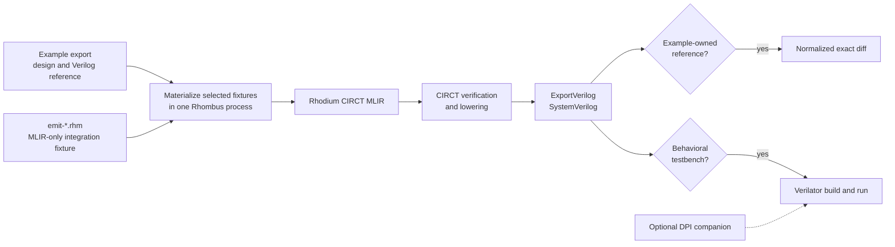

<!-- Documents CIRCT fixtures, Verilator simulations, and example-owned Verilog goldens. -->

# Backend tests

Backend validation is split by the failure boundary it exercises. Host-side
Rhombus tests check backend emission, diagnostics, and policies without
invoking external tools. The fixture runner can then check selected designs
with CIRCT, exact SystemVerilog references, and Verilator.

The [backend guide](../../rhodium/backend/README.md) owns lowering architecture
and operation contracts. The [example guide](../../examples/README.md) owns the
canonical example catalog. This guide owns the backend test workflow; the
fixture manifest in [`run-circt.sh`](run-circt.sh) remains authoritative for
fixture names, groups, exports, and available simulations.

Contributors changing the manifest, fixtures, benches, or exact references
should read [`DEVELOPING.md`](DEVELOPING.md).



## Choose the smallest useful run

For a backend lowering change, start with the host test file that owns the
behavior:

```sh
tools/run-racket-tests.sh tests/backend/circt-test.rhm
```

Replace `circt-test.rhm` with the relevant `*-test.rhm`. `make backend-test`
runs every backend host test after package-boundary checks; it does not run
CIRCT or Verilator.

For an external-tool check, select one declared fixture explicitly:

```sh
FIXTURE=bundle bash tests/backend/run-circt.sh
```

Use `FIXTURES` for a focused batch. The runner materializes the selected
examples and emitters together, avoiding a separate Rhombus startup for each
fixture:

```sh
FIXTURES='bundle interface-array' bash tests/backend/run-circt.sh
```

Use a group when a change crosses one ownership area:

```sh
bash tests/backend/run-circt.sh --group std
```

The accepted groups are `language`, `std`, `protocols`, `cores`, and `rfpl`.
A `std` selection includes both `rhodium/std` foundations and the root-level
[`flow/` library](../../flow/README.md).
A group selects every declared fixture in that group, not just the curated
spine. `FIXTURE`, `FIXTURES`, and `--group` are mutually exclusive selectors;
an unknown name fails before materialization.

The main targets differ in scope and stage:

| Command | Selection and work performed |
|---|---|
| `make circt-test` | Curated semantic spine; lower with CIRCT, compare example references when the CIRCT version permits it, and run available simulations |
| `make circt-verify-test` | Curated spine; materialize and lower only, with no golden comparison or simulation |
| `make verilator-test` | Curated fixtures that have simulations; lower, build, and run them without golden comparison |
| `make verilog-golden-test` | Every explicitly golden example fixture; require the pinned CIRCT version and compare each exact reference, with no simulation |
| `make circt-full-test` | Every declared example and direct emitter; compare selected simple-example references with the pinned tool and run every available simulation |

The default curated spine covers representative external behavior across the
lowering families while avoiding every frontend and parameter variation.
`--full`, a group, or explicit fixture selection is comprehensive only within
the manifest scope it selects. Combine a selector with a runner mode when the
focused question is narrower, for example:

```sh
FIXTURE=sync-memory-masked bash tests/backend/run-circt.sh --verify-only
bash tests/backend/run-circt.sh --group protocols --simulate-only
```

## Toolchain and exact-reference behavior

Use the repository's [pinned Verilator setup](../../README.md#requirements)
for simulations. Verilator 5.020 miscompiles stimulus propagation in several
event fixtures; CI and the local installer use 5.038. The installer verifies
the source checksum and installed version, and CI caches the installation by
OS, architecture, and installer contents.

Install the repository's pinned CIRCT release with:

```sh
make setup-circt
```

The runner prefers `.tools/firtool-1.155.0/bin/circt-opt`, then a `circt-opt`
on `PATH`; `CIRCT_OPT` overrides both. Selected simple-example references are
exact output for CIRCT `firtool-1.155.0`. Before comparison, the runner strips temporary debug-path
suffixes and generated-version noise, applies the repository's fixed lowering
and prettification passes, and disables register and memory randomization.
Everything else is compared exactly.

With another CIRCT version, a normal, full, group, or explicit run still
verifies lowering and runs selected simulations, but announces that it is
skipping version-specific reference comparisons. `make verilog-golden-test`
instead fails on a version mismatch so a golden-only run cannot silently pass
without comparing text.

When a backend change intentionally changes generated SystemVerilog, update
the affected reference only after diagnosing the diff. Reference ownership and
the guarded update workflow are documented in
[`DEVELOPING.md`](DEVELOPING.md#verilog-references).

## Interpret failures by stage

- A host `*-test.rhm` failure points to backend emission, naming, diagnostics,
  or a backend policy assertion before external lowering.
- A materialization failure points to example exports, elaboration, public-IR
  verification, or a direct emitter. The runner invokes
  [`../../tools/run-racket.sh`](../../tools/run-racket.sh), which supplies a
  fresh compiled root unless the caller deliberately provides one or verified
  CI bytecode.
- A `circt-opt` failure means the emitted MLIR did not parse, verify, or survive
  the selected lowering passes. Confirm the reported CIRCT version before
  attributing a pass-pipeline difference to Rhodium.
- A golden diff means the pinned generated text changed. Decide whether the
  backend change explains it before updating the example-owned reference.
- A Verilator build failure usually isolates generated SystemVerilog,
  testbench, top-module, or DPI linkage. The runner prints the build log before
  removing its temporary directory.
- A simulation failure is behavioral unless it is one of the runner's labeled
  expected-assertion failures. Diagnose it independently from a passing exact
  text comparison: a golden proves stable output, not correct behavior.

## Fixture and artifact ownership

Fixture, bench, temporary-artifact, and generated-output ownership is now in
[`DEVELOPING.md`](DEVELOPING.md#fixture-and-artifact-ownership). This heading is
retained for existing links.

## Verilog references

Exact-reference ownership and update maintenance are now in
[`DEVELOPING.md`](DEVELOPING.md#verilog-references). This heading is retained
for existing links.

## Contributing backend tests

See [`DEVELOPING.md`](DEVELOPING.md) to add or rename fixtures, maintain
Verilator benches and DPI companions, update references, or change the runner.
