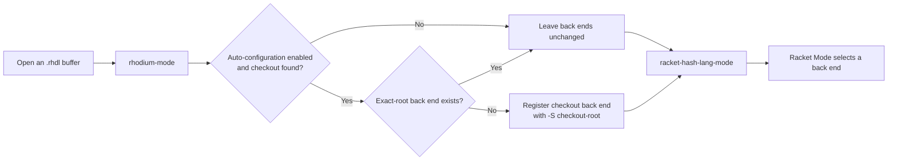

<!-- Documents installation and behavior of Rhodium's project-aware Emacs integration. -->
<!-- SPDX-License-Identifier: Apache-2.0 -->

# Rhodium Emacs integration

[`rhodium-mode.el`](rhodium-mode.el) is a project-aware entry point to Racket
Mode's `racket-hash-lang-mode`. It adds Rhodium file dispatch, checkout-local
Racket configuration, and a small presentation layer without defining another
major mode.

Contributors changing the integration should read
[`DEVELOPING.md`](DEVELOPING.md).

## Installation

Install the Emacs package `racket-mode`, then add this directory to Emacs's
load path and load the integration:

```elisp
(add-to-list 'load-path "/path/to/rhodium/tools/emacs")
(require 'rhodium-mode)
```

Loading the file associates names ending in `.rhdl` with `rhodium-mode` through
`auto-mode-alist`. It does not add an association for `.rhm`; configure those
files separately if desired. `M-x rhodium-mode` can also enter the mode
explicitly.

## Project auto-configuration

When `rhodium-mode` starts, it loads Racket Mode. If automatic configuration is
enabled, it looks upward from the buffer's `default-directory` for a readable
[`rhodium/main.rkt`](../../rhodium/main.rkt) and treats the containing directory
as the checkout root. It registers that root with Racket Mode and appends
`-S <checkout-root>` to the Racket command. The collection search path then
includes the checkout, so `#lang rhodium` can resolve without installing or
linking the checkout as a Racket package.



The exact precedence is:

1. An existing Racket Mode configuration whose `:directory` is exactly the
   checkout root is kept unchanged.
2. Otherwise the automatically registered `:racket-program` starts with the
   first non-`nil` value among `rhodium-racket-program`, Racket Mode's
   `racket-program`, and the fallback string `"racket"`. The integration then
   appends `-S` and the checkout root.
3. Racket Mode selects among all registered back ends by its own longest
   matching directory-prefix rule. For example, a more-specific configuration
   below the checkout may be selected for a buffer there. Rhodium does not
   change that selection rule.

Each automatically discovered checkout root is considered only once per Emacs
session, including when an exact-root configuration was already present.

## Manual overrides

Customize these Rhodium variables before first visiting a checkout:

- `rhodium-racket-program`: `nil` inherits `racket-program`; a string names an
  executable; a list supplies an executable followed by initial arguments.
- `rhodium-auto-configure-back-end`: set this to `nil` to skip checkout
  discovery and registration. File dispatch and the presentation layer remain
  available.

For example:

```elisp
(setq rhodium-racket-program
      '("/opt/homebrew/bin/racket" "-j"))
```

For full control, disable automatic registration and add an exact-root Racket
Mode configuration yourself. Include `-S` when that is how the uninstalled
checkout should become visible to Racket:

```elisp
(setq rhodium-auto-configure-back-end nil)
(require 'racket-mode)
(racket-add-back-end
 "/path/to/rhodium/"
 :racket-program
 '("/path/to/racket" "-S" "/path/to/rhodium"))
```

An exact-root manual configuration also takes precedence while automatic
configuration remains enabled, so disabling it is optional in that case.

## Behavior

`rhodium-mode` performs three operations in order: load Racket Mode, consider
the checkout back end, and call `racket-hash-lang-mode`. The buffer's actual
`major-mode` is therefore `racket-hash-lang-mode`, which preserves the identity
expected by Racket Mode integrations.

Racket Mode obtains tokenization, indentation, navigation, delimiter and
comment metadata, and related language services from the active `#lang` back
end. Their availability and exact behavior belong to Racket Mode and the
language implementation; `rhodium-mode.el` does not reimplement or guarantee
them.

After Racket Mode reports either `(lib rhodium/language.rhm)` or
`(lib rhodium/base/language.rhm)` as the module language, the integration:

- changes the mode-line prefix from `#lang` to `Rhodium`; and
- adds keyword faces for the Rhodium forms listed in
  `rhodium--font-lock-keywords` and type faces for `Bits`, `Bool`, `Clock`,
  `Mask`, `MaybeOneHot`, `OneHot`, `Reset`, `SInt`, and `Vec`.

For another module language, it does not relabel the buffer and removes any
Rhodium-specific font-lock rules it previously installed. All other syntax
coloring continues to come from the language back end.

## Troubleshooting

- **`Rhodium mode requires the Emacs package racket-mode`:** install or expose
  `racket-mode` on `load-path`, then retry `M-x rhodium-mode`.
- **A `.rhdl` file opens in another mode:** ensure `(require 'rhodium-mode)` ran
  and inspect the first matching entry in `auto-mode-alist`; configuration
  loaded later may have inserted a competing association ahead of it. Use
  `M-x rhodium-mode` to test dispatch directly.
- **`#lang rhodium` does not resolve:** verify the file is below a checkout with
  a readable `rhodium/main.rkt`. Inspect `racket-back-end-configurations`; an
  existing exact-root entry is deliberately left unchanged and must make the
  checkout visible itself.
- **The wrong Racket executable starts:** set `rhodium-racket-program` before
  the checkout is first considered, or replace the exact-root configuration
  with `racket-add-back-end`. A running Racket Mode back end may also need to be
  restarted using Racket Mode's controls.
- **The `Rhodium` label or extra faces do not appear:** wait for Racket Mode to
  load the language metadata and confirm the file uses `#lang rhodium` or
  `#lang rhodium/base`. The presentation layer recognizes only the two module
  language identifiers documented above.

The integration does not install Racket, Racket Mode, or Rhodium; associate
`.rhm` files; validate a configured executable; or manage Racket Mode back-end
process lifetime. Changing customization after a root has been considered does
not retroactively rebuild that root's configuration.

## Validation

Contributor test coverage and its limits are documented in
[`DEVELOPING.md`](DEVELOPING.md#focused-validation).
