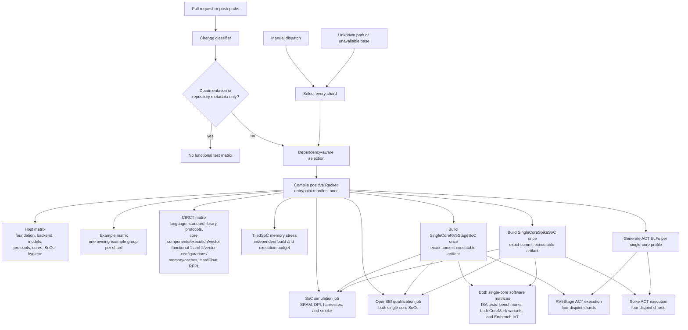

<!-- Explains how to add, organize, classify, and maintain Rhodium tests. -->
<!-- SPDX-License-Identifier: Apache-2.0 -->

# Developing Rhodium tests

Read the [test-running guide](README.md) first for validation targets, focused
selectors, toolchain depth, and failure interpretation. This guide owns the
contributor rules for adding and maintaining tests.

## Test placement and ownership

There is no repository-level test package. Every test, fixture, emitter, bench,
and package-specific helper belongs under the lowest package that owns the
behavior, normally in `<package>/tests/`. Compiler tests therefore live under
`rhodium/core/tests/`, `rhodium/analysis/tests/`,
`rhodium/frontend/tests/`, `rhodium/backend/tests/`, and
`rhodium/formal/tests/`; domain tests remain under `flow/tests/`, `noc/tests/`,
`riscv/tests/`, `cores/*/tests/`, and the corresponding package directories.

This directory owns only repository-wide test policy and reusable
orchestration. [`run-negative.rkt`](run-negative.rkt) is a package-neutral
diagnostic harness. [`circt/`](circt/DEVELOPING.md) owns external-tool
orchestration, but package-local `tests/circt/` directories own their emitters,
benches, and DPI companions. Canonical valid authoring programs belong under
[`../../examples/`](../../examples/README.md); invalid programs stay beside the
frontend or domain suite that owns their diagnostics.

When moving or adding implementation, move its tests with it and run
`make check-boundaries`. Do not create a new top-level `tests/` directory or
move package fixtures into `tools/testing/` merely because one runner consumes
them.

## Authoring principles

- A new hardware module does not require a dedicated test merely because it
  elaborates or passes `verify_design`. Successful compilation and elaboration
  are compiler responsibilities and should be covered once at representative
  integration boundaries, not repeated for every library component.
- For reusable hardware, prefer CIRCT/Verilator tests of cycle-visible behavior:
  outputs, state transitions, reset, handshakes, backpressure, arbitration,
  ordering, faults, and protocol interactions.
- Keep host tests for pure host algorithms and configuration, public
  elaboration-time rejection, specialization that removes or changes a public
  interface, and structural metadata consumed by another tool.
- Inspect exact operations, internal instance names, register names, or counts
  only when that IR is the compiler feature under test or an explicitly stable
  downstream contract. Incidental implementation shape is not behavior.
- Test supported behavior and invalid uses of supported features.
- Prefer semantic structure, opcodes, and types over generated temporary names.
- Use language-layer equivalence tests when syntax should lower to existing
  kernel or core meaning.
- Update Verilog references only when backend output changes intentionally, and
  review the example-source diff.
- Keep generated Racket, CIRCT, SystemVerilog, and Verilator output out of
  version control.
- Reserve broader suites for cross-layer, shared-infrastructure, or complete
  backend-pipeline changes.

## CI ownership

CI first tests and applies [`../tools/ci-changes.sh`](../../tools/ci-changes.sh).
When it selects any downstream work, CI compiles the positive Racket entrypoint
manifest once for reuse by the selected jobs. Pull requests and pushes classify
the changed paths; manual dispatch selects every matrix shard.

Local runner scripts preserve the same freshness boundary with a persistent
compiled root owned by each worktree under `.rhodium-cache/`. The cache is keyed
by the Racket version, installed package metadata and checksums, operating
system, architecture, and absolute checkout path. The wrapper hashes repository
sources and uses Racket's recorded dependency graph to remove changed modules
and their transitive project dependents before incremental compilation. It also
records the source path inventory and clears only the checkout's mirrored
bytecode subtree when a source is added, removed, or moved, preventing orphaned
modules from surviving structural changes.

Mutable project bytecode and its lock are never shared across worktrees. An
explicit common `RHODIUM_RACKET_CACHE_DIR` still separates project roots by
absolute checkout path; only a completed external-dependency snapshot can be
shared, and checkout bytecode is removed before that snapshot is published.
Cache access is serialized within one worktree. The wrapper supervises the
cached command, releases its lock on interruption, reports long-running phases,
and fails without an uncached retry when the cache is unavailable or busy.
Callers that deliberately provide `PLTCOMPILEDROOTS` retain full ownership of
that root, while CI continues to use its separately verified exact-commit
bytecode artifact.

Known dependency paths can select several branches. For example, NoC, RISC-V,
CHI, core, and shared standard/flow library changes also select the SoC host shard
when their behavior feeds system composition. Backend implementation or fixture
changes select the backend host shard and every external CIRCT group. The
simulation job remains independent from backend fixtures and owns the
repository's harness and ISA-smoke flow. OpenSBI qualification uses its own job
budget and the same exact-commit single-core simulator artifacts, so firmware
execution cannot consume the harness job's timeout budget.

Core CIRCT coverage gives scalar/frontend execution, two functional vector
shards, alternate vector configuration, and HardFloat independent jobs and
timeout budgets. The aggregate `cores-vector-functional` selector combines
the two functional shards, `cores-vector` adds configurations, and `cores`
still covers the five manifest-owned subsystem groups.
HardFloat retains its package-owned runner and target.

The stalled-memory TiledSoC specialization runs in its own job under the same
simulation change selection. Its separate build and bounded execution cannot
consume the ordinary harness job's budget or skip downstream smoke coverage.
Always retain its build/execution log, including on failure or cancellation.

Both single-core software matrices independently select ISA tests, benchmarks,
both CoreMark variants, and Embench-IoT. The OpenSBI job tests its target adapter,
qualifies both single-core products under the simulation change selection, and
publishes its diagnostics. Both profiles select their own ACT generation and
four-shard execution. Shared SoC dependencies
(including CHI, NoC, devices, and RISC-V support) select these lanes; suite-only
adapter/source changes select the owning lane. MiniRV5StageSoC and
TiledSoC remain capability-filtered smoke targets in the simulation job
and do not receive additional full-suite matrices. ACT configuration
generation uses the exact compiled root; ISA/benchmark/CoreMark/Embench-IoT execution needs only the
compiler and native simulator artifact. All software builds use the same pinned
GCC/Newlib toolchain. ACT execution consumes its shared ELF archive without installing
the compiler or reference-model toolchain again. Four deterministic shards cover
the full generated inventory, including failures. They run independently with bounded process parallelism and
upload logs plus JSON/JUnit results even when execution fails. Do not add
`continue-on-error` or pass-based exclusions to make new suites green. Measure a
complete Linux run and resolve baseline failures before marking the new jobs
required in branch protection. Platform/privileged ACT coverage limits remain
in the [simulation guide](../../sims/README.md#architectural-certification-tests).
The native software and ISA-smoke jobs publish manifest-selected ELF archives
with their diagnostics; package by manifest entry rather than filename suffix,
since upstream ISA binaries have no extension. The ordinary simulation jobs
also attach their standalone hand-written ELFs.

Recognized documentation and inert repository metadata select no functional
test jobs. The optional Emacs integration and most of `vlsi/` have no
functional CI lane; Rhodium sources there still receive source hygiene, while
`vlsi/sim/` and the mapped MiniRV5StageSoC flow select simulation. Unrecognized paths
fail closed by selecting every job, and the classifier audit rejects tracked
executable source that selects no job.

The hygiene lane runs `make check-license-headers` over the complete tracked
source, test, script, configuration, and documentation inventory. It requires
Apache-2.0 identifiers for original Rhodium material and BSD-3-Clause
identifiers within `hardfloat/`, while exempting exact legal texts and external
submodule contents.

When adding or moving executable source, update the classifier if its existing
dependency rules do not select every affected owner. Test the classifier change
directly before relying on its downstream matrix selection.

## Change workflow

1. Put the test beside the layer or package that owns the behavior.
2. Before adding a host test, state what regression it catches beyond successful
   elaboration. If the answer is only internal shape, add or extend an
   end-to-end simulation instead.
3. Add valid executable examples to the owning example group and invalid
   language uses to the frontend-invalid suite.
4. Add external lowering or simulation coverage through the
   [CIRCT fixture workflow](circt/DEVELOPING.md) only when the change crosses
   that toolchain boundary.
5. Confirm [`../tools/ci-changes.sh`](../../tools/ci-changes.sh) selects every
   affected package, example, CIRCT, or simulation shard.
6. Run the smallest owner target first, then the broader target required by the
   changed dependency surface. The [test-running guide](README.md) lists those
   targets and their scope.
