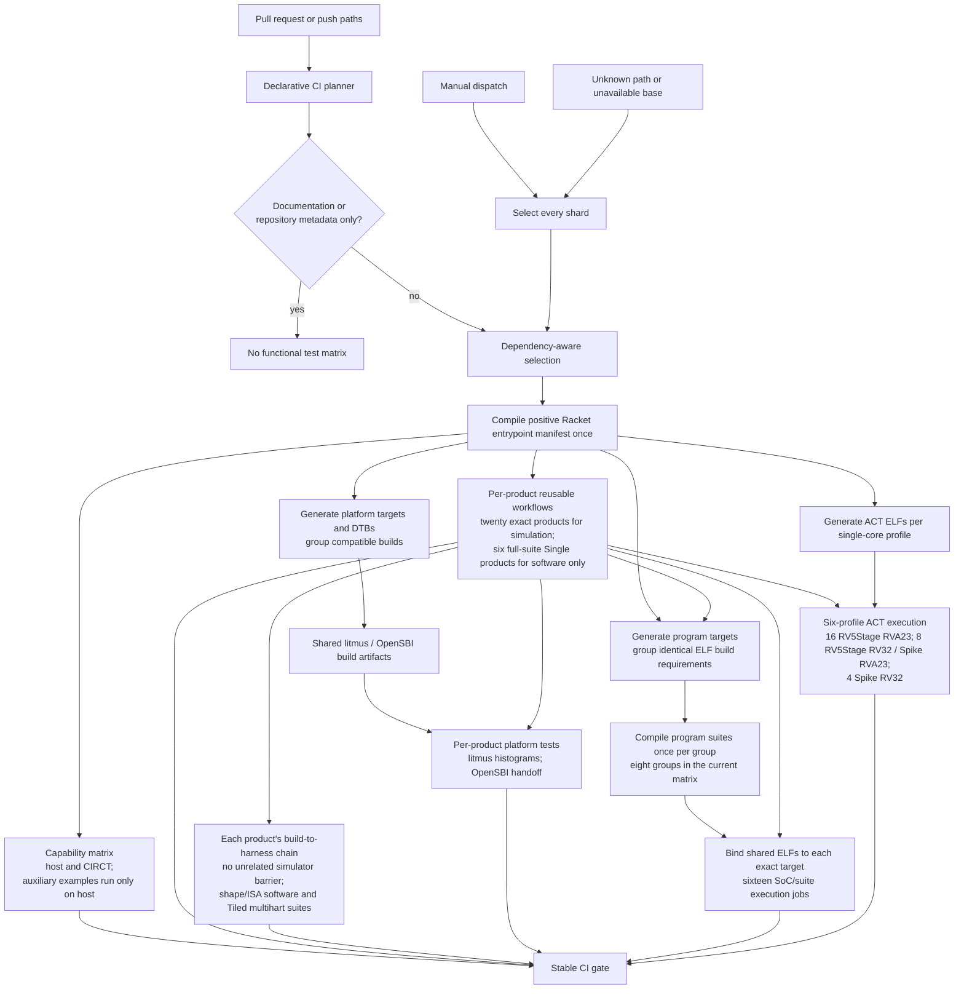

<!-- Defines test ownership, CI artifact reuse, and incremental bytecode validation. -->
<!-- SPDX-License-Identifier: Apache-2.0 -->

# Developing Rhodium tests

Read the [test-running guide](README.md) first for validation targets, focused
selectors, toolchain depth, and failure interpretation. This guide owns the
contributor rules for adding and maintaining tests.

## Test placement and ownership

There is no repository-level test package. Every test, fixture, emitter, bench,
and package-specific helper belongs under the lowest package that owns the
behavior, normally in `<package>/tests/`. Compiler tests therefore live under
`rhodium/core/tests/`, `rhodium/analysis/tests/`,
`rhodium/frontend/tests/`, `rhodium/backend/tests/`, and
`rhodium/formal/tests/`; domain tests remain under `flow/tests/`, `noc/tests/`,
`riscv/tests/`, `sw/tests/`, `cores/*/tests/`, and the corresponding package directories.

This directory owns only repository-wide test policy and reusable
orchestration. [`run-negative.rkt`](run-negative.rkt) is a package-neutral
diagnostic harness. [`circt/`](circt/DEVELOPING.md) owns external-tool
orchestration, but package-local `tests/circt/` directories own their emitters,
benches, and DPI companions. Canonical valid authoring programs belong under
[`../../examples/`](../../examples/README.md); invalid programs stay beside the
frontend or domain suite that owns their diagnostics.

When moving or adding implementation, move its tests with it and run
`make check-boundaries`. Do not create a new top-level `tests/` directory or
move package fixtures into `tools/testing/` merely because one runner consumes
them.

Representative compiler integration tests may reuse existing package-owned
circuits, benches, and DPI companions. The direct/differential backend targets
include SyncRam and UART DPI integrations; their focused invocation and checks
are documented in the [backend contributor guide](../../rhodium/backend/DEVELOPING.md#validation).
Keep those test artifacts with their original owners. CI runs direct authored
behavior plus shared-target manifest comparisons in the differential lane,
reusing the language, standard-library, and protocol lanes for CIRCT behavior.
The planner enrolls those three owners whenever it selects the differential
lane. A separate SyncRam smoke retains the no-CIRCT dependency boundary.

## Authoring principles

- A new hardware module does not require a dedicated test merely because it
  elaborates or passes `verify_design`. Successful compilation and elaboration
  are compiler responsibilities and should be covered once at representative
  integration boundaries, not repeated for every library component.
- For reusable hardware, prefer CIRCT/Verilator tests of cycle-visible behavior:
  outputs, state transitions, reset, handshakes, backpressure, arbitration,
  ordering, faults, and protocol interactions.
- Keep host tests for pure host algorithms and configuration, public
  elaboration-time rejection, specialization that removes or changes a public
  interface, and structural metadata consumed by another tool.
- Inspect exact operations, internal instance names, register names, or counts
  only when that IR is the compiler feature under test or an explicitly stable
  downstream contract. Incidental implementation shape is not behavior.
- Test supported behavior and invalid uses of supported features.
- Prefer semantic structure, opcodes, and types over generated temporary names.
- Use language-layer equivalence tests when syntax should lower to existing
  kernel or core meaning.
- Update Verilog references only when backend output changes intentionally, and
  review the example-source diff.
- Keep generated Racket, CIRCT, SystemVerilog, and Verilator output out of
  version control.
- Reserve broader suites for cross-layer, shared-infrastructure, or complete
  backend-pipeline changes.

## CI ownership

CI first tests and applies the declarative policy in [`../ci/`](../ci/plan.py).
[`plan.py`](../ci/plan.py) maps changed paths to the capability matrix declared
by [`policy.py`](../ci/policy.py). The product rows come from the single
[`simulator inventory`](../../sims/test-products.txt); policy selects workloads
by shape and ISA, independently of core. Simulator matrices additionally carry
backend and artifact identity. The direct `simple-rv5stage-rva23-verilog` entry
uses the same product/target with three smoke tests; it does not expand the
architectural or software test inventories. Its build job omits CIRCT,
and its prebuilt consumer verifies backend provenance. Its unit tests also reject tracked executable
inputs that select no lane. When the plan selects any downstream work, CI
compiles the positive Racket entrypoint manifest once for reuse by the selected
jobs. Pull requests and pushes classify changed paths; manual dispatch selects
every matrix shard.

Local runner scripts preserve the same freshness boundary with a persistent
compiled root owned by each worktree under `.rhodium-cache/`. The cache is keyed
by the Racket version, installed package metadata and checksums, operating
system, architecture, and absolute checkout path. The wrapper hashes repository
sources and uses Racket's recorded dependency graph to remove changed modules
and their transitive project dependents before incremental compilation. It also
records the source path inventory and clears only the checkout's mirrored
bytecode subtree when a source is added, removed, or moved, preventing orphaned
modules from surviving structural changes.

Mutable project bytecode and its lock are never shared across worktrees. An
explicit common `RHODIUM_RACKET_CACHE_DIR` still separates project roots by
absolute checkout path; only a completed external-dependency snapshot can be
shared, and checkout bytecode is removed before that snapshot is published.
Cache access is serialized within one worktree. The wrapper supervises the
cached command, releases its lock on interruption, reports long-running phases,
and fails without an uncached retry when the cache is unavailable or busy.
Callers that deliberately provide `PLTCOMPILEDROOTS` retain full ownership of
that root. Invalidation reads each reachable module's direct `.dep` record once
and walks reverse edges from changed sources or unreadable project metadata;
it deletes only project bytecode, and does not recursively rescan external
libraries for every source. Its summary reports cached, inspected, invalidated,
retained, and unreadable module counts.

CI caches the entire completed compiled root and source manifests across runs,
including external bytecode updated by project compilation. The key scopes
reuse to the Racket/Rhombus environment, absolute workspace path, and cache
implementation. Restoring only project bytecode over an older dependency seed
would mix imported-dependency fingerprints and defeat warm reuse. The package
installation cache seeds cold builds; a completed-root cache replaces its
bytecode with the coherent snapshot from the previous build. Source-path changes
still clear only the checkout subtree, preserving external bytecode. CI then
applies the same content invalidation as the local wrapper and records total
compilation time. The cross-run cache is only a compilation starting point.
Downstream jobs consume a newly published exact-commit artifact, including hidden
package-cache paths, and verify its environment and absolute workspace path.

```mermaid
flowchart TD
    Changes["Pull request or push paths"] --> Classifier["Declarative CI planner"]
    Manual["Manual dispatch"] --> All["Select every shard"]
    Unknown["Unknown path or unavailable base"] --> All
    Classifier --> Docs{"Documentation or<br/>repository metadata only?"}
    Docs -->|yes| None["No functional test matrix"]
    Docs -->|no| Selected["Dependency-aware selection"]
    All --> Selected
    Selected --> Compile["Compile positive Racket entrypoint manifest once"]
    Compile --> Checks["Capability matrix<br/>host and CIRCT;<br/>auxiliary examples run only on host"]
    Compile --> Simulators["Per-product reusable workflows<br/>twenty exact products for simulation;<br/>six full-suite Single products for software only"]
    Simulators --> Simulation["Each product's build-to-harness chain<br/>no unrelated simulator barrier;<br/>shape/ISA software and Tiled multihart suites"]
    Compile --> PlatformTargets["Generate platform targets and DTBs<br/>group compatible builds"]
    PlatformTargets --> PlatformBuilds["Shared litmus / OpenSBI build artifacts"]
    PlatformBuilds --> Platform["Per-product platform tests<br/>litmus histograms; OpenSBI handoff"]
    Simulators --> Platform
    Compile --> ProgramTargets["Generate program targets<br/>group identical ELF build requirements"]
    Simulators --> ProgramTargets
    ProgramTargets --> ProgramBuilds["Compile program suites once per group<br/>eight groups in the current matrix"]
    ProgramBuilds --> Programs["Bind shared ELFs to each exact target<br/>sixteen SoC/suite execution jobs"]
    Simulators --> Programs
    Compile --> ActBuild["Generate ACT ELFs per single-core profile"]
    Simulators --> ActRun["Six-profile ACT execution<br/>16 RV5Stage RVA23; 8 RV5Stage RV32 / Spike RVA23;<br/>4 Spike RV32"]
    ActBuild --> ActRun
    Checks --> Gate["Stable CI gate"]
    Simulators --> Gate
    Simulation --> Gate
    Platform --> Gate
    Programs --> Gate
    ActRun --> Gate
```

Known dependency paths can select several branches. For example, NoC, RISC-V,
CHI, core, and shared standard/flow library changes also select the SoC host shard
when their behavior feeds system composition. Backend implementation or fixture
changes select the backend host shard, direct SystemVerilog simulation, and every
external CIRCT group, including the backend differential route. The direct lane
requires Verilator without CIRCT and runs one authored SyncRam smoke; the
differential lane installs both and owns the full compiler behavioral families. Its
Builder fixtures, oracle, and runner live under
[`rhodium/backend/tests/verilog/`](../../rhodium/backend/tests/verilog/); see the
[backend contributor guide](../../rhodium/backend/DEVELOPING.md#validation). The
example manifest partitions execution: CIRCT loads and checks each declared
example source once in its owning lane, while `ci-host-examples-test` derives
the remaining non-formal examples by subtracting the manifest's source list.
Keep the local example targets for focused authoring checks; do not add a
second CI lane that merely reloads the same concrete designs. The foundation
host lane also executes standard-library, Flow, event, and diagram contracts;
the frontend and backend host owners execute their equivalence tests once.

CI uses the display groups `Checks`, `SoC / <product>`, `Platform`, and
`Software`, with short build and run names beneath each group. ACT execution
names include the product and shard. Shared ELF builds name the suite and matrix
group rather than implying ownership by the representative SoC. The final `CI`
gate name remains stable.

The root simulator matrix calls `ci-simulator.yml` once per product. Each call
publishes its simulator before starting `ci-harness.yml`; its harness depends
only on that product's build. The simulator result aggregates both phases for
the stable gate. Software and platform tests still consume the shared
simulator artifacts after the full build-and-harness product matrix completes.
Producers upload build logs and Verilator pass statistics independently of their
simulator artifacts, including on failure. `ci-platform.yml`
owns platform test grouping and execution, independently of backend
fixtures. Each OpenSBI test has its own
job budget and uses the matching exact-commit single-core simulator artifact,
so firmware execution cannot consume another SoC's or the harness job's budget.
That workflow groups litmus builds by software requirements and OpenSBI builds
by derived boot layout and generated DTB contents. Litmus7 and target compilers
belong only to build jobs, and the common ELF archive/binder feeds all compatible
execution products. Each tiled product runs the same bounded, model-checked
litmus7 selection with its independent 90-minute budget; OpenSBI retains a
45-minute budget per single-core product. Both retain build diagnostics and
runner results even on failure. The full litmus inventory is manual only and has
no CI job or schedule. Do not remove smoke cases because they expose a failure.

Core CIRCT coverage gives frontend, control, and datapath execution leaves,
two functional vector shards, alternate vector configuration, and HardFloat
independent jobs and timeout budgets. The aggregate `cores-execution` selector
combines the three execution leaves; `cores-vector-functional` combines
the two functional shards, `cores-vector` adds configurations, and `cores`
still covers the five manifest-owned subsystem groups.
HardFloat retains its package-owned runner and target.

Both RVA23 single-core software matrices independently select ISA tests, benchmarks,
both CoreMark variants, Embench-IoT, and one bounded Bringup-Bench selection.
`ci-software.yml` projects generated target descriptors into suite build groups,
compiles each group once, and distributes one ELF archive to all compatible
products. Each run binds the archive to its own full target fingerprint and
checks its simulator attestation. Compiler installation and ELF caches belong
only to the build jobs; the sixteen execution jobs retain every selected test.
Program adapter contracts run once before the build matrix. A failed build does
not prevent execution jobs from attempting other published groups.
Platform adapters run once in the planning job. Each OpenSBI execution
validates one single-core product under simulation change selection and
publishes separate diagnostics. A failed platform build does not prevent
execution jobs from attempting other published build groups.
All four Simple RV32 products select upstream ISA tests;
the existing RV64-only benchmark ports remain outside their coverage.
The six Simple RV32/RVA23 products select their own ACT generation and execution: sixteen
shards for RV5Stage RVA23, eight for both RV5Stage RV32 profiles and Spike RVA23,
and four for both Spike RV32 profiles. Counts live in `tools/ci/policy.py` and
only split execution; each profile still generates one shared ELF archive and
builds one simulator. Shared SoC dependencies
(including CHI, NoC, devices, and RISC-V support) select these lanes; suite-only
adapter/source changes select the owning lane. All six CI Mini and both Tiled
products receive capability-filtered ISA smoke. The `rv64max`, `rv64imacb`, and
`rv64imafdcb` presets enroll only their paired Simple products; these six products
run only that suite, without ACT,
benchmarks, or platform tests. Both Tiled cores run the
eight-hart benchmark manifests in CI. Harness jobs compile their platform and
ISA-smoke software with the RISC-V toolchain, but ordinary RV5Stage jobs install
no Racket, CIRCT, Verilator, or FESVR. ISA-smoke target preparation copies the
producer's target descriptor; the ordinary manifest and simulator checks retain
configuration validation. Only mapped MiniRV5Stage checks install Racket and
hardware build tools. Spike consumers restore their required runtime libraries.
Native DPI and transport checks run once in the Simple RV5Stage CIRCT producer,
where their build dependencies already exist. Software selection is a
function of SoC shape and ISA, never core identity. No timeout or prior failure
removes a workload from one core. None receives the full
single-hart suite matrices. ACT configuration
generation uses the exact compiled root; ISA/benchmark/CoreMark/Embench-IoT/Bringup-Bench execution needs only the
shared ELF archive and native simulator artifact. All software builds use the same pinned
GCC/Newlib toolchain. ACT execution consumes its shared ELF archive without installing
the compiler or reference-model toolchain again. Generation can reuse only an
exact-input, checksum- and inventory-verified complete bundle; execution still
uses the current commit's simulator and reruns every shard. The configured deterministic shards cover
the full generated inventory, including failures. They run independently with bounded process parallelism and
upload logs plus JSON/JUnit results even when execution fails. Do not add
`continue-on-error` or pass-based exclusions to make new suites green. Measure a
complete Linux run and resolve baseline failures before marking the new jobs
required in branch protection. Platform/privileged ACT coverage limits remain
in the [simulation guide](../../sims/README.md#architectural-certification-tests).
The program suites and ISA-smoke jobs publish manifest-selected ELF archives
with their diagnostics; package by manifest entry rather than filename suffix,
since upstream ISA binaries have no extension. The ordinary simulation jobs
also attach their standalone hand-written ELFs.

Recognized documentation and inert repository metadata select no functional
test jobs. The optional Emacs integration and most of `vlsi/` have no
functional CI lane; Rhodium sources there still receive source hygiene, while
`vlsi/sim/` and the mapped MiniRV5StageSoC flow select simulation. Unrecognized
paths fail closed by selecting every lane, and the planner tests reject tracked
executable source that selects no lane. The root workflow owns only triggers,
planning, the shared Racket artifact, reusable-workflow calls, and the stable
`CI` gate. The reusable workflows separately own capability checks, simulator
construction, simulation, and bare-metal software. Composite actions own only
repeated toolchain setup, so test steps and their failures remain visible as
workflow jobs.

The hygiene lane runs `make check-license-headers` over the complete tracked
source, test, script, configuration, and documentation inventory. It requires
Apache-2.0 identifiers for original Rhodium material and BSD-3-Clause
identifiers within `hardfloat/`, while exempting exact legal texts and external
submodule contents.

When adding or moving executable source, update the planner if its existing
dependency rules do not select every affected owner. Run `make ci-plan-test`
before relying on its downstream matrix selection.

## Change workflow

1. Put the test beside the layer or package that owns the behavior.
2. Before adding a host test, state what regression it catches beyond successful
   elaboration. If the answer is only internal shape, add or extend an
   end-to-end simulation instead.
3. Add valid executable examples to the owning example group and invalid
   language uses to the frontend-invalid suite.
4. Add external lowering or simulation coverage through the
   [CIRCT fixture workflow](circt/DEVELOPING.md) only when the change crosses
   that toolchain boundary.
5. Confirm `python3 -m tools.ci.plan --paths PATH... --pretty` selects every
   affected package, example, CIRCT, simulation, or software lane.
6. Run the smallest owner target first, then the broader target required by the
   changed dependency surface. The [test-running guide](README.md) lists those
   targets and their scope.
