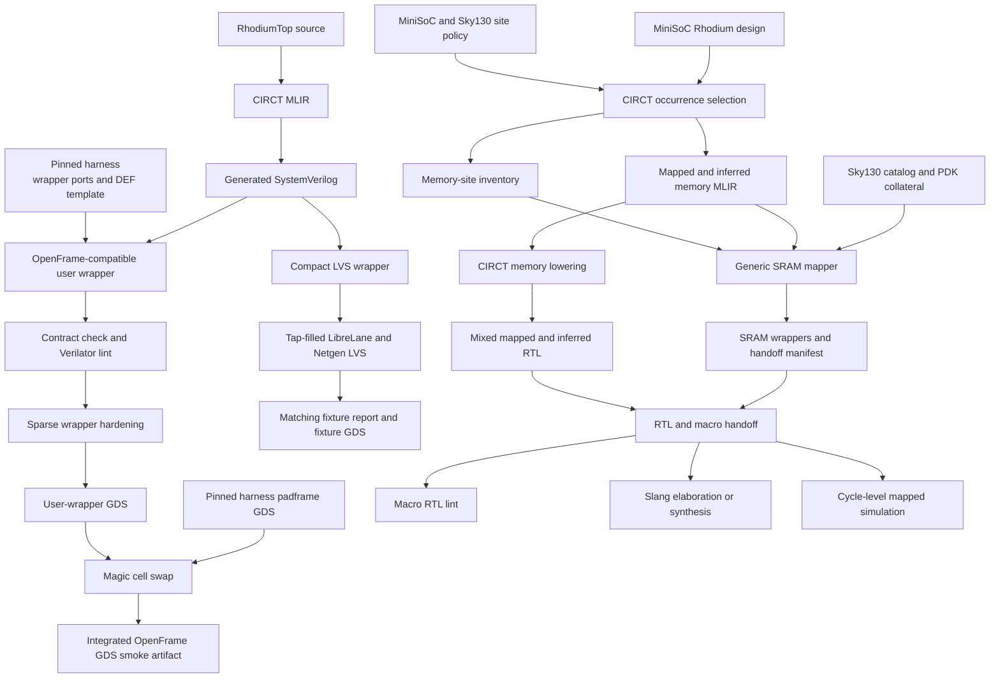

<!-- Documents the reproducible Rhodium-to-GDS smoke flow for Double-Wide OpenFrame. -->

# Rhodium physical-flow prototypes

This directory contains two deliberately separate physical-design experiments:

- a minimal Rhodium inverter carried through RTL checks, a focused LVS fixture,
  and sparse Double-Wide OpenFrame GDS integration; and
- a MiniSoC/Sky130 memory-mapping and synthesis handoff that stops before
  placement and routing.

The first path proves that a real Rhodium-derived cell can cross the OpenFrame
wrapper boundary. GPIO 0 drives the inverter and GPIO 1 drives its result; all
other GPIOs remain input-only. The second path proves that a checked-in
design/technology policy can select and preserve SRAM macros in mapped MiniSoC
RTL and synthesized netlists. No target currently places that MiniSoC or
integrates it into the OpenFrame wrapper.

Contributors changing a physical profile, handoff, or flow target should read
[`DEVELOPING.md`](DEVELOPING.md).



## Ownership and proof boundaries

| Concern | Owner in this repository | Contract |
|---|---|---|
| Rhodium smoke leaf and MLIR emission | [`src/rhodium-top.rhdl`](src/rhodium-top.rhdl) and [`tools/emit-top.rhm`](tools/emit-top.rhm) | Supplies the real one-bit combinational cell used by both physical smoke paths. |
| User-wrapper implementation and physical profiles | This `vlsi/` directory | Preserves the harness ports and pin locations, selects which GPIOs reach the leaf, and configures sparse hardening and compact fixture LVS. |
| Padframe, empty-wrapper boundary, fixed DEF template, tool flake, padframe GDS, and cell-swap script | Pinned `double_wide_openframe` submodule | The harness remains an external physical contract; it does not import Rhodium sources or generate the user design. |
| Reusable occurrence selection, memory-contract checks, tiling, adapters, and manifest schema | [`sram/`](../sram/README.md) | Remains independent of MiniSoC and Sky130 site policy. |
| MiniSoC/Sky130 selection and synthesis configuration | [`designs/mini-soc/sky130/sram-map.yaml`](designs/mini-soc/sky130/sram-map.yaml) and [`openlane/mini_soc/config.yaml`](openlane/mini_soc/config.yaml) | Chooses implementation per logical site and registers the selected macro's physical views. |
| Mapped functional simulation | [`sim/`](sim/README.md) | Reuses the normal SoC harness and FESVR stack with zero-delay SRAM models. |

The submodule's module name, power and reset ports, 63-GPIO interface, 6754.63
by 4766.63 micrometre user area, and 1216-pin DEF template are fixed inputs to
this prototype. `tools/check-openframe-contract.py` compares this directory's
wrapper header with the pinned empty wrapper and checks the template's design
name and 1216-pin count; the local flow never regenerates or edits those
harness-owned assets.

## Stage 0: initialize tools and physical inputs

Run commands from the repository root. Initialize the pinned harness before any
OpenFrame contract check or Nix-backed LibreLane command:

```sh
git submodule update --init --recursive
```

The generated-RTL and memory paths use the repository-pinned CIRCT build by
default. Install it once if it is absent, or point at a compatible existing
installation:

```sh
make -C vlsi setup-circt
make -C vlsi rtl-check CIRCT_OPT=/path/to/circt-opt
```

The MiniSoC collateral-validating mapping target and every LibreLane physical
stage require the pinned PDK collateral. Enable it once:

```sh
make -C vlsi enable-pdk
```

`PDK_ROOT` defaults to `$HOME/.ciel` and `PDK` defaults to `sky130A`. The
Makefile uses `librelane`, `ciel`, or `magic` directly when the needed tool is
on `PATH`; otherwise it enters the harness's pinned Nix flake. The flake pins
the physical-design tool environment, including LibreLane 3.1.0.dev2 and the
matching PDK commit. A standard multi-user Nix installation may need the user
to be trusted before it can use the flake's binary cache; without the cache,
the initial tool build can take substantially longer.

## Stage 1: bring up the OpenFrame RTL boundary

```sh
make -C vlsi rtl-check
```

Inputs are the Rhodium smoke leaf, its emitter, the local
`double_wide_openframe_project_wrapper`, and the pinned harness wrapper and DEF
template. The target:

1. emits `build/rhodium-top.mlir` with an isolated build-local Racket compiled root;
2. lowers it to `build/rhodium-top.sv` with CIRCT;
3. checks the exact wrapper header and 1216-pin template contract; and
4. lints the generated leaf and complete user wrapper with Verilator.

This stage proves elaboration, RTL generation, boundary compatibility, and
static RTL connectivity. It does not synthesize or physically implement the
wrapper.

## Stage 2: map and synthesize MiniSoC memories

Generic mapper behavior is tested in its owning package:

```sh
make -C sram test
```

Then exercise the design-specific policy in increasing order of cost:

```sh
make -C vlsi mini-soc-memory-map
make -C vlsi mini-soc-macro-rtl-check
make -C vlsi mini-soc-slang-check
make -C vlsi mini-soc-synth
```

`mini-soc-memory-map` selects `MiniSoC`, flattens occurrence paths, applies the
checked-in policy, and validates the resulting manifest. It maps the shared
4096 by 128-bit RAM and both 256 by 64-bit L1 data arrays to 36 installed 512
by 32-bit Sky130 SRAM instances. The four shallow tag and coherence-state
arrays remain intentionally inferred. See the [SRAM mapping guide](../sram/README.md#transformation-and-policy-flow)
for the generic policy, eligibility, tiling, and manifest contracts rather
than treating this flow as their definition.

The staged targets write these handoff artifacts under `build/mini-soc/`:

| Artifact | Role |
|---|---|
| `mini-soc.mlir` | Direct Rhodium-to-CIRCT output before top selection and site mapping. |
| `mini-soc-firmem.mlir` | Selected, flattened MLIR containing mapped externs and retained inferred memories. |
| `memory-sites.json` | Complete occurrence inventory and policy decision record. |
| `memory-wrappers.sv` | Generated exact-name macro banks, width slices, and adapters. |
| `memory-manifest.json` | Validated physical handoff, including selected instances and collateral. |
| `mini-soc.sv` | CIRCT RTL containing both mapped and inferred memory paths. |

`mini-soc-macro-rtl-check` lints the mixed RTL, wrappers, and installed PDK
macro Verilog model together with Verilator. `mini-soc-slang-check` runs only
LibreLane's `Yosys.Synthesis` step in elaborate-only mode; it verifies that
Slang accepts CIRCT's packed SystemVerilog, that its netlist contains all 36
macro instances, and that no packed structs remain. Its netlist is
`openlane/mini_soc/runs/RHODIUM_SLANG_CHECK/final/nl/MiniSoC.nl.v`.
`mini-soc-synth` runs the same synthesis step without elaborate-only mode,
then runs the native Yosys [post-synthesis recipe](openlane/mini_soc/post-synth.tcl).
This locally balances and remaps the RV64 divider's 64-bit remainder-capture
cone without changing RTL or the rest of the mapped design. The final,
verified synthesis handoff is `build/mini-soc/synthesis/MiniSoC.nl.v` (with a
companion JSON netlist). LibreLane's raw netlist and metrics remain unchanged
under `openlane/mini_soc/runs/RHODIUM_SLANG_SYNTH/`; those metrics describe the
pre-repair design, not the final handoff. Direct LibreLane invocations bypass
this Make-owned post-synthesis step.

To rerun just the post-synthesis step against an existing completed synthesis:

```sh
make -C vlsi mini-soc-post-synth
```

An experimental multiplier operand-capture repair uses the same local balancing
and equivalence proof. It is disabled by default: nominal pre-layout testing
improved the multiplier path but regressed overall worst setup slack through
shared side outputs. Keep its handoff separate when comparing timing:

```sh
make -C vlsi mini-soc-post-synth MINI_SOC_REPAIR_MULTIPLIER=1 \
  MINI_SOC_POST_SYNTH_DIR="$PWD/vlsi/build/mini-soc/synthesis-multiplier"
```

This does not change RTL or add pipeline stages. Compare full-design STA, not
only ABC's local delay estimate, before enabling it for a physical handoff.

The recipe reuses the synthesis netlist, filtered Liberty libraries, clock
target, and output load; `jq` reads LibreLane's JSON metadata. `YOSYS` overrides
the executable (ABC is its companion binary). Native tools or the harness's
Nix environment are supported. `MINI_SOC_SYNTH_STEP_DIR` and
`MINI_SOC_POST_SYNTH_DIR` override the input and output directories.

Before writing the handoff, a native `miter`/`sat -verify` check proves every
extracted boundary output equivalent, including shared side outputs. Outside
RTLIL must match except for the global auto-name counter, and the reassembled
design must pass `check -assert`. The proof and local mapping report are in
`build/mini-soc/synthesis/yosys.log`. Selection is specific to the current RV64
register layout and Sky130 `dfxtp_2` registers; mismatched endpoints fail the
build. This is a design-specific synthesis workaround, not a general timing
optimizer or physical timing signoff.

These targets prove a consistent mapping and synthesis handoff. They do not
place the macros, define blockages, connect the macro power grid, route the
design, close timing, extract parasitics, or run DRC or LVS. The manifest
carries inputs for those later stages but is not evidence that they passed.

Cycle-level behavior for the same policy is a separate consumer check:

```sh
make -C vlsi/sim smoke
```

That target scopes the MiniSoC-relative policy through `SoCHarness.soc` and
runs the existing smoke payload with the checked-in Sky130 functional SRAM
model. It proves logical cycle behavior, not PDK timing or physical signoff;
see the [mapped simulation guide](sim/README.md) for setup and custom binaries.

## Stage 3: run the focused LVS fixture

```sh
make -C vlsi lvs-smoke
```

The full OpenFrame user area contains roughly 32 mm² of standard-cell rows.
Populating that footprint around one inverter with physical-only cells would
make a quick regression unnecessarily large, so this target instead hardens
the same generated `RhodiumTop` inside the 100 by 100 micrometre
`rhodium_lvs_smoke` wrapper. Its profile enables normal Sky130 tap/endcap and
filler insertion and requires Netgen LVS to report matching circuits.

The target exports `build/lvs-views/gds/rhodium_lvs_smoke.gds` and checks
`openlane/rhodium_lvs_smoke/runs/RHODIUM_LVS/*-netgen-lvs/reports/lvs.netgen.rpt`.
This is a focused proof that the Rhodium-to-standard-cell flow can produce an
LVS-clean compact block. The fixture does not validate the full-size user
wrapper, any SRAM macro, the padframe, or the post-integration GDS.

## Stage 4: harden and integrate the sparse OpenFrame wrapper

```sh
make -C vlsi gds
```

`gds` depends on two independently useful stages:

1. `harden` runs `rtl-check`, then LibreLane hardens the local user-wrapper
   implementation with the harness-owned DEF template. It exports
   `build/views/gds/double_wide_openframe_project_wrapper.gds`.
2. `integrate` invokes the harness-owned `scripts/integrate_openframe.tcl` with
   Magic. The script cell-swaps that hardened wrapper into the pinned
   `gds/double_wide_chip_io.gds` padframe and writes
   `build/integrated/double_wide_openframe.gds`.

Use `make -C vlsi harden` or `make -C vlsi integrate` directly when debugging
one side of the handoff. The `vlsi/` layer owns the user-wrapper GDS passed to
the swap; the submodule owns the padframe GDS, physical boundary template,
integration script, and tool environment.

The sparse hardening profile intentionally disables tap/endcap and filler
insertion, in-flow DRC and LVS, and IR-drop reporting; it also tolerates PDN
violations. The resulting files prove reproducible wrapper hardening and
padframe cell-swap mechanics only. They are not production or tapeout-signoff
artifacts.

## From smoke flow to a production design

A populated OpenFrame design needs a physical plan beyond the targets above.
At minimum, that work must place SRAMs and other macros, cut standard-cell rows
and add routing blockages around them, connect and verify every power domain,
enable tap/endcap and filler insertion, provide consistent LVS models or
black-box declarations for hard macros, restore DRC/LVS and power-integrity
checks, close timing, and run the harness precheck. It must also run LVS on the
actual wrapper and padframe and verify the post-integration GDS; the compact
fixture cannot substitute for any of those checks.

Generated MLIR, RTL, manifests, LibreLane runs, and exported views are ignored
by Git. They live under `vlsi/build/` or `vlsi/openlane/*/runs/` and may be
absent in a clean checkout. `make -C vlsi clean` removes `vlsi/build/` and the
OpenFrame-wrapper and LVS-fixture run directories.
