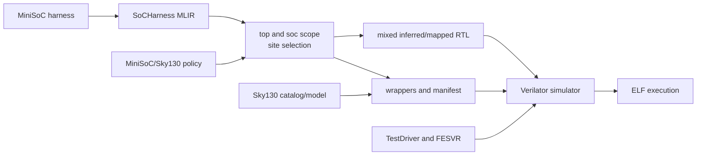

<!-- Guides contributors through maintaining mapped MiniSoC simulation orchestration. -->
<!-- SPDX-License-Identifier: Apache-2.0 -->

# Developing mapped VLSI simulation

Read the mapped-simulation [README](README.md) for tool setup, mapping reports,
build/run commands, artifacts, and failure diagnosis. This guide owns the
orchestration boundary, supported configuration, build graph, and validation.

## Architecture and ownership

This directory combines, but does not redefine:

- the MiniSoC harness, TestDriver, FESVR, and target execution from
  [`../../sims/`](../../sims/DEVELOPING.md);
- memory-site selection, mapping, wrappers, and manifests from
  [`../../sram/`](../../sram/DEVELOPING.md);
- the Sky130 catalog and functional model from
  [`../../sram/sky130/`](../../sram/sky130/DEVELOPING.md); and
- MiniSoC/Sky130 policy and manifest assertions from
  [`../`](../DEVELOPING.md).

It owns only their harness-scoped orchestration and isolated artifacts. The
supported matrix is deliberately one point: `SOC=mini`, `TECH=sky130`.

## Implementation map

[`Makefile`](Makefile) owns the complete implementation. Its principal stages
are:



The Makefile must keep the generated inventory, wrappers, manifest, RTL,
simulator object tree, and smoke binary beneath the selected `BUILD_ROOT`.

## Change the mapped simulator

1. Add a new system or technology only after its normal simulator harness,
   site policy, catalog, functional model, and design-specific manifest checker
   exist independently.
2. Scope a design-relative policy through the harness instance explicitly;
   preserve stable wrapper identity and validate both logical and actual paths.
3. Compile selected wrappers with zero-delay functional models only. Do not use
   PDK timing or physical views as a substitute for cycle semantics.
4. Keep target loading and execution in the shared simulator stack and keep
   physical assertions in the parent VLSI flow.
5. Add early configuration rejection, isolated artifacts, and mapping-stage
   stamps for any expanded matrix.
6. Update [README.md](README.md) when operators gain a supported configuration,
   command, variable, artifact, or debugging path.

## Focused validation

Validate selection, wrappers, and manifest without building the simulator:

```sh
make -C vlsi/sim mapping
```

Include CIRCT RTL lowering with:

```sh
make -C vlsi/sim mapped-rtl
```

Validate the complete compiled execution path with:

```sh
make -C vlsi/sim smoke
```

Compare against `make -C sims smoke SOC=mini` when diagnosing whether a failure
belongs to shared simulation or mapping. Mapping requires CIRCT, the SRAM pass,
Python, and Verilator; execution additionally requires FESVR and the RISC-V
cross compiler. Generated artifacts are not checked in.
