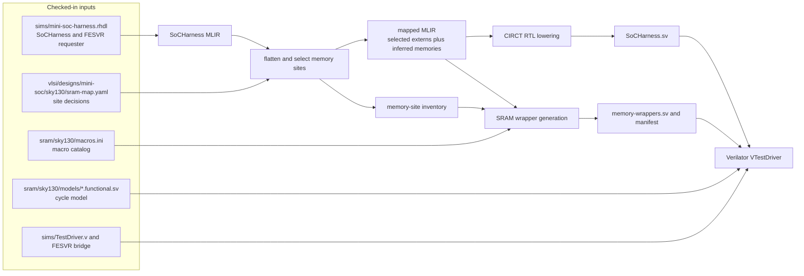

<!-- Documents cycle-level simulation after design- and technology-specific SRAM mapping. -->
<!-- SPDX-License-Identifier: Apache-2.0 -->

# Mapped VLSI simulation

This directory runs the MiniSoC `SoCHarness` after applying the same
MiniSoC/Sky130 SRAM-site policy used by the physical flow. It is a consumer of
the reusable [simulation stack](../../sims/README.md) and
[SRAM mapper](../../sram/README.md), not a second implementation of either.
Use `sims/` when all memories should remain technology-independent and inferred.

Contributors changing the mapped build graph or supported configuration should
read [`DEVELOPING.md`](DEVELOPING.md).

## Flow and ownership



The neighboring packages own the contracts behind this orchestration:

| Concern | Owner |
| --- | --- |
| `SoCHarness`, `TestDriver.v`, FESVR transport, Verilator binding, and target execution | [`sims/`](../../sims/README.md) |
| Memory-site discovery, compatibility checks, tiling, wrappers, and manifest schemas | [`sram/`](../../sram/README.md) |
| Sky130 catalog and zero-delay functional model | [`sram/sky130/`](../../sram/sky130/README.md) |
| MiniSoC/Sky130 site choices and design-specific manifest assertions | [`vlsi/`](../README.md#stage-2-map-and-synthesize-minisoc-memories) |
| Combining those inputs into a mapped simulator and keeping its artifacts isolated | This directory |

The Makefile elaborates the normal MiniSoC harness, then scopes the
MiniSoC-relative policy through its `soc` instance. Policy-selected memory
occurrences become generated SRAM-wrapper instances; all other occurrences
remain inferred and are lowered into simulator RTL by CIRCT. Verilator compiles
that mixed RTL with the checked-in Sky130 functional model. The model verifies
logical cycle behavior only; it does not model PDK timing, power, or signoff
views. See the owning [VLSI guide](../README.md#stage-2-map-and-synthesize-minisoc-memories)
for the current site selection and physical-flow interpretation.

## Prepare the tools

Install the repository-pinned CIRCT build and the shared pinned FESVR library:

```sh
make setup-circt
make -C vlsi/sim setup
```

`setup` delegates to `sims/`, so one FESVR installation serves both inferred
and mapped simulators. The build also needs Racket/Rhombus, Verilator, Python,
and `riscv64-unknown-elf-gcc` for the smoke program; follow the repository
[quick-start requirements](../../README.md#requirements). To use existing tool
installations, set `CIRCT_OPT` (and the matching `CIRCT_ROOT` when the SRAM pass
must be rebuilt), `FESVR_PREFIX`, `RACKET`, `VERILATOR`, `PYTHON`, or `RISCV_CC`
on the `make` command.

## Validate the mapping

Generate the selected MLIR, site inventory, SRAM wrappers, and manifest without
building Verilator:

```sh
make -C vlsi/sim mapping
```

This target also runs the MiniSoC manifest checker with `top=SoCHarness` and
`scope-prefix=soc`; success means the harness-scoped result still satisfies the
design-owned policy assertions. Inspect the two complementary reports with:

```sh
python3 -m json.tool vlsi/build/sim/mini/sky130/memory-sites.json
python3 -m json.tool vlsi/build/sim/mini/sky130/memory-manifest.json
```

The inventory records every discovered occurrence and its policy decision. The
manifest adds the validated macro tiling for mapped sites while retaining the
inferred decisions. Mapper syntax, failure boundaries, and inventory/manifest
schemas belong to the [SRAM mapping guide](../../sram/README.md).

To emit the complete mixed mapped/inferred SystemVerilog as well, run:

```sh
make -C vlsi/sim mapped-rtl
```

## Build and run

Build the mapped simulator without embedding a target program:

```sh
make -C vlsi/sim simulator
```

Run the focused RV64I execution smoke, which builds any missing prerequisites
and then uses the shared FESVR run path:

```sh
make -C vlsi/sim smoke
```

Run another FESVR-compatible ELF with:

```sh
make -C vlsi/sim run BINARY=/absolute/path/to/program.elf
```

As in `sims/`, `HTIF_ARGS` precedes the binary and `TARGET_ARGS` follows it.
See the [simulator guide](../../sims/README.md#run-a-target) for the host
transport and execution contract.

`SOC=mini` and `TECH=sky130` are the only supported configuration; other values
fail immediately. Override `BUILD_ROOT` to isolate an experiment. By default,
all generated files stay under `vlsi/build/sim/mini/sky130/`:

| Stage | Generated artifacts |
| --- | --- |
| Elaboration and selection | `soc-harness.mlir`, `soc-harness-mapped.mlir`, `memory-sites.json` |
| Mapping and RTL | `memory-wrappers.sv`, `memory-manifest.json`, `SoCHarness.sv` |
| Simulation | `obj/VTestDriver`, plus `rv5stage_smoke.elf` for `smoke` |

Stamp files in the same directory track successful mapping stages. These are
build products, not checked-in inputs.

## Debug a failure

First compare the technology-independent MiniSoC smoke with this mapped one:

```sh
make -C sims smoke SOC=mini
make -C vlsi/sim smoke
```

If both fail, investigate the shared harness, FESVR path, target, or SoC. If
only the mapped run fails, rerun `mapping`, inspect `memory-sites.json` for the
selected occurrence paths, inspect `memory-manifest.json` for the final tiling,
and then compare `SoCHarness.sv` with `memory-wrappers.sv`. A missing
`circt-opt` is repaired with `make setup-circt` or an explicit `CIRCT_OPT`; a
missing FESVR library is repaired with `make -C vlsi/sim setup` or an explicit
`FESVR_PREFIX`. Mapping diagnostics and the generated inventory should be used
instead of guessing flattened hierarchy paths.
